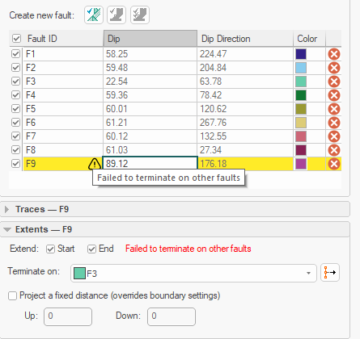

# Model Faults

To access this dialog: 

  * Activate the _Geology_ ribbon and select **Surfaces | Faults**.
  * Run the command [model-faults ](<../command_help/model-faults.md>)
  * Use the quick key combination "mfa"

## Fault Modelling Overview

The **Model Faults** tool automatically generates fault wireframes from loaded fault _trace_ data.

A fault trace is a string that represents the profile of a fault at a landmark position. Faults can be constructed using one or more traces. Higher trace numbers tend to produce more convoluted wireframe fault data. Digitize fault traces directly into an active **3D** window, and modify existing traces by extension and/or reversal.

The tool utilizes loaded trace data to form wireframe sheets through extrusion. This extrusion can be controlled either as a general value for all fault traces, or individually per fault trace, or a combination whereby individual fault trace dip and dip direction can set, whilst falling back to the default fault-level orientation if not specified.

Once fault data has been generated, edits to precursor fault traces can either be performed as a batch, then applied to regenerate all affected fault wireframe data, or wireframes will update in real time as traces are edited. 

This command assumes the following:

  * A dip of 90 degrees is vertical, 0 is flat

  * A dip direction of 0 is to the north and clockwise, e.g., 90 degrees is east.

  * Faults can have a relationship to each other, where a fault terminates on another, formating a fault 'block'

  * Faults terminate at some point, they don't carry on indefinitely.

  * A fault can comprise one or more fault traces.

  * A fault trace is a distinct string entity, comprising a start and an end vertex.

#### Fault and Boundary Data Relationships

Fault systems can be complex, including multiple dependent structures. Thrust and shear events from one fault domain can affect other domains. Modelling these interrelationships is achieved by defining **Starts on** and **Stops on** parameters.

Faults can either be fully constrained to the length and shape of the underlying fault traces or can be projected to a boundary (as defined by either a custom boundary string or a block model prototype hull). The start and end of fault traces are configured independently and fault data can be defined by two or more dependent faults, and a fault can even interact with itself (say, to represent a sigmoidal result).

You can also extend faults beyond a nominated boundary by a set distance. This could be useful, say, to enforce a full and clean intersection of fault data and a modelled vein, categorical/grade model or contact surface.

For example, in the image below, fault F2 **Starts on** the boundary (as indicated by the orange custom boundary string). It **Stops on** fault F1. The fault traces for each fault are drawn with direction indicators:

As another example, the fault system below represents two faults that represent a sigmoidal arrangement. Fault F1 **Stops on** Fault F2, and Fault F2 Stops on Fault F1. Both faults extend to a custom boundary:

## Fault/Trace Dip & Dip Direction

During fault modelling, loaded string data is appended to create fault trace data. First, a fault container object is specified, then traces are added to it. A fault object can contain one or more fault traces. 

Selecting a **Fault ID** in the faults table automatically updates the traces tables below. A mean fault **Dip** and **Dip Direction** displays for each fault.

Trace data can also be created directly within the **Model Faults** tool.

Trace data will always include two attributes to represent the **Dip** of the trace and the **Dip Direction**. Where a single fault trace is extruded to form a fault sheet, the dip is 90 (vertical) by default, and the dip direction is calculated according to the average dip direction of each edge of the trace object.

Where multiple traces are linked together to form a fault sheet with more complex directional changes across its surface, the dip and dip direction of each trace edge are calculated automatically. 

Note: If it is not possible to construct a fault due to the arrangement of fault trace strings or impossible fault dependencies, feedback is provided as a tooltip in the faults or traces table. Failed faults or traces are highlighted with a "!" symbol, e.g.:

### Implicit Modelling Metadata

Implicit modelling tools store metadata to allow previous settings to be reinstated automatically, and for downstream commands to understand the 'legacy' of input data. See [Implicit Modelling Metadata](<../COMMON/Implicit-Modelling-Metadata.md>).