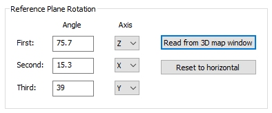
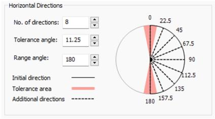

# Create Variograms

To access this screen:

  * In the [**Advanced Estimation**](<Multivariate_Dialogs_Overview.md>) wizard, select **Create Variograms**.

This panel, part of the **Advanced Estimation** (AE) screen, is used to create one or more experimental variograms. Variograms are calculated for each zone if a ZONE field has been defined previously on the _[Select Samples](<Multivariate_Select_Samples.md>)_ screen.

You can also use this panel to create cross-variograms for multivariate analysis. Once you have selected your parameters for variogram creation (see below) click **Calculate Variograms** to generate the variogram file.

Experimental variogram files generated by the AE wizard are compatible with the [VCONTOUR](<../Process_Help_XML/vcontour.md>) process.

**Note** : If you create experimental variograms on this panel, they are automatically loaded into the _[Fit Models](<Multivariate_Fit_Models.md>)_ panel when it is opened. You will also be able to use the **Fit Models** panel to load any previously generated variogram file, regardless of the scenario in which it was created.

### Normal Score Variograms

The [NSCORE](<../Process_Help_XML/nscore.md>) process can be used to create a normal score transformation for grade values prior to calculating the variograms. The normal score values can then be treated as Gaussian equivalent grades for variogram calculation purposes.

For grade values where the distribution is highly skewed or log normal, modelling a variogram of the untransformed values may be difficult. Modelling the normal score of the variogram and back transforming the variogram can give a variogram with a better shape. 

### Variogram Output

Depending on the complexity of the input sample set, it can take time to generate all of the experimental variograms required for your scenario. Progress information is written to the[Command](<../COMMON/command%20control%20bar%20overview.md>)window.

On completion the experimental variograms are written to the file defined at the top of the panel.This can be viewed in the **Table Editor** and the variograms can be displayed on the **Fit Models** screen.

### Reference Plane Rotations

All variograms and cross-variograms are calculated relative to the rotation plane.

The default sequence of axes is **Z** , then **X** , then **Y**. In the example below, the first rotation is by 75.7 around the **Z** axis, then 15.3 around **X** , and finally 39 around **Y**.

The rotation angle convention shown on this panel will be the same as that shown on the **3D Variogram** ribbon. This is automatically updated when you select Read from 3D map window.

This means that a direction along the Y axis of the rotation plane will have DIP and AZI angles of zero. 

The perpendicular direction in the rotation plane, the X axis, will have a DIP of zero and an AZI of 90 degrees.

The DIP and AZI angle for each experimental variogram is reported in the **Fit Models** screen together with the **WDIP** and **WAZI** values; the directions of the variograms in the World Coordinate System, that is, relative to a horizontal plane.

### Horizontal and Vertical Directions

In the descriptions below for Horizontal and Vertical directions the definition for horizontal and vertical applies to the reference plane _after it has been rotated_. This means that after rotation the reference plane becomes the horizontal plane.

You define the number of directions for which variograms and cross-variograms are calculated (in both horizontal and vertical directions). The directions all lie in the reference plane with the default reference plane being horizontal.

The incremental angle, in degrees, between adjacent directions is calculated as the Range angle (default 180) divided by the number of directions. For example, if the number of directions is specified as 8 then the incremental angle between adjacent directions will be 22.5 (180/8).

Horizontal Directions and Vertical Directions are set independently. The Horizontal Directions represent the local azimuth (with 0 pointing up, 90 to the right, and 180 pointing down). The Vertical Directions represent local dip (with 0 to the right, 90, pointing down, and 180 pointing left) 

_The Horizontal Directions widget on the Create Variograms screen_

If the number of directions is an even number then the set of directions will always include pairs of orthogonal directions. Although this is not essential, it is often useful to make it even so that if the fitted variogram model includes two directions in the reference plane there will always be an experimental variogram for at least two directions of anisotropy. This will make it easier to validate the fitted model visually.

The Tolerance angle is measured in the horizontal plane either side of variogram direction and defines an arc within which the vector connecting a pair of samples must lie in order to be assigned to that direction. The default Tolerance angle is half the incremental angle. In the example graphic this is calculated as 11.25. This means that if the vector connecting two samples has a horizontal angle (azimuth) within the interval 0 11.25 then the grades will contribute to the variogram with a 0 azimuth.

Although the default Tolerance angle is half the incremental angle, you can reset it if you want. Making the angle greater than the default means that there will be an overlap between adjacent Tolerance areas. Pairs of samples lying in the overlap area will then contribute to the variogram directions on either side. 

This means there will be some degree of averaging between adjacent directions which can sometimes be helpful in smoothing the variograms and making it easier to identify anisotropies particularly if there is a limited amount of data. Making the **Tolerance angle** less than half the incremental angle will reduce the number of pairs of samples and in general will make it more difficult to interpret any anisotropy.

**Note** : For 2D data **Vertical Directions** is disabled. This function is only available if 3D sample data is specified.

### Maximum Distance Threshold

The **Maximum distance** setting represents the default lag distance for variogram calculation.

This is calculated as the maximum distance between samples divided by 1000. This is done in order to achieve a small lag distance which can be used as the increment value by the Minimum lag distance slider bar on the **[Fit Models](<Multivariate_Fit_Models.md>)** screen. As the slider is moved to the right more of the increments are added together to show how the shape of the experimental variogram changes as the lag distance increases. It is done this way in order to make the recalculation fast recalculating the entire variogram each time would be far too slow.

The maximum distance between samples is shown in the **Sample Summary** table on the **[Select Samples](<Multivariate_Select_Samples.md>)** screen and is used as the default value for the **Maximum distance** option shown on this screen. 

You can reduce the maximum distance used for variogram calculation. This gives more control over the lag distance to be used for modelling and speeds up the processing by not calculating variogram values greater than the user defined maximum distance.

### Create Variograms

In the following activity, a [scenario has been created](<Multivariate_Scenario_Setup.md>) and [samples selected](<Multivariate_Select_Samples.md>). 

To create variograms for kriging or cokriging:

  1. Enter the name of the Experimental variogram file  to create (or accept the default).

  2. Select variables (grades) for variogram creation. All variables selected on the **Select Samples** screen display here.

  3. If you want to create variograms of the normal scores, check Normal score. 

The Normal Score Transformation (NST) transforms data to resemble a standard normal distribution. This will transform one or more grade fields to a normal (gaussian) distribution and calculate the experimental variograms for the nscore values.

If selected, all selected grades are transformed. Actually, both untransformed and transformed variograms are calculated. This is so you can back transform the variogram model parameters so that the back transformed model can be used for kriging untransformed values later on, if required.

Grades are transformed within each domain, if you have specified one or more domains/zones.

**Note** : You can view transformed and untransformed variograms on the [Fit Models](<Multivariate_Fit_Models.md>) panel.

  4. Choose the Typeof variograms to create:

     1. DownholeCreate downhole variograms.

     2. **Cross** Calculate cross-variograms for all possible pairs of grades, where multiple variables are being estimated. Only available if multiple variables have been picked.

     3. Directionalcheck to calculate directional variograms for both the all-samples variograms and the downhole variograms

If no options are selected, only omni-directional variograms are calculated.

  5. Select zones for which variograms and cross-variograms are required. Absent data (-) qualifies as an independent zone.

  6. Choose your **Reference Plane Rotation** settings to set a reference plane. Variograms are created relative to this plane.

**Note** : If you have used the [Investigate Anisotropy](<Multivariate_Investigate_Anisotropy.md>) screen, you can read the current rotations directly from the 3D Variogram window using **Read from 3D map window**.

     1. Set the **First** , **Second** and **Third** rotation angles and associated **Axes**. By default all three angles are set to zero so the reference plane is horizontal.

  7. Define the number of Horizontal directions for which variograms and cross-variograms are calculated in the horizontal plane. See "Horizontal and Vertical Directions", above for more guidance.

This and related options are enabled if Directional variograms are created for 2D or 3D data (see above).

  8. Define the **No. of directions** (number of azimuths) for which variograms and cross-variograms are calculated in the horizontal plane. The dips are measured relative to the reference plane with the default reference plane being horizontal.

  9. Similarly, define the Tolerance angle, measured in the horizontal plane either side of variogram direction. This defines an arc within which the vector connecting a pair of samples must lie in order to be assigned to that direction. 

  10. Choose the Range angle within which an azimuth can fall in order to be used within a variogram calculation. Typically, this is 180 but you can expand or constrict this.

  11. Similarly, choose the Vertical directionsparameters to consider when calculating variograms in the vertical plane. In this context, you're setting the dip angles.

  12. Define general variogram **Options** :

     1. Set the Maximum distance for variogram calculation. By default, this is capped to the maximum sample spacing. You can see this value on the [Select Samples](<Multivariate_Select_Samples.md>) panel (Range Dist). It is, in effect, the maximum distance between any two samples. Reducing this value can reduce the amount of time taken to process variograms, but potentially at the expense of fully accommodating a data sample set.

See **Maximum Distance Threshold**, above.

     2. Set the Minimum Lag. Define a minimum permissible lag distance for the sample set. The default value of Minimum lag is the largest of 5 or the maximum separation of any two samples / 1000.

     3. If the **Downhole** variogram type is checked (see above), set the Minimum Lag (downhole).This is the average length of non-absent intervals (the length of samples that contain one or more of the selected grade values), rounded to the nearest 0.1.

     4. Check and choose a Cylinder Radius that represents the search scope. If enabled, define the radius of a cylinder centred on the variogram direction. This option only applies to directional variograms. 

The search radius will only have an effect on samples within it. Excessively large values may not alter estimation results.

Related topics and activities

  * [Advanced Estimation Introduction](<Multivariate_Introduction.md>)
  * [Scenario Setup](<Multivariate_Scenario_Setup.md>)

  * [Select Samples](<Multivariate_Select_Samples.md>)

  * [Unfolding](<Multivariate_Unfold.md>)

  * [Define Custom Zones](<Define_Zones.md>)

  * [Bivariate Statistics](<Bivariate_Statistics.md>)

  * [Investigate Anisotropy](<Multivariate_Investigate_Anisotropy.md>)

  * [Fit Models](<Multivariate_Fit_Models.md>)

  * [KNA: Select Locations](<Multivariate_KNA_SelectLocations.md>)

  * [KNA: Optimize](<Multivariate_KNA_Optimize.md>)

  * [Select Prototype](<Multivariate_Select_Prototype.md>)

  * [Parameters](<Multivariate_Import_Parameters.md>)

  * [Define an Estimation](<Multivariate_Define_Estimations.md>)

  * [Review Variograms](<Multivariate_Confirm_Variograms.md>)

  * [Define Search Volumes](<Multivariate_Select_Search_Volumes.md>)

  * [Run Estimations](<Multivariate_Run_Estimation.md>)