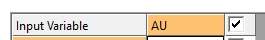

# Define an Estimation

To access this screen:

  * Using the [Advanced Estimation](<Multivariate_Introduction.md>) console, select the Define Estimations menu item.

This screen is used to define grade estimation parameters for the current scenario. 

If you have [imported data from Datamine Supervisor](<Multivariate_Scenario_Setup.md>), estimations derived from the imported project appear here automatically.

Estimations that use the same parameters (estimation type, discretization level, output level, search volume) can be grouped together and given an Estimation case name. The case parameters can then be assigned to a single grade or to multiple grades in multiple zones.

  * An Estimation Case can be created automatically from the **Save Models** tab on the Fit Models panel. This is the recommended method if the cokriging option has been selected. Alternatively, a new case can be created and parameters defined for any combination of grade and zone. See [Save Models](<Multivariate_FitModels_SaveModels.md>).

  * An Estimation Group can be copied to a new group and its parameters edited. The results for both groups will be written to the output model so it is then easy to compare the estimates, for example, ordinary kriging and simple kriging.

#### Estimations List

The area on the left of the screen lets you add, delete and copy an estimation scenario. This can be useful when testing sensitivity to grade estimation parameters or input data.

All estimation scenarios that have been committed for estimation using the **Save Models** panel (**Fit Models** screen) appear here.

To clear the list of all estimations (after confirmation), use **Clear all estimations**. This action cannot be undone.

#### Centre Panels

The centre of the **Define Estimations** screen hosts 3 panels, of which one is displayed at a time.  

  * **Estimation Setup** \- define the core parameters for the estimation case. See Estimation Setup.
  * **Field Names** \- a summary of the fields that will be created in the output model file. See **Field Names**.
  * Soft Boundary Setup \- if custom zones have been configured (using the [Define Custom Zones](<Define_Zones.md>) screen) you can associate them with a model zone here. If multiple zone (or zone combinations) are represented by the custom zone, samples from all custom zone members will be used to influence the model cell values within the model zone. See **Soft Boundary Setup**.

#### Grade Variable(s) and Zone(s)

The Available Variables and Available Zones areas on the right of the panel allow you to add grades and zones to the current case. When a new grade or zone is selected the value appears in the corresponding area in the lower central portion of the panel using the **Estimation Setup** panel.

## Estimation Setup Panel

This panel is used to define the core parameters for the estimation case. Settings applied here can have a significant effect on the outcome of your estimation run.

To define general estimation parameters:

  1. Display the **Estimation Setup** panel. Only one centre panel is visible at a time.
  2. On the left, select the **Estimation** you wish to configure.
  3. Enter a **Description** for the estimation scenario, or accept the default text.

**Tip** : Use a consistent naming convention for estimation scenarios. Include the grade variable and key parameters, e.g. "AU Univariate No Zones SVOL 4".

  4. Choose the general estimation method using one of the following **Estimation Options** : 
     * **Ordinary Kriging** Arguably, the most widely used kriging method. It serves to estimate a value at a point of a region for which a variogram is known (Kriging methods depend on mathematical and statistical models), using data in the neighbourhood of the estimation location. 
     * **Simple Kriging** Simple kriging is more restrictive than ordinary kriging because you have to know the mean value of the surface, but it produces more realistic prediction error maps. 

If **Simple Kriging** is selected, you can choose the method for calculating the local mean grade to be used for the estimation. If you want the process to calculate the local mean automatically from the data in the search volume then you will need to select the required local mean attribute using the Local mean (SK) entry in the **Field Names** panel. See **Field Names**.

If either **Kriging** method is chosen and two or more variables have been selected for the current case (and all combinations of variogram and cross-variogram models are available), you can choose to perform either **Univariate** or **Multivariate** estimation:

       1. Select **Multivariate** to perform cokriging.

       2. Select **Univariate** to perform a single grade variable estimation.

     * **Nearest neighbour** The nearest neighbor method assigns grade values to blocks from the nearest sample point to the block. Closest sample gets a weight of one; all others get a weight of zero.

       * If **Use search distance anisotropy** is **checked** , **COKRIG** uses the transformed distances defined by the search volume.
       * If **Use search distance anisotropy** is **unchecked** , no transformation is considered. Distances are calculated from the coordinate system used in the input **Samples File** (**[Select Samples](<Multivariate_Select_Samples.md>)** panel).
     * **Inverse distance** A mathematical (deterministic) method assuming closer known grade values are more related than further values. Essentially, the 'power' of a known sample wanes over increasing distance. If selected, you can choose the weighting **Power** of known sample points. For IPD estimates, choose which transformed distance to use, either using anisotropy or not:
       * If **Use search distance anisotropy** is **checked** , **COKRIG** uses the transformed distances defined by the search volume.
       * If **Use search distance anisotropy** is **unchecked** , no transformation is considered. Distances are calculated from the coordinate system used in the input **Samples File** (**[Select Samples](<Multivariate_Select_Samples.md>)** panel).
  5. For any estimation method, choose if subcelling is performed:
     * Choose **Sub-cells estimation** to permit sub-cells to be constructed to create a more organic grade shell boundary within the model. This will typically produce larger model data than regular, parent-only cell models.
     * Choose **Parent cell estimation** to generate a regular model without sub-cells. The model prototype will determine size of blocks throughout the model.
  6. Decide how negative kriging weights, if generated, are handled:
     * If Reset negative kriging weights to zero is **checked** , samples with negative weights are ignored.
     * If **Reset negative kriging weights to zero** is **unchecked** , samples with negative weights are maintained and used in estimation.
  7. Choose if the estimation should contribute to a **SAMPOUT** file, if one is requested on the **[Run Estimation](<Multivariate_Run_Estimation.md>)** screen:
     * If **Save in SampOut file** is **checked** , samples contributing to cell estimation for the selected estimation are recorded in a SAMPOUT file.
     * If **Save in SampOut file** is **unchecked** , no sample information for the selected estimation is recorded in a SAMPOUT file, if one is requested.

See **[show-samples](<../command_help/show-samples.md>)** and **[show-samples-subcells](<../command_help/show-samples-subcells.md>)**.

  8. Choose **Dynamic Anisotropy** options:

     * Check **Search Volume** to define a **Dynamic Anisotropy Search Pitch** field on the **Field Names** panel. This becomes the 3rd angle from the search volume file.

     * Similar to the above, **check** Variogram model to define a **Dynamic Anisotropy Variogram Pitch** field on the **Field Names** panel. 

Note: You must also [Define Dynamic Anisotropy Fields](<Multivariate_Select_Prototype_DA.md>) for either search volume or variogram model (or both) if either of the above options are selected.

       * If Dynamic Anisotropy is being applied for your estimation (either of the above options are selected), choose how the 3rd pitch angle is calculated. This can be either in relation to a dipping structure (**Inclined**) or a horizontal or sub-horizontal wireframe (Flat lying).

Note: This selection equates to the [ANISOANG](<../Process_Help_XML/anisoang.md>) process's @**FLAT** parameter.

  9. Select the number of discretization points for each cell in the X, Y and Z directions. The optimum number of points can be determined using the options described in [Kriging Neighbourhood Analysis](<Multivariate_KNA_SelectLocations.md>). This setting is not supported if using the **Nearest neighbour** estimation method.

If using 1x1x1 discretization and either of the kriging estimation methods, the system will default to not using point discretization. You can override this setting if you wish, and force point (not block) kriging by checking Point Kriging, which only appears where a 1x1x1 discretization and kriging is chosen.

**Note** : The purpose of block kriging is to produce direct block averages from point or quasi-point measurements, not from known block averages. It is useful to achieve the estimation of a linear average for an attribute inside supports that are intermediate in size between the support of the sampling and the sampling domain.

  10. If you have configured attributes for **Dynamic Anisotropy** (attributes containing angle data for block model cells) whilst **[setting up a prototype model](<Multivariate_Select_Prototype_DA.md>)** you should indicate which structure(s) will be oriented with this data; either _Search volume_ ,_Variogram model_ or both.

**Note** : If you haven't defined orientation fields for a selected **Dynamic Anisotropy** option, you'll see a warning to this effect.

## Field Names Panel

This panel displays the field names that appear in the output grade model for each grade variable specified on the [Select Samples](<Multivariate_Select_Samples.md>) screen. You can choose whether to include the field or not using the corresponding check box (or select all or none using the check box in the respective header cell).

Each field is assigned a default name based on the selected grade field. The default name can't be changed using the Auto name field and any field can be renamed by editing the name in the grid.

  * Local Mean: this only appears if Simple kriging is performed and is used to select the local mean attribute for the variable.
  * Number of holes: this is only supported if a Hole ID is selected on the Select Samples panel.

Available field names and default suffixes:

Description |  Default suffix  
---|---  
**Auto name**   
See "Using Auto name", below. |  -  
Estimates |  (Grade Name, no suffix)  
Number of samples |  _N  
Number of holes |   
Weight of mean |  _WM  
Sum of the pos. weights |  _WP  
Local mean (SK) * |  -  
Variance |  _V  
**Corr(Z, Z*)**   
_Correlation between actual and estimate_ |  CRZ  
**Cov(Z, Z*)**   
_Covariance between actual and estimate_ |  CVZ  
**Cov(Z1*, Z*)**   
_Covariance between two estimates multivariate case only_ |  CZ1  
**Slope of regression Z/Z***   
_Actual on estimate_ |  _SR  
**Variance of Z***   
_Variance of estimate_ |  VZS  
Kriging efficiency |  _KE  
Lagrange parameter |  _LG  
Minimum distance  
Smallest distance used for estimation of block | _MD  
Average distance  
 _Average distance of all samples used for estimation of block_ | _AD  
Transformed minimum distance | _TMD  
Transformed average distance | _TAD  
**Search volume index**   
_Used for estimate_ |  _SI  
**Dynamic Anisotropy Search Pitch**   
Only available if **Dynamic Anisotropy >> Search Volume** is selected on the **Estimation Setup** panel. |  _SPT  
**Dynamic Anisotropy Variogram Pitch**   
Only available if **Dynamic Anisotropy >> Variogram Model** is selected on the **Estimation Setup** panel. |  _VPT  
  
* If you have previously created a field in the input model file it can be selected from the drop-down list. All numeric fields are listed. Once selected, the check box to the right is automatically enabled, but you can disable it if you wish to calculate the local mean based on the input sample data instead.

### Using "Auto name"

A prefix can be applied to your output data files to help identify the attribute and the grade variable to which the attribute values apply. By default, your grade variable is used as the prefix, e.g. "AU", meaning output attribute names will be prefixed with "AU_".

If the Auto name check box is enabled:

  * All text fields below (which excludes the Local mean drop-down list, if Simple kriging is selected), will not be directly editable but can be enabled or disabled using their corresponding check box.
  * Any changes to the Auto name prefix will be applied to all enabled output attributes (i.e. those with an enabled check box) when <ENTER> is pressed. 

If the Auto name check box is disabled:

  * All text fields below (which excludes the Local mean drop-down list, if Simple kriging is selected), can be edited by typing in any value
  * Any changes to the Auto name prefix will not be applied to enabled output attributes when <ENTER> is pressed.

Auto name field specification

The **Auto name** prefix can be up to 5 characters for [Short field](<../COMMON/Long_Field_Mode.md>) systems or 21 characters for [Long-field](<../COMMON/Long_Field_Mode.md>) systems.

In order to associate output fields with their sample variable you can define up to five characters that will be used as the first characters in the output field name. The process automatically creates the full output field name by adding an additional two or three characters. For example; N for the number of samples used for the estimate and _WP for the sum of the positive weights. Details of all suffixes are given in the Output Field Names view, above. If you do not define a prefix the system will assign one automatically based on the input variable name.

Selecting and Deselecting Variables

Estimation variables can be globally enabled or disabled using the check box in the Input Variable header row, e.g.:  

Enabling or disabling this check box will forcibly enable or disable all check boxes below with the exception of the Auto name row and (if it is displayed as part of Simple kriging), the Local mean (SK) row.

Deselecting or selecting variables will automatically trigger the same behaviour if there are dependent variables. For example, disabling the Variance attribute will automatically disable, amongst others, the Sum of pos. weights attribute, as variance is required to calculate the kriged weights.  

## Soft Boundary Setup Panel

As a resource geologist, you may want to use different combinations of sample zones for estimating a domain with soft boundaries. 

Soft boundary estimation is used when there is a gradual grade transition at a contact, rather than a sharp grade transition. This indicates that samples from an adjacent zone influence grades within that zone, therefore those samples can be used to inform the estimate. 

Using custom zones lets you estimate from different zones into your block model. Custom zones are defined using the [Define Custom Zones](<Define_Zones.md>) panel. If configured, you can assign them to a model zone here.

For example, zone values 1, 2 and 3 exist. You want your model zone (1) to be influenced by samples across a larger area than just zone 1 samples. In fact, you want samples from zones 1 and 2 to contribute. To do this, you set up a custom zone representing zones 1 and 2, and assign it to model zone 1 using the Soft Boundary Setup table.

Model Zone: this field shows you the zone that was chosen to generate the estimation case (as determined by the zone used to create the Candidate Model Set on the [Fit Models](<Multivariate_Fit_Models.md>)panel). You can't edit this value as it is part of the model set definition.

**Custom Zone** : all [predefined custom zones](<Define_Zones.md>) are listed here. Select one to assign it to the Model Zone.

Related Topics and Activities

  * [Advanced Estimation Introduction](<Multivariate_Introduction.md>)
  * [Define Custom Zones](<Define_Zones.md>)
  * [Create Variograms](<Multivariate_Create_Variograms.md>)
  * [ESTIMA](<../Process_Help_XML/estima.md>)
  * [ESTIMATE](<../Process_Help_XML/estimate.md>)