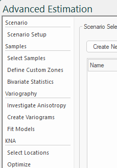
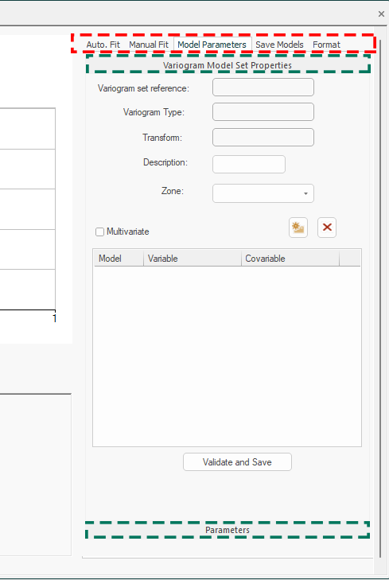

# Advanced Estimation Screens

The Advanced Estimation wizard comprises a series of screens to support univariate or multivariate estimation.

Screens are accessed using the vertical menu system on the left. 

_The Advanced Estimation wizard's vertical menu system_

Screens are organized to encourage a top-bottom workflow, although this doesn't need to be rigidly followed. For example, you can use the wizard to fit and review variogram models, or to simply import estimation parameters (say, from Datamine Supervisor) and just process an estimation with relatively little other setup. There are lots of other incidental uses for the wizard - the full workflow isn't mandatory. That said, some stages are dependent on others (you can't run an estimation without defining a prototype model, for example). This is clarified in each screen's help page.

Each screen comprises one or more panels hosting related controls, and sometimes tabs to provide further controls. Panels are expandable and collapsible to save screen space:

;>)

Advanced Estimation screen showing tabs (highlighted in red) and expandable panels (green).

Data from each screen is stored with each scenario. You can have one or more estimation scenarios in the current project. See [Scenario Setup](<Multivariate_Scenario_Setup.md>).

Find out more about each screen below.