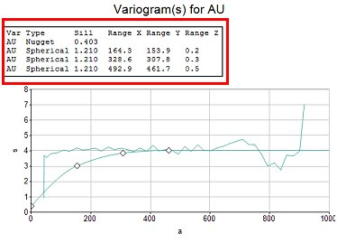

# Format Models

To access this screen:

  * [**Fit Models**](<Multivariate_Fit_Models.md>) screen **> > Format** tab.

Format the visual properties of your variogram, as displayed in the centre of the **Fit Models** screen.

Formatting options are split into the following areas. All variogram charts are affected by changes to these options:

### Manual Fitting Options

The **Manual Fitting** collection contains a series of check boxes used to constrain the extent of [manual fitting](<Multivariate_FitModels_ManualFitting.md>).

  * Lock total sillIf checked, the upper sill of the model is fixed at its current level. Moving a control point for the highest structure then only change the _range_. Moving control points for other structures (if any) change spatial variances (Ci values).

  * Lock nugget: if checked, the defined nugget position is locked.

  * Lock sillsIf checked, the current variogram sills are locked.

  * Lock rangesCheck to keep the current range values. Moving control points then only changes the spatial variances.

### Annotation Options

Choose how annotation appears on each variogram chart:

  * TitleThe primary variogram chart title is automatically generated by default, using the syntax "Variogram(s) for #Property Name#". You can edit it by replacing the default text. You can also edit the font size (in points) using the up and down arrows.

  * X-axis, Y-Axis: enter a description for your X- and Y-axis here. As above, you can also edit the font size. Further axis formatting options exist (see below).

### Axes Options

This group of controls allows you to define the range for the vertical and horizontal axis. By default, all values are included, and the axes are scaled accordingly, but you can edit the value for each axis independently by unchecking Auto and entering a custom **Minimum** and Maximum range value. You can also define the chart **Interval** spacing.

### General Options

The Options command group displays the following options:

  * Display number of pairsCheck to display the number of samples pairs for each variogram point in the main graphics area. 

    * NormalizeIf checked, data points are normalized.

  * Display Variance: display an additional line on the selected graph showing the Variance. Pick your own colour.

  * **Display Model Parameters** Embed variogram parameters onto each plot. If checked, the variable, structure type, sill value, nugget and XYZ range values will be added to the selected plot, for example:  
  

### Series Options  

This list includes the charts of the current series. Pick a series and change its **Series color**.

Related topics and activities

  * [Fit Models](<Multivariate_Fit_Models.md>)

  * [Automatic Model Fitting](<Multivariate_FitModels_AutomaticFitting.md>)

  * [Fit Models Manually](<Multivariate_FitModels_ManualFitting.md>)
  * [Model Parameters](<Multivariate_FitModels_ModelParameters.md>)

  * [Save Models](<Multivariate_FitModels_SaveModels.md>)

  * [Advanced Estimation & Variography](<Multivariate_Introduction.md>)