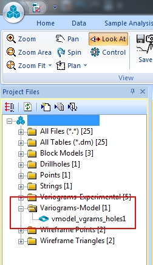

# Save Models

To access this screen:

  * [**Fit Models**](<Multivariate_Fit_Models.md>) screen **> > Save Models** tab.

Each time a new variogram model set is created by either **[manual](<Multivariate_FitModels_ManualFitting.md>)** or **[automatic](<Multivariate_FitModels_AutomaticFitting.md>)** fitting, it is saved and its description is displayed in the **Candidate Model Sets** table of this screen.

Otherwise, use this screen to:

  * Update variogram model sets so they can be used for estimation.
  * Import, export or delete a variogram model set.
  * Add or remove a model set from the displayed variogram chart(s).

Multiple variogram models can be created within the same Variogram Model Set (VMS). A VMS can include models for multiple grades but a VMS cannot include multiple models for the same grade. Therefore each model is uniquely identified by its VMS and its grade.

If a VMS contains models for multiple grades and is exported to a DM variogram model file, all models are assigned the same VSETNUM value which is set to the VMS value. The GRADE field is also exported so the model can be identified.

To ensure output data is compatible with other Studio processes, a unique **VREFNUM** value is assigned to each data row.

Output data is automatically detected as a Variogram model data file and added to the **Variogram-models (Adv Est)** folder in the [Project Files](<../COMMON/Concept_Project%20Files%20Control%20Bar%20Overview.md>) control bar for easier retrieval and review, for example:  
  

**Note** : You can import standardised variogram models from Datamine Supervisor using this function.

### Save a Variogram Model

The following activity assumes a variogram model has been fitted.

  1. Display the **Save Models** screen.

  2. Review the **Candidate Model Sets** table. All model sets available for estimation are shown (one per table row).

     * **Display** Determines if the model set is displayed on the selected variogram. 
     * DescriptionAn editable description of the model set. Click in this field to edit its contents.
     * **Variables** The grades for which variogram models have been created
     * **Zone** The domain(s), if any, to which the models apply. Click inside the cell to display other zones (if zones were defined on the **[Select Samples](<Multivariate_Select_Samples.md>)** screen).

Having access to the other zone combinations for the current estimation scenario could be useful, for example:

       * When a zone has insufficient data and you want to use the domain of a different variable. 
       * When you want to use one variable's variogram for a different variable. (for example, a variogram modelled for **AU** and you wish to run it for **AUCUT**).
       * When copying a scenario and being able to re-use it for a different variable.

     * **Multivar** Shows whether the models are multivariate (_Yes_) or univariate (_No_)
     * **Fitting** Displays how the model was fitted, which is either _Auto_ if the model has been created **[automatically](<Multivariate_FitModels_AutomaticFitting.md>)** or _Mix_ if there has been any **[manual editing](<Multivariate_FitModels_ManualFitting.md>)**.
     * TransShows Yes or No depending on whether normal-score transformed values are displayed. If the fitted variogram model has already been back-transformed, this states Back.
     * **In use** Displays if the model set has already been committed for estimation (or KNA). Either _Yes_ or _No_.
  3. Make sure the candidate model set of interest is selected in the **Candidate Model Sets** table, and decide what to do with it:

     * **Export** the variogram model. Enter a file name and save the file to disk. The model set may contain more than one model. You may need change the VREFNUM values depending on what the file is being used for.

Exported variogram models are automatically added to the current project, and accessible using the Project Files control bar.

**Note** : Once exported, models can be imported to this screen using **Import**.

     * **Delete** the highlighted model set. If you delete any set apart from the one in the final row, the reference numbers adjust to create a new ordered sequence starting from 1.

     * Commit to KNA & Estimation. The highlighted model set is committed to the rest of the estimation workflow, and a summary of parameters is added to the **Estimations** table below.

The variables to be estimated, the zone(s) selection and the variogram models are copied from the Variogram Model Set to an Estimation Set. This forms the basis of a set of estimates to which other parameters such as search volumes and estimation method will be added from the estimation panels.

**Note** : Multiple sets can be picked by holding down CTRL while selecting with the mouse, so they can all be committed together. This can be useful for related variogram configurations.

     * Back-transformOnly available for samples in transformed space (that is, the Transformed grades option is selected, and samples have already been converted to normal score distributions using the [Create Variograms](<Multivariate_Create_Variograms.md>) panel).

Select a candidate model set where **Trans** = _Yes_ and you can back-transform to an untransformed sample set. Once back-transformation is completed, the Untransformed grades option is automatically set and your updated variogram is displayed. 

**Note** : This command uses the [NSMODBAK](<../Process_Help_XML/nsmodbak.md>) process.

       * Fit Sills OnlyIf checked, transform only the sill values (instead of the sill and ranges) when variogram models are transformed from Gaussian to original units.
  4. If model set data has been committed for estimation or KNA, review the Estimations table.

Multiple sets of estimations can be defined and run as a single process. You can double-click to edit the automatically-generated estimation name. 

Once an estimation is selected, you can click the X in top right corner to delete it. Listed estimations can be configured using the later screens of the **Advanced Estimation** wizard, culminating in an estimation run on the **Run Estimation** screen.

Related topics and activities

  * [Fit Models](<Multivariate_Fit_Models.md>)

  * [Automatic Model Fitting](<Multivariate_FitModels_AutomaticFitting.md>)

  * [Fit Models Manually](<Multivariate_FitModels_ManualFitting.md>)
  * [Model Parameters](<Multivariate_FitModels_ModelParameters.md>)

  * [Format Models](<Multivariate_FitModels_Format.md>)

  * [Advanced Estimation & Variography](<Multivariate_Introduction.md>)