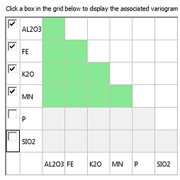
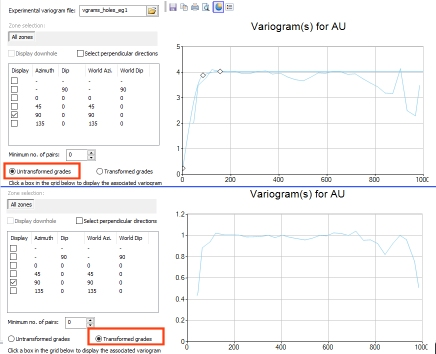
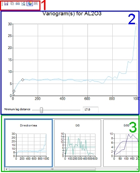
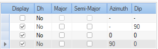

# Fit Models

To access this screen:

  * In the [**Advanced Estimation**](<Multivariate_Dialogs_Overview.md>) wizard, select **Fit Models**.

Load and view the experimental variograms created on the **[Create Variograms](<Multivariate_Create_Variograms.md>)** screen and fit a model variogram set.

A model variogram set may include more than one model.

If you are performing a **multivariate** estimation (that is, multiple grade variables are considered, as determined by your choices on the **[Select Samples](<Multivariate_Select_Samples.md>)** screen), the set will include a model variogram for each variable and a model cross-variogram for each pair of variables. The variograms and cross-variograms have the same rotations, number of structures, structure type and ranges. 

If the model set is **univariate** then a model is fitted for each variable. Although it is possible to have univariate models for more than one variable in a model set the estimation process is more flexible if you keep to a single univariate model for one variable in each model set.

Things to remember:

  * If the only experimental variogram selected is omnidirectional, then an isotropic model will be created. If any directional variograms are selected, then the previous requirement for at least 2 directional variograms will apply.
  * Downhole variograms to ascertain the nugget are always omnidirectional.

Use the **Fit Models** screen to:  

  * Select the grades and experimental variograms to be displayed and analyzed
  * Choose the model fitting variogram you wish to use (Variogram, Log Variogram, Madogram etc.)
  * Automatically fit 3D variogram models, both univariate and multivariate
  * Adjust model parameters through the graphical interface
  * Load external variogram models for comparison and modification

The resulting variogram models can be used in Kriging Neighbourhood Analysis (KNA) to optimise parameters. Once models are fitted, and the estimation is "committed" for estimation, the **Estimation** screens are used to select a full set of estimation parameters, including the variogram models, so that grades can be estimated into a block model.

When you fit a model to a variogram, you transform the empirical (often noisy) spatial dependence data into a smooth function that can be used for interpolation and spatial prediction. The fitted model describes the key spatial parameters (nugget, sill, range), which are crucial for understanding and predicting spatial patterns in the dataset.

Key model fitting concepts:

  * **Nugget** Represents the semivariance at zero distance. It accounts for measurement errors or spatial variation occurring at distances smaller than the sampling resolution.

  * **Sill** The value where the semivariance levels off, representing the total variance of the data once spatial correlation is no longer present.

  * **Range** The distance beyond which the semivariance no longer increases, meaning there is no further spatial correlation between points.

### Effects of Fitting a Model

##### Smoothing

The fitted model smooths the empirical variogram, providing a continuous function that represents the spatial dependence structure. This allows you to avoid overfitting to noisy empirical data.

##### Interpolation and Kriging:

Once a variogram model is fitted, it is used in kriging, a geostatistical interpolation method. The variogram model helps determine the weights assigned to neighboring data points when making predictions at unsampled locations. The spatial correlation described by the variogram influences how far the effect of one point extends.

##### Extrapolation:

The fitted variogram model also allows for interpolation over distances not explicitly sampled. It enables kriging to make predictions across the study area, even in regions without direct data.

##### Improved Estimation:

A well-fitted model captures the underlying spatial relationship and reduces estimation errors by appropriately weighing the influence of nearby data points.

##### Handling Spatial Variability

The nugget, sill, and range help characterize the spatial structure. A large nugget might suggest high measurement error or short-range variability, while a long range indicates strong spatial correlation over larger distances.

### Variograms in ESTIMA & COKRIG

Variogram files from either COKRIG or ESTIMA / ESTIMATE processes can be used in the **Advanced Estimation** wizard.

The main differences between the variogram models for **COKRIG** (which powers the **Advanced Estimation** wizard) and **ESTIMA** (which powers the **[ESTIMATE](<../Process_Help_XML/estimate.md>)** wizard) are:

  * A variogram model set number (**VSETNUM**) is used in **COKRIG** instead of a variogram reference number (**VREFNUM**). If **VSETNUM** is available, it is used, otherwise **VREFNUM** is used instead.

  * The variogram model requires two additional fields **GRADE** and **GRADE2** in **COKRIG** to identify the grade or grades in the case of cross-variograms, to which the model applies.

    * GRADEPrimary grade, or if absent, the grade being estimated is used instead.
    * GRADE2Secondary grade, or if absent, **GRADE** is used (if available) or the grade being estimated if neither GRADE nor GRADE2 are available.

### Variogram Types

The Advanced Estimation wizard supports the following variogram types:

  * **Variogram** (default)A normal variogram describing how the spatial correlation of a variable changes with distance.

  * **Covariance** A variogram to describe how data similarity decreases with increasing distance between sample points. It measures the spatial dependence or autocorrelation of a variable. The variogram plots the _semivariance_ against the distance between locations.

At small distances, points are often more similar (low semivariance), but as the distance increases, the semivariance typically increases until it levels off, indicating no further spatial dependence.

  * **Log Variogram** A modified form of the standard variogram, where the logarithms of the data values are used instead of the raw values. This transformation is applied to deal with data that exhibit non-normal distributions, particularly when there are large variations in the scale or outliers, which can distort the interpretation of spatial correlation in a standard variogram.

  * **Madogram** Measure spatial variability, but instead of using squared differences (as in the standard variogram), it uses absolute differences between values at two locations.

Madograms are used when you want to avoid overemphasizing extreme values, such as when data are highly skewed or contain outliers. They offer a more robust alternative to the variogram, especially in such cases.

  * **Pairwise Relative** a variogram that normalizes the differences between data points by the values of the data themselves. This helps to account for heteroscedasticity (varying variance) in the data, where variability increases with the magnitude of the values.

### The Variogram / Cross-variogram Grid

View variograms and cross-variograms for any combination of variables. 

Using the dynamic variogram grid, you can select or deselect variables for variogram model fitting. Each pair of selected variables is shown by green grid squares.

Click a green grid square to display a set of variograms or cross-variograms on the right . For example, the following grid is the result of loading an experimental variogram file for an estimation involving 6 variables:

If normal score variograms were generated, you can swap between Transformed grades and Untransformed grades:

;>)

### Variogram Charts

The Variogram View is the central area of the Fit Models screen. It is used to display variogram charts and thumbnails. There are three main areas:

Area (1) is a simple toolbar that allows you to (from left to right): save, copy (to clipboard), print, print preview, toggle 3D mode and show/hide the chart legend.

Area (2) is the display area for the main chart - using this view you can adjust the lag distance in real-time using the slider bar provided, and if a model has been fitted, you can manually edit the model anchor points (optionally restricting the editing based on settings found in the [Model Parameters](<Multivariate_FitModels_ModelParameters.md>) tab.

When adjusting the Minimum lag distance, ensure the distance is supported by the selected experimental variogram, i.e. the variogram must have sufficient resolution.

You can adjust the lag distance for all directional variograms (All directions) or you can select one or more of the thumbnail views (using <SHIFT> or <CTRL>) and only apply the lag distance changes to those items (Highlighted directions).

Area (3) shows a thumbnail view of the other variograms that were generated using the previous panel. 

Click on the thumbnail view to load the variogram into the display area. Use the <CTRL>key to select multiple variograms for display.

### Fit Models Screens

In addition to the general settings for model fitting, other functions are available to fine tune the model fitting process. These appear on the right of the screen as tabs:

  * Auto. Fit Define variogram model structures, types and extents. When a model has been fitted its parameters are displayed on the [Model Parameters](<Multivariate_FitModels_ModelParameters.md>) tab.

See [Automatic Model Fitting](<Multivariate_FitModels_AutomaticFitting.md>)

  * Manual FitManually fit a model to the variogram(s) using the specified number of structures. After manual fitting, parameters appear on the [Model Parameters](<Multivariate_FitModels_ModelParameters.md>) tab. 

See [Fit Models Manually](<Multivariate_FitModels_ManualFitting.md>).

  * Model ParametersThe variogram model parameter values can be restricted using the options found on this panel. This area also gives you access to summary information and review rotation, nugget and structural parameters.

See [Model Parameters](<Multivariate_FitModels_ModelParameters.md>).

  * Save ModelsView and save candidate models. Fitted variogram models are automatically saved to the list shown in this tab. These options are also used to define estimation runs for grade interpolation. 

See [Save Models](<Multivariate_FitModels_SaveModels.md>).

  * FormatGeneral visual formatting options for the Fit Models panel.

See [Format Models](<Multivariate_FitModels_Format.md>).

### Fit a variogram model

The following activity assumes a **[scenario has been created](<Multivariate_Scenario_Setup.md>)** , **[samples are selected](<Multivariate_Select_Samples.md>)** and [variograms have been created](<Multivariate_Create_Variograms.md>).

To fit a 3D variogram model (either manually or automatically):

  1. Display the **Fit Models** screen.
  2. If variograms have been created using the Create Variograms screen, their associated file name appears as **Experimental variogram file**. 

**Note** : You can also browse for another file to display and edit the associated experimental variograms and fit models.

  3. Set the **Variogram Type**. This is the variogram to which the model is fitted. By default, a normal variogram is used, but there are other options. See Variogram Types, above.
  4. If you specified one or two zone fields on the **Select Samples** screen, you can switch between zonal variograms using the appropriate button. If you did not select any zones an **All zones** button displays.
  5. Select **Display downhole** to restrict the display of variograms to show only downhole variograms for selection. This check box is only available if variograms were calculated as downhole items using the Create Variograms screen.

If **Display downhole** is unchecked, the table displays all variograms except downhole types.

  6. Choose if perpendicular variograms are automatically selected later:

     * If Select perpendicular variograms is **checked** , when you select a variogram other variograms perpendicular to the selected variogram are selected automatically.

     * If Select perpendicular variograms is **unchecked** , only the target variogram is selected.

  7. Review the **variogram table**.

This table includes all possible variogram options for the currently selected options above. You can display results for downhole (if available) and/or directional items (if available). In all cases, you will be able to select a non-downhole, directionless option, assuming variograms have been created using the Create Variograms panel.

For example, if directional variograms are loaded, the table looks like:

Each item in the grid is supported by the following information:

     * DisplayShow or hide the variogram for the selected variable, type and direction. 

     * DhIf the item is a downhole variogram this states 'Yes', otherwise 'No'

     * MajorIf selected, this determines the major direction of the variogram model. Only one item in the table can be selected.

     * Semi-MajorIf selected, this determines the semi-major direction of the variogram model. Only one item in the table can be selected.

     * Azimuth and DipThe direction that applies to the current item. If _Major_ is selected, this is used to define the azimuth and dip of the major direction used for fitting. If _Semi-Major_ is selected for the item, these values determine the azimuth and dip of the semi major fitting direction.

  8. If normal score variograms were generated, you can swap between Transformed grades and Untransformed grades. Existing variogram charts update automatically.

  9. Display and review the unfitted variogram charts. See **Variogram Charts** , above.

  10. When adjusting the Minimum lag distance, ensure the distance is supported by the selected experimental variogram, that is, the variogram must have sufficient resolution.

     * You can adjust the lag distance for all directional variograms (All directions) or you can select one or more of the thumbnail views (using <SHIFT> or <CTRL>) and only apply the lag distance changes to those items (Highlighted directions).

  11. Fit a model to the selected variogram:

     * To fit a model automatically, configure and run auto-fitting. See [Automatic Model Fitting](<Multivariate_FitModels_AutomaticFitting.md>).

     * To fit a model manually, activate the Manual Fit tab. See [Fit Models Manually](<Multivariate_FitModels_ManualFitting.md>).

To define manual model fitting parameters for fitting a model to the currently selected variogram, activate the **Model Parameters** tab. See [Model Parameters](<Multivariate_FitModels_ModelParameters.md>).

  12. Format the visual properties of your variogram using the **Format** tab. See [Format Models](<Multivariate_FitModels_Format.md>).

  13. Commit the variogram models for an estimation run (and KNA if required) using the **Save Models** tab. See [Save Models](<Multivariate_FitModels_SaveModels.md>).