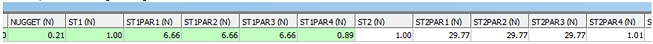
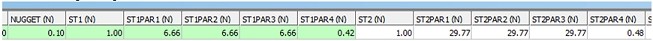

# Parameters

To access this screen:

  * In the [**Advanced Estimation**](<Multivariate_Dialogs_Overview.md>) wizard, click **Parameters**.

This screen is part of the **Advanced Estimation** wizard. It is used to export or import predefined parameter files from and into your estimation workflow.

### Import Parameters

Once a [sample file](<Multivariate_Select_Samples.md>) and [prototype model](<Multivariate_Select_Prototype.md>) are defined, you can import parameter files that relate to these two items. When files are imported, it is assumed that a model and samples are already defined. Validation checks will be performed to ensure the fields represented by the imported table data are relevant to the model and samples, particularly with regards to zone and grade variable specification.

If mismatches are found, they are described in the Output control bar. You will need to resolve these before proceeding as issues in imported data can prevent an estimation from being run, or produce incorrect/unexpected results.

**Note** : You can import any combination of estimation parameter files using the **Parameters** screen. For example, if required, you can just import a variogram model file.

All estimation parameter files must be specified on this form for import to take place, including:

  * An [estimation parameter file](<Grade%20Estimation%20Parameter%20File.md>). If angular estimation parameters are contained, the [Estimate Angles](<Multivariate_Select_Prototype_EstimateAngles.md>) screen will be automatically updated with imported information. If there are more than one angular estimation records in the file, then the first estimation record is used as reference and the input variables from any subsequent estimation records (which matches the reference estimation) are added to it.

The parameter file can have records for both angular and grade interpolation. For grade interpolation, the variable fields are the input grades which are matched against the sample data. If the grade does not match, an error message is displayed during estimation file import.

More information on these files can be found in the [COKRIG](<../Process_Help_XML/cokrig.md>) process help file.

  * A field list table containing field names. This is a file that contains field names of input variables to be used for estimation (which must be present in the input samples file) and output variables to be included in the file specified by output grade model. 

  * A variogram model: if multivariate estimation runs have been defined, this file must contain the columns **GRADE** and **GRADE2**.

  * Search parameters: this must contain the following 12 mandatory fields: 

    * **SREFNUM** which is used to store a reference number for each record which is then specified by the **SREFNUM** parameter in **COKRIG**. 

    * **SDIST1** , **SDIST2** , **SDIST3** specifying the search distances in the **X** , **Y** and **Z** directions respectively. 

    * **SAXIS1** , **SAXIS2** , **SAXIS3** specifying the first, second and third axes which the search volume is to be rotated around (1 = x, 2 = Y, 3 = Z). 

    * **SANGLE1** , **SANGLE2** , **SANGLE3** which specify the clockwise angles which search volume is rotated around the axes specified by **SAXIS1** , **SAXIS2** , **AXIS3**. 

    * **MINNUM1** which is the minimum number of samples required per estimate

    * **MAXNUM1** which is the optimum number of samples to be used per estimate. 

  * Custom zones parameters: this must be specified if soft zones are to be used. It contains the following fields: 

    * **ZREFNUM** (numeric) - the soft zone reference number. 

    * **ZONE1** : (numeric or alphanumeric; same as **ZONE1_F**) this contains values of **ZONE1_F** , the first field used for zone selection. 

    * **ZONE2** : only included if **ZONE2_F** has been specified (numeric or alphanumeric; same as ZONE2_F) this contains values of **ZONE2_F** , the second field used for zone selection. 

    * **DESCRIPTION** : Description of soft zone **ZREFNUM**. 

    * **COUNTFLD** : Name of the optional field created in output model indicating the number of samples from **ZONE1** and/or **ZONE2** THAT were used in estimation. 

  * **Unfolding parameters** : if you are estimating using unfolded samples, an unfolding parameters file (as generated by the **[UNFOLD](<UnfoldWizard.md>)** wizard) has been loaded and potentially modified using the Advanced Estimation console. Export an up-to-date unfolding parameters file here.

#### Convert Normalized Variogram

Variogram models (Variograms) structures can be represented with the true variance or variances normalized to the sill (or sample variance). Variograms with the true variance display the nugget (C0) and each structure (C1, C2..) as variances that when summed equal to the variance of the samples. This variogram might look like this:

In this example of a variogram with the true variance, the sill value is 2.11 (Calculated from C0 + C1 + C2 or 0.21 + 0.89 \+ 1.01).

Variograms could also be normalised to the variance of the sill. This means that all structure variances are divided by the true sill value (C0+C1+C2..). For these variograms, the sum of the nugget (C0) and each structure equal 1. This is done so variograms are easier to compare to each other. This variogram might look like this: 

In this example of a normalized variogram, the sill value is 1.00 (Calculated from C0 + C1 + C2 or 0.10 + 0.42 + 0.48)

When converting a variogram model to have true variance, the sample variance is assumed as the true variance for the sill value.

The results from a kriging process like **COKRIG** or **ESTIMA** are the not affected by the type of model. However non-linear processes, like Uniform Conditioning, require a variogram model to have the true variance. Both types of variogram are correct, and is just a different choice of convention.

Datamine Supervisor saves variograms as normalized by default (this setting can be changed in any Supervisor project), however Advanced Estimation Variography displays variograms using the true variance. To display Supervisor variograms in Advanced Estimation, there is a tool to automatically convert a normalized variogram to a variogram with the true variance of the sill. 

In order to convert a variogram, the sample file and zones need to be selected on the [Select Samples](<Multivariate_Select_Samples.md>) panel. You have the option to convert normalized variograms when importing using the [Fit Models](<Multivariate_Fit_Models.md>) or this Import Parameters panel. 

  * Clear: clear the current panel details.

  * Import: import the files listed above.

  * Export: export the files listed above.

To import estimation parameters:

  1. Import mode is enabled by selecting the **Import** radio button.

**Tip** : Import Parameters can also be used for importing [ESTIMA](<../Process_Help_XML/estima.md>) format parameter files.

  2. Specify if imported data is in **ESTIMA** or **COKRIG** format:

     * If you are importing parameter files suitable for **ESTIMA** , check **Use ESTIMA format file(s)**.

     * If parameter information being imported is in a format natively recognizable by COKRIG, leave **Use ESTIMA format file(s)** unchecked.

See [Import ESTIMA Parameters](<Import%20ESTIMA%20Parameter%20Files%20into%20COKRIG.md>).

  3. Locate the file(s) to import using the respective browse button:

     * Estimation parameters

     * Field names

     * Variogram model

     * Search parameters

     * Custom zones parameters

     * _Unfolding parameters_. See [Unfolding](<Multivariate_Unfold.md>).

  4. Choose to convert the normalize variogram during import or not:

     * If Convert normalize variogram to true variance of the sill is checked, all structure variances are divided by the true sill value (C0+C1+C2..).

     * If Convert normalize variogram to true variance of the sill is unchecked, structure variances are not normalized.

See "Convert normalized variogram to true variance of the sill" above, for more information.

  5. Click **Import**.

Affected Advanced Estimation screens are updated to reflect the imported parameters.

### Export Parameters

To export Advanced Estimation parameters:

  1. Select the Export radio button. 

  2. Either specify or locate a folder to store your output file for each category.

**Note** : If Use Default is checked, files are exported to the current project directory using the default file names for each data category. Unchecking this option lets you set custom file names and locations for each item. A default name is comprised of the Output model ([Select Prototype](<Multivariate_Select_Prototype.md>) panel) and a standard suffix.

  3. If **Angled Estimation** is checked, the angular estimation parameters defined on the [Estimate Angles](<Multivariate_Select_Prototype_EstimateAngles.md>) screen is included in the export. If unchecked, angular estimation parameters are not exported.

  4. Click **Export**.

**Note** : The Export button is unavailable until at least one exportable table is specified.