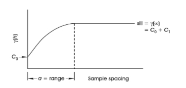

# Investigate Anisotropy

To access this screen:

  * In the [**Advanced Estimation**](<Multivariate_Dialogs_Overview.md>) wizard, select **Investigate Anisotropy**.

The Investigate Anisotropy screen is used to generate a 3D variogram in all directions, presented in a dedicated 3D viewing window to identify directions of spatial continuity. Continuity is indicated by colour bands of the average variance. The chosen orientation should align with the maximum grade continuity (that is, the direction where similar grades can be seen). 

_A 3D variogram displaying the major axes (and a 3D type)_

This 3D Variogram model should be interpreted with respect to sample data, to ensure the anisotropy is expected relative to the data and the geological setting. This orientation is used for setting the reference plane for variogram modelling. 

If you wish to view your samples in conjunction with the generated variogram map, the borehole identification attribute must be called "BHID". Non-standard borehole IDs are not supported. If no BHID field can be found, the map will still be generated, but you will not be able to view the samples file.

### Defining Lag Values

The [3D Variogram](<Variogram_Window.md>) window shows a variance model coloured according to standard legend bins representing bands of continuity from high correlation between samples (below sill) to no correlation between sills (above sill). These legend colours and thresholds are adjustable with the legend slider. 

The separation distance of sample data pairs is referred to as lag, and the plotted value is the average variance at that separation distance. As the lag distance increases, so the variances changes. Typically, the variance increases up to the sill after which the variance falls above the sill. Once the variance increases above the sill, the sample separation is such that there is no longer relationship between samples. Often at large distances the where the variance drops below the sill which implies correlation, but this is more likely noise and should not be interpreted as correlation. 

By default, **Lag** is calculated as 1/10 of the **Maximum Lag** distance, but can be adjusted.

A suitable initial value is in the order of your sample spacing. Choosing a suitable value should show an area of high continuity in the centre of the 3D variogram. The default Maximum lag value at half the maximum distance between samples, however this may be reduced so the variance map is focused around the area of interest (for example, the maximum lag might be set as 10 x the lag value).

Lag can also be adjusted once a variogram map exists, using the **3D Variogram** ribbon's Lag value. 

**Note** : If applying a new lag setting using the 3D Variogram ribbon (when a 3D view already exists), there may be a small delay whilst all views are recreated and re-displayed.

For example, choosing a lag value that is too high hides a highly-continuous area that would otherwise be used for aligning to a major axis. Reducing the lag allows the high continuity zone to be displayed and then either manually or automatically aligned.

The semivariogram below shows the average similarity of nearby sample pairs at low values of **Lag** at low separation distances in the area of interest (y(h)), and is calculated for a series of lags and plotted against the Lag to create a variogram plot.

It also shows the systematic increase in y(h) as sample spacing increases and the eventual plateauing of variability beyond a given sample spacing (a). (a), therefore, represents the point where no correlation can be established between the samples. This is the sill.

Co is a random component of variability for all spacings. The average range of influence of a sample is therefore Lag = a):

In addition to the above, you can also determine the number of blocks that will exist in the output model. This will be a cube of a specified n blocks in each of the 3 axes.

As an input to the estimation process, a variogram is invaluable; in Studio you can create a 3-dimensional variogram representing three orthogonal directions. The resulting 3D result is shown in the 3D Variogram window.

The aim is to calculate variability for any sample separation distance, in any direction. These are called the _Primary_ , _Secondary_ and _Tertiary_ views.

### Generate a 3D Variogram

To generate a 3D variogram map:

The procedure below assumes that a [scenario has been created](<Multivariate_Scenario_Setup.md>) and [samples have been defined](<Multivariate_Select_Samples.md>).

  1. Review the **Variogram map file**. This file name is generated automatically. This is a 3D variogram map (block model) file that will be generated for the grade and zone selected below.

  2. If zones have been specified during the **Select Samples** step, a zone value can be selected using the **Select zone** list. This will constrain variogram calculation to the zone (or zone combination if specified during the [Define Custom Zones](<Define_Zones.md>) stage.

  3. Choose the estimation variable from the **Select variable** list. This contains all variables picked when defining your samples.

  4. Review the Max distance between samples. This distance is calculated from the input samples data set (drillholes or points) and is used to determine an appropriate Maximum lag and default Lag value (see below).

  5. Define the Maximum lag permitted for the input data set. It is calculated as 50% of the Max distance between samples (see above). Values above Max distance between samples (see above) are unattainable. Typically, a value of 10 x the lag is sufficient.

  6. Set the default Lag value to be used for anisotropic analysis and 3D map creation. Typically, a value of the average sample spacing between drillholes or sample points is suitable. This is an editable field. 

Note: You can also edit and apply a new global lag value after the 3D variogram is created, using the **3D Variogram** ribbon's Lag field.

  7. Choose how big your want your output block model to be by setting the **Number of blocks**. The specified value will determine the cube size for the output model, using the value to denote the number of blocks present along each major axis.

  8. Click **Create Variogram Map** to calculate the 3D variogram for the inputs and display it in the 3D Variogram window.