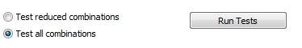
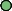
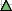
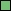
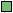
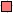
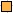
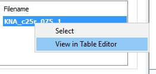
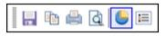

# KNA: Optimize

To access this screen:

  * **Advanced Estimation** wizard **> > KNA >> Optimize**.

This panel offers three sets of estimation parameters that can be optimized. It also provides **Chart Options** to display the results of each optimization.

This panel is only visible if Supervisor data is not being imported. You decide this using the [Scenario Setup](<Multivariate_Scenario_Setup.md>) screen.

### Variogram Model

A summary of the variogram model set that was chosen previously from the **Select Locations** panel is shown in the top left corner of this panel. If the model set includes models for the multivariate case then this option can be selected by ticking the cokriging box. Otherwise a variable should be selected from the **Select variable** drop down for a univariate optimization.

### Optimizations

The inputs to each set of optimizations are defined in subpanels on the left of the main panel. The three subpanels are for optimizing:

  * Number of discretization points
  * Block size
  * Search parameters

Each sub-panel has a series of inputs that are specified in an identical manner by five numbers that define a range of values for each input. 

### Test Combinations

For each optimization there are multiple inputs that can have multiple values so the number of possible combinations can be large. For example the **Optimize Discretization** sub panel has three inputs, to define the number of points in X, Y and Z. If X has 10 values, Y has 8 and Z has 6 then if **Test all combinations** is selected there will be a total of 10*8*6 = 480 combinations.

There is an option to run with a reduced number of combinations. In this case each input is run with just the _Base_ value for the other inputs in the same optimization set as well as the **Base** values for the inputs in the other optimization sets. In the above example, if the **Base** value for each of X, Y and Z were 3 and **Test reduced combinations** were selected, then the following combinations would be used:  
  
X| Y| Z| Combinations  
---|---|---|---  
1,2 ......10| 3 (Base)| 3 (Base)| 10  
3 (Base)| 1, 2.....8| 3 (Base)| 8  
3 (Base)| 3 (Base)| 1,2 .....6| 6  
  
The above values would give a total of 10+8+6 = 24 combinations.

**Note** : Advanced Estimation is part of the Studio RM toolset. Additional licensing modules aren't required.

### Chart Options

The Chart Options area includes multiple choices for displaying the data as described below or alternatively the KNA results file can be input to the **Charting >> Point/Line Plot** process.

Variable of interest: The grade variable. There is a separate set of results for each grade.

Measured value (y-axis): The estimation statistic to be shown on the Y-axis. For example the Block Covariance

Order by (x-axis): The input parameter to be shown on the X-axis. For example the number of discretization points in X.

Group on x-axis by: Not implemented in this version.

Group on separate graphs by: Not implemented in this version.

**Group on separate tabs by** : Select a key field so that the chart for each key value is shown on a separate tab. For **Optimize Block Sizes** and **Optimize Search Parameters** the **Test Block Group** can be selected, i.e. results for locations **Well informed** , **Moderately informed** and **Sparse** are displayed on separate tabs. 

If displayed on the same tab, you can differentiate the level of information about the values by the shape symbol and the color differentiates the type of value being shown (mean, minimum, maximum and standard deviation). This formatting is explained further below.  

Display on chart: select the values (**Mean** , **Minimum** , **Maximum** , **Standard deviation**) to be shown. This is best used when **Line chart** is also selected, although can also be useful for scatterplots. Each symbol on the chart (line or scatterplot) will be given a shape symbol to represent the sample support:

| This data is well informed  
---|---  
| This data is moderately informed  
| This data is sparse  
  
In addition to the shape symbol, a color represents the type of data being displayed (which is required when showing multiple block groups on the same chart, using the **Group on separate tabs** by options.

| Mean average values are shown in green  
---|---  
| Minimum values are shown in blue  
| Maximum values are shown in red  
| Values representing standard deviation are shown in gold  
  
Scatterplot / Line chart: Select the required option - display either a **Line chart** or **Scatterplot**.

**Previous KNA runs** : The results of each KNA run are saved in a file with the template name of KNA_samples_n where samples is the input sample file and n is a sequence number. Double click to select a previous results file to display. 

The KNA results file can be opened in the **Table Editor** from the **Project Files** control bar, or by right-clicking an item and selecting **View in Table Editor** , e.g.:  
  

### Chart Toolbar

The Chart toolbar is displayed at the top of the main chart area. The options are:

  * Save chart
  * Copy chart
  * Print chart
  * Print preview \- [Charts - Print Preview](<../PLOTS_LOGS/Charts_PrintPreview.md>)
  * Switch 3D mode
  * Show / hide legend