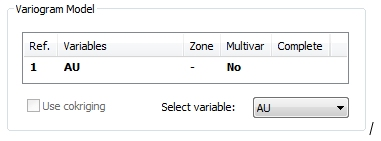
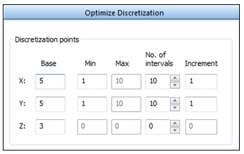
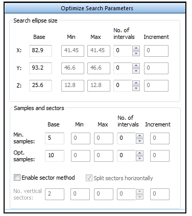
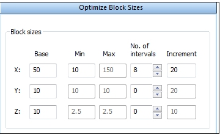
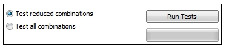
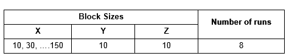
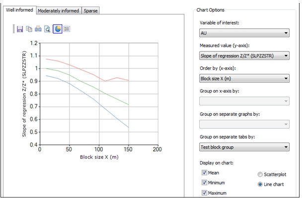
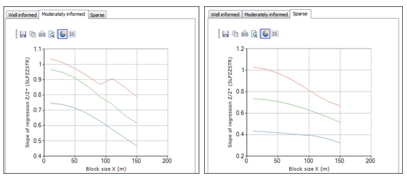

# KNA: Optimize Block Sizes

To access this screen:

  * **Advanced Estimation** wizard **> > KNA >> Optimize>> Optimize Block Sizes**.

This panel is used to help determine the optimum block size. A range of statistical parameters are calculated and a **Block Size** chart is displayed to show the relationship between each parameter and one of the block dimensions.

This panel is only visible if Supervisor data is _not_ being imported. You decide this using the [Scenario Setup](<Multivariate_Scenario_Setup.md>) screen.

Define the size of a model cell in each of the X, Y and Z directions by entering the minimum size, the number of intervals and the increment between successive values for each of the three directions as described in the Optimize section. 

The calculation of statistics also needs the number of discretization points in each direction to be defined; these are defined by the Base values selected in the Optimize Discretization sub-panel. In addition a set of search volume parameters, defined by the Base values in the Optimize Search Volume sub-panel, must exist. 

**Tip** : check the **Base** values in both Optimize Discretization and Optimize Search Volume sub-panels before running a test.  

### Example

In the following example, only the X block size changes while the block size in **Y** and **Z** is fixed at 10m.

#### Inputs- Variogram Model

The variogram model has been selected by double clicking the required model in the **Variogram Model** area of the **Optimize** panel:

;>)

This example is based on a single structure spherical anisotropic model with the following parameters:

  * **Nugget** : 0.35

  * **Sill** : 3.87

  * **Rotation** : 22.5 degrees around Z|

  * **Ranges** : X - 82.8, Y - 93.2, Z - 25.6

#### Inputs- Discretization

These parameters are defined by their Base values in the Optimize Discretization sub-panel:

  * Number of discretization points:
    * X: 5
    * Y: 5
    * Z: 3

The **Optimize Discretization** panel looks like this:

;>)

#### Inputs- Search Parameters

These parameters are defined by their **Base** values in the **Optimize Search Parameters** sub-panel:

  * The lengths of the search volume axes:
    * X: 82.9
    * Y: 93.2
    * Z: 25.6

**Note** : the initial default values are set equal to the maximum variogram ranges in each direction.

  * Minimum number of samples: 5
  * Optimum number of samples: 10
  * Segment method: not applied

In the image below only the **Base** values are used for optimizing the block size.

;>)

The following parameters are defined using the **Optimize Block Sizes** sub-panel:

;>)

**Note** : Increment values are rounded up to the nearest integer. 

#### Inputs - Combinations

The **Test reduced combinations** option is checked:

This ensures a total of 8 KNA runs. The combinations of values to be tested are:

**Run Tests** starts the KNA runs.

##### Outputs Slope of Regression

The chart display option **Group on separate tabs by** has been selected as _Test block group_ so the results for each location are shown on different tabs.

The results for the **Well informed** location are shown below. The mean slope of regression(green line) has a value of 1 for a block size in X of 10m but reduces as the block size increases:

;>)

The corresponding charts for the _Moderately informed_ and _Sparse_ locations are shown below. The mean regression slope for _Moderately informed_ is similar to _Well informed_ , but the mean slope for _Sparse_ is considerably lower reflecting the lower sampling density: 

;>)

### Statistical Parameters

The table below shows the statistical parameters that are reported for each run. These parameters appear in the Measured value (y-axis) list:

Name | Field | Description  
---|---|---  
Average time per block (ms) | TIME_MS | Processing time for each model block.  
Corr(Z, Z*) | CORZZSTR | Correlation between actual value and estimate.  
Cov(Z, Z*) | COVZZSTR | Covariance between actual value and estimate.  
Cov(Z1*, Z*) | COVZ1SZS | Covariance between two estimates multivariate case only.  
Kriged estimate | EST | Kriged block estimate.  
Kriging efficiency | KRIGEFF | Comparative measure of confidence in block estimate.  
Lagrange parameter | LAGRANGE | Lagrange parameter when solving kriging matrix.  
Number of samples | NUMSAMP | Number of samples used for block estimate.  
Search volume index | SINDEX | Search volume index used for block estimate.  
Slope of regression Z/Z* | SLPZZSTR | Slope of regression of actual value on estimate.  
Sum of pos. weights | SUMPOSWT | Sum of positive weights.  
Variance | VAR |  Kriging variance.  
Variance of Z* | VARZSTR |  Variance of the estimator (Z*)  
Weight of mean | WTOFMEAN | Weight assigned to mean of simple kriging.  
  
Related topics and activities

  * [Kriging Neighbourhood Analysis](<KNA-Introduction.md>)

  * [Select Locations](<Multivariate_KNA_SelectLocations.md>)

  * [Optimize](<Multivariate_KNA_Optimize.md>)

  * [Optimize Discretization](<Multivariate_KNA_Optimize_Discretization.md>)

  * [Optimize Search Parameters](<Multivariate_KNA_Optimize_SearchParameters.md>)