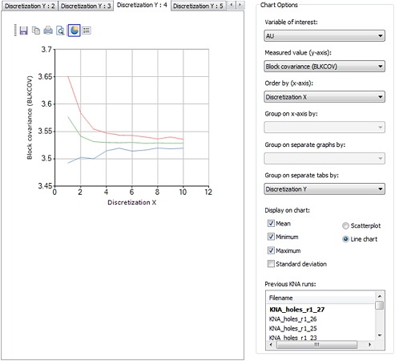
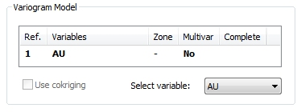
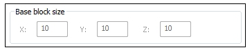
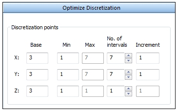
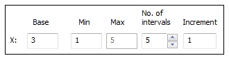

# Optimize Discretization

To access this screen:

  * **Advanced Estimation** wizard **> > KNA >> Optimize>> Optimize Discretization**.

Determine the optimum number of discretization points for calculating the block covariance (BLKCOV).

A 3D array of discretization points is used to represent the model cell for the purpose of calculating the block and block-point covariances that are required for setting up the kriging equations.

The points are located symmetrically within the model cell so that each point represents an equal 3D rectangular volume. Further details of the block covariance are given at the end of this page. In general terms; as the number of points increases the accuracy of the covariance increases but the processing time also increases.

Consider the following example, where BLKCOV decreases from about 3.667 when there is 1 discretization point in X to 3.637 when there are 8 points. However, there is no real gain in accuracy after about 6 points.

### Block Covariance Value

The Block Covariance (BLKCOV) value is calculated as the difference between the total sill of the variogram model and the average value of the variogram over the entire block. The average variogram value is approximated as the average value between each pair of discretization points. This is acceptable when pairing a discretization point with a different discretization point but when a discretization point is paired with itself the variogram value will equal the nugget which will under-estimate the average value in the 3D rectangular volume that the point represents. 

To compensate for the under-estimation an additional discretization point is generated which lies at random within each 3D rectangular volume that each discretization point represents. The variogram value for the point with itself is then calculated as the value between the central discretization point and the random point. This value is used instead of the nugget variance when calculating the average value of the variogram over all pairs of points. 

The random component means that multiple runs with the same set of parameters will not give exactly the same results. However a review of the mean, minimum and maximum values is more than sufficient to determine a suitable number of discretization points.

### Discretization Example

In this example, the variogram model has been selected by clicking the required model in the **Variogram Model** area of the **Optimize** panel. This example is based on a single structure spherical anisotropic model with the following parameters:

  * Nugget: 0.35 Sill: 3.87 Rotation: 22.5 around Z

  * Ranges: X 82.9, Y 93.2, Z 25.6

The block dimensions are defined by their values shown in the Base block size area. 

**Note** : These values can be changed by editing the **Base** values on the Optimize Block Sizes sub-panel.

The Optimize Discretization table is filled out thus:

The number of points in X and Y range from 1 to 7 while the number in Z is fixed at 3. Increment values are rounded up to the nearest integer

The **Test all combinations** option is selected.

This creates a total of 10x10x1 = 100 KNA runs. Clicking **Run Tests** starts the KNA runs. A progress message is displayed in the Command Window.

The chart below shows the number of discretization points in X, on the X axis, and the Block covariance on the Y axis. 

Discretization Y has been chosen from the **Group on separate tabs by** list. This means there is a separate tab for each of the 10 values of _Discretization Y_. The tab for 6 discretization points in Y is displayed.

The coloured lines show the mean (green), minimum (blue) and maximum (red) values of the Block Covariance.

It can be seen that there is no real change in the mean Block covariance value after 4 discretization points in both X and Y, with 3 in Z, so there is no point in selecting more than that.

The full set of results are available in the KNA results file KNA_holes_r1_27 which can be opened in the Table Editor from the Project Files control bar.

The **Block Covariance** (BLKCOV) value is calculated as the difference between the total sill of the variogram model and the average value of the variogram over the entire block. The average variogram value is approximated as the average value between each pair of discretization points. This is acceptable when pairing a discretization point with a different discretization point but when a discretization point is paired with itself the variogram value will equal the nugget which will under-estimate the average value in the 3D rectangular volume that the point represents. 

To compensate for the under-estimation an additional discretization point is generated which lies at random within each 3D rectangular volume that each discretization point represents. The variogram value for the point with itself is then calculated as the value between the central discretization point and the random point. This value is used instead of the nugget variance when calculating the average value of the variogram over all pairs of points. 

The random component means that multiple runs with the same set of parameters will not give exactly the same results. However a review of the mean, minimum and maximum values is more than sufficient to determine a suitable number of discretization points.

### Optimize Discretization Points

To determine the optimum number of discretization points for calculating block covariance:

This activity assumes a variogram model has been calculated and [fitted](<Multivariate_Fit_Models.md>). KNA locations have also been **[selected](<Multivariate_KNA_SelectLocations.md>)**.

  1. Review the **Variogram Model**. This was selected on the [KNA: Select Locations](<Multivariate_KNA_SelectLocations.md>) screen, and displays the variogram Description, Variables, Zone, Multiva (No=univariate) and whether KNA optimization tests have been run and completed or not. These values are read-only.

  2. Optimization can be performed with respect to any estimation variable. In a multivariate case, expand **Select variable** and pick a value.

  3. Expand the **Optimize Discretization** panel.

  4. Define the number of discretization points within a model cell in each of the X, Y and Z directions. This is done by entering the **Base** , **Minimum** , **No. of intervals** and **Increment** for each of the three directions as described in the Optimize section. The **Max** value adjusts automatically as other values change.

For example:

     * **Base** : This value is used when the estimation parameters for one of the other subpanels are being optimized. It is also used when running the **Test reduced combinations** option.
     * **Min** : The minimum value of the current input
     * **Max** : The maximum value of the current input. This is calculated automatically by the process.
     * **No. of intervals** : The number of values to be used for the current input
     * **Increment** : The increment between successive values for the current input.

The values used for X in the above example are therefore 1, 2, 3, 4 and 5.

**Note** : The **Base block size** is shown on this screen for reference. It is configured using the [KNA: Optimize Block Sizes](<Multivariate_KNA_Optimize_BlockSizes.md>) screen. The BLKCOV calculation also needs these dimensions. You should always check that the dimensions shown in the _Base block size_ area are your required values.

  5. Configure block dimensions using the [KNA: Optimize Block Sizes](<Multivariate_KNA_Optimize_BlockSizes.md>) panel.

  6. Configure search ellipsoid dimensions and sample or sector constraints using the [KNA: Optimize Search Parameters](<Multivariate_KNA_Optimize_SearchParameters.md>) screen.

  7. Choose to run either all or reduced combinations. See [KNA: Optimize](<Multivariate_KNA_Optimize.md>).

  8. Review the charted results. See [KNA: Optimize](<Multivariate_KNA_Optimize.md>).

Related topics and activities

  * [Kriging Neighbourhood Analysis](<KNA-Introduction.md>)

  * [KNA: Optimize](<Multivariate_KNA_Optimize.md>)

  * [Select Locations](<Multivariate_KNA_SelectLocations.md>)

  * [Optimize Block Sizes](<Multivariate_KNA_Optimize_BlockSizes.md>)

  * [Optimize Search Parameters](<Multivariate_KNA_Optimize_SearchParameters.md>)