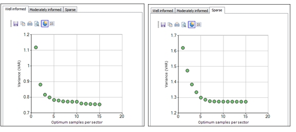

# KNA: Optimize Search Parameters

To access this screen:

  * **Advanced Estimation** wizard **> > KNA >> Optimize>> Optimize Block Sizes**.

Determine the optimum search parameters, such as search volume dimensions, minimum number of samples, optimum number of samples per sector and the number of sectors.

he same range of statistical parameters are calculated as for the **[Optimize Block Sizes](<Multivariate_KNA_Optimize_BlockSizes.md>)** screen.

A chart is displayed to show the relationship between each statistical parameter and one of the input search values.

### Optimize Search Parameters Example

In the example below, the Optimum Number of Samples per Sector is shown on the X axis and the Slope of the Regression Line on the Y axis of the chart. As the Sector method (see below) has not been enabled, the X axis shows the optimum total number of samples in the search volume.

It can be seen that the value of the _Slope of Regression_ levels out once about 20 samples are selected.

The same variogram model has been used for this run as for the example shown for [Optimize Discretization](<Multivariate_KNA_Optimize_Discretization.md>).

  * The number of discretization points used is 4 in X, 4 in Y and 4 in Z.

  * A block size of 10x10x10 has been selected.

  * The default values for the search ellipse are set equal to ranges of the variogram model.

  * In this example only the Optimum number of samples is tested with values from 1 to 30. 

  * The number of sectors is set to 1 which means that sectors have not been used so only the total optimum number of samples is tested.

The Chart Options that have been selected are shown in the graphic below. The Kriged Variance is plotted on the Y axis against the _Optimum samples per sector_ on X.

The charts for the _Well informed_ and _Sparse_ locations are shown below. As expected, the mean _Kriged variance_ for the _Well informed_ location is significantly lower than for the _Sparse_ location.

In both locations the Kriging variance reaches its minimum for about 7 samples per sector.

### Sector Method

The **Sector** method divides the search ellipsoid into smaller volumes that are similar to orange segments. All sectors have the same angle measured in the horizontal plane through the centre of the ellipsoid before any rotation is applied. Each angle will be 360/n where n is the number of sectors. The sectors can be split into two parts by the horizontal plane, thus doubling the number of sectors.

If the _Sector Method_ is not enabled then the optimum number of samples per sector parameter defines the total number of samples in the search volume. The search method selects the nearest samples that lie within the search volume up to the specified number per sector. If there are insufficient samples within the search volume then the optimum will not be reached. There are two conditions under which more than the optimum may be selected:  

  * All samples that lie within the block being estimated will always be selected
  * If the minimum number of samples (which is global, over all sectors) is not reached and there are some sectors with less than the optimum then samples may be added to sectors that already have the optimum in order to meet the minimum number criteria.

Related topics and activities

  * [Kriging Neighbourhood Analysis](<KNA-Introduction.md>)

  * [Select Locations](<Multivariate_KNA_SelectLocations.md>)

  * [Optimize](<Multivariate_KNA_Optimize.md>)

  * [Optimize Discretization](<Multivariate_KNA_Optimize_Discretization.md>)

  * [KNA: Optimize Block Sizes](<Multivariate_KNA_Optimize_BlockSizes.md>)