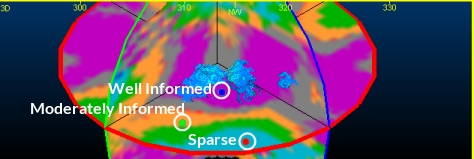

# KNA: Select Locations

To access this screen:

  * **[Advanced Estimation](<Multivariate_Introduction.md>)** wizard **> > KNA >> Select Locations**.

Define the parameters and locations to be used for the [KNA optimization](<KNA-Introduction.md>). The goal is to determine optimum values for parameters to be used in the estimation, such as the number of discretisation points, the block size and the search volume.

This is achieved by selecting up to three areas with different sampling densities, evaluating a set of statistics for a grid of model blocks in each area and displaying a scatter or line plot for each statistic and estimation parameter value. The sensitivity of each statistic to changes in estimation parameter values can then be identified and the optimum values selected.

Activity steps:

This activity assumes a **[scenario has been created](<Multivariate_Scenario_Setup.md>)** and [samples selected](<Multivariate_Select_Samples.md>).

  1. **[Calculate variograms](<Multivariate_Create_Variograms.md>)** and **[fit appropriate models](<Multivariate_Fit_Models.md>)**.

  2. Commit the defined estimation for KNA, using the [Save Models](<Multivariate_FitModels_SaveModels.md>) screen.

  3. Field Details:

  4. Use the **Select Variogram** table to pick the model set used for KNA. Do this by double clicking a row in the table.

**Note** : Once a variogram appears in bold, it is active and KNA parameters can be defined.

  5. Next, define model block grid settings. There are two ways to achieve this:

     * Check **Define from Prototype** and select an existing prototype model.

     * Uncheck **Define from Prototype** and specify:

       * The model **Origin** in 3D world coordinates (X/Y/Z).

       * The **Initial block size** , the default base block size for subsequent optimizations.

       * The **Model rotation** by choosing the **First** , **Second** and **Third** rotation Angle and **Axis**.

  6. Select up to three areas within which KNA analysis is performed.

     * Well informed

     * Moderately informed

     * Sparse

The analysis can be presented separately for each area or averaged over all areas. The names are intended to describe areas with different sampling densities but could be used for other purposes.

     1. If not already displayed, [Investigate Anisotropy](<Multivariate_Investigate_Anisotropy.md>) and leave the [3D Variogram window](<Variogram_Window.md>) on display.

     2. Load drillhole data into the **3D Variogram** window.

     3. Highlight a KNA category by selecting the corresponding table row.

     4. Click the **Select in 3D window** arrow button.

     5. Click a point in the 3D window that represents the KNA description (that is, high sampling, medium or sparse).

The coordinates of the point display in the **Select Locations** table and indicated in the 3D view as a coloured disc. 

     6. Repeat the procedure for the remaining KNA categories, for example:

  7. Define the number of **Total test blocks** for KNA. In essence, each location point lies with a grid of cells, with a fixed number of cells in each direction. The default values are 3x3x3 test blocks in each direction, meaning 27 blocks in total.

This cuboid grid represents the size of the grid around each location that is considered when optimizing parameters.

  8. Before moving on to the [Optimize](<Multivariate_KNA_Optimize.md>) panel make sure a variogram model set is highlighted in the **Select Variogram** table.

Related topics and activities

  * [Kriging Neighbourhood Analysis](<KNA-Introduction.md>)

  * [KNA: Optimize](<Multivariate_KNA_Optimize.md>)

  * [Optimize Discretization](<Multivariate_KNA_Optimize_Discretization.md>)

  * [KNA: Optimize Block Sizes](<Multivariate_KNA_Optimize_BlockSizes.md>)

  * [KNA: Optimize Search Parameters](<Multivariate_KNA_Optimize_SearchParameters.md>)