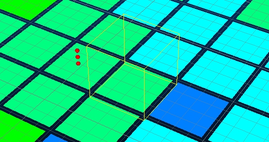

# Run Estimations

To access this screen:

  * **[Advanced Estimation](<Multivariate_Introduction.md>)** wizard >> **Run Estimations**.

See a summary of all the inputs to the estimation process and launch configured estimation runs. 

The process validates inputs before running the estimation. If any problems are identified they are reported so you can rectify issues beforehand. 

The panel is split into the following general areas:

  * The Sample/Model Summary section contains read-only information indicating the input samples driving the process, the input model and whether you are using zonal control to focus the estimation.

**Note** : The output model name was set on the Select Prototype screen.

  * The Estimation summary lists all estimations ready to be run. The table items can be selected, which will automatically update the panel to show the details for that run. Each estimation is described by its Type (Ordinary Kriging, Simple Kriging, Nearest neighbour etc.), the variable (univariate) or variables (multivariate) to be used, the Zones that are considered, the type of output and discretization scope (Disc.)
  * The Parameter Files area displays the outputs to be created by the estimation run. 

The following files are generated:

    * An Estimation parameter file  

    * A Search Parameter file

    * A Field names file

    * A Variogram file

    * A Custom zone parameter file if custom zones have been defined for **[soft boundary analysis](<Define_Zones.md>)**.
    * Optionally, you can generate a SAMPOUT file. This output sample file contains details of weights for each sample for each cell estimated. It can also be useful in determining the number of samples contributing to the estimation of a cell or sub-cell, and the location of those samples. This is used in both the [**show-samples**](<../command_help/show-samples.md>) and [**show-samples-subcells**](<../command_help/show-samples-subcells.md>) commands to display 3D window information about selected model cells.  
  
  
_Example of the Show Samples command running with selected cell and contributing sample points in red._  

  * The **Display Results** area at the bottom of the panel allows you to select a subset of the results and generate a set of statistics.
    * Click Display to load the output model and display it in the 3D Window, using a default legend for the selected grade variable. If zonal control is used, you can optionally filter the view to display a particular zone.

Related topics and activities

  * [Advanced Estimation Introduction](<Multivariate_Introduction.md>)
  * [Scenario Setup](<Multivariate_Scenario_Setup.md>)

  * [Select Samples](<Multivariate_Select_Samples.md>)

  * [Unfolding](<Multivariate_Unfold.md>)

    * [UNFOLD in Advanced Estimation](<Unfold-advanced-estimation.md>)

    * [UNFOLD Parameters](<Unfold-parameters.md>)

  * [Define Custom Zones](<Define_Zones.md>)

  * [Bivariate Statistics](<Bivariate_Statistics.md>)

  * [Investigate Anisotropy](<Multivariate_Investigate_Anisotropy.md>)

  * [Create Variograms](<Multivariate_Create_Variograms.md>)

  * [Fit Models](<Multivariate_Fit_Models.md>)

  * [KNA: Select Locations](<Multivariate_KNA_SelectLocations.md>)

  * [KNA: Optimize](<Multivariate_KNA_Optimize.md>)

  * [Select Prototype](<Multivariate_Select_Prototype.md>)

  * [Parameters](<Multivariate_Import_Parameters.md>)

  * [Define an Estimation](<Multivariate_Define_Estimations.md>)

  * [Review Variograms](<Multivariate_Confirm_Variograms.md>)

  * [Define Search Volumes](<Multivariate_Select_Search_Volumes.md>)