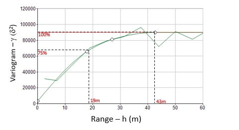

# Define Search Volumes: Select an Estimation

To access this screen:

  * Using the [**Advanced Estimation**](<Multivariate_Introduction.md>) wizard, select the [**Define Search Volume**](<Multivariate_Select_Search_Volumes.md>) menu item. The **Estimation** area is found on the left of the panel.

Each estimation for the current scenario is listed in the **Select an estimation to view or apply variogram models** table.

The summary information for each estimation includes:

  * **Grade** The estimation variable

  * **Zone** The zone or zones to which the estimation applies, if zonal control is used, otherwise absent.

  * **Search volume reference** An index uniquely identifying a search volume. 

  * **Size** The size of the search ellipsoid along each major axis.

  * Min samplesThe number of samples lying within the total search volume must always be greater than or equal to this minimum before an estimate can be made.

If the estimation method is [Inverse Distance](<Multivariate_Define_Estimations.md>) or [Nearest Neighbour,](<Multivariate_Define_Estimations.md>) search parameters are not defined automatically so this list appears empty. In this case a new search volume can be created as described in the **Available Search Volumes** section below. See [Define Search Volumes](<Multivariate_Select_Search_Volumes.md>).

### Create from Variograms

One option is to **Create search volumes from variograms**.

If the default set of search volumes is empty or has been cleared, a new set can be generated using the **Create search volumes from variograms** button at the bottom of the left area.

To create volumes from variograms, a Variance % is required. This is used to create a search parameter file at a given % of the total variogram variance by entering a value from >0 to 100 in this field. The total variance is calculated (NUGGET + sum of ST*N*PAR4 values, for N structures), then the distance at the specified % of that is determined. This length is determined through the range length of the spherical model.

This setting allows for the sizes of search parameters to be determined from variogram models, at ranges given a percentage of the total variance. These ranges are calculated directly from the variogram model, in the X, Y and Z directions. Each of these distances are used for the in the search parameters (**SDIST1** , **SDIST2** and **SDIST3**), with the same rotation as the variogram model. This is for cases where you wish to limit the search neighbourhood based on the variogram ranges, but retain the anisotropy ratios determined in the variogram modelling. 

A rule of thumb for interpolation is that samples selected for a robust neighbourhood might be found at ranges which are 70 % - 80 % of the total variance. This setting allows you to quickly identify distances at selected percentage variances and set those ranges to limit your primary search neighbourhood. 

Where you see good continuity in your variogram, you might expect to find optimal ranges at lower percentage variance values (that is, a smaller search neighbourhood would provide a robust estimate). In cases where you see a more _nuggety_ variogram with poor continuity, you might expect to find optimal ranges at higher percentage variance values (a larger search neighbourhood would provide a more robust estimate, although your estimates will be more smoothed). The ellipsoid factors can be used to extend the secondary / tertiary searches by a ratio of the primary search neighbourhood. 

The example below shows distances given variances of 75 % of the total variance (sill). In such an example we would samples for the primary search neighbourhood to fall within 19 m of the block being estimated, and thus would use those to limit the primary search at that distance:  
  
  

**Apply to estimations** if checked, search volumes are automatically assigned to the **Estimation** from which the search volume was derived.

Related topics and activities

  * [Define Search Volumes](<Multivariate_Select_Search_Volumes.md>)

  * [Define Search Volume Parameters](<Multivariate_Select_SearchVol_Params.md>)

  * [Define an Estimation](<Multivariate_Define_Estimations.md>)

  * [Grade Estimation Methods](<Grade%20Estimation%20Methods.md>)

  * [Search Volumes](<Grade%20Estimation%20Search%20Volume%20Introduction.md>)