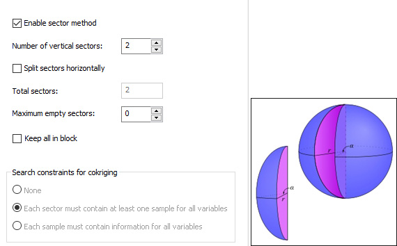

# Search Volume Parameters

To access this panel:

  * Using the [**Advanced Estimation**](<Multivariate_Introduction.md>) wizard, select the [**Define Search Volume**](<Multivariate_Select_Search_Volumes.md>) menu item and an **Available Search Volume**. The parameters are shown on the right of the screen.

Parameters are grouped like this: 

  * **Shape** : Define the shape and orientation of search ellipsoid(s). 

  * **Sample Number Limits** : Define minimum and optimum sample numbers and size factors.

  * **Sectors : Optionally setting up the ****Sector** method divides the search ellipsoid into smaller volumes. 

  * **Outliers** : Perform upper and lower level grade capping, optionally with a distance threshold. 

**Note** : Advanced Estimation is part of the Studio RM toolset. Additional licensing modules aren't required.

### Shape Parameters

This group of controls is used to define the shape and orientation of the search ellipsoid:

**Ref** : the search volume reference number is shown here. This cannot be edited.

**Desc** : initially the default Description is blank. A description of up to 32 characters can be entered.

**Ellipsoid Size** : choose whether your search volume will be Ellipsoidal (default) or Rectangular, then define the lengths of each of the three axes of the search volume.

**Rotation** : up to three rotation angles and the axis about which each rotation is defined are specified here. The rotation angle convention shown here will match that of the Create Variograms panel.

**Display Ellipsoid** : the X, Y and Z text boxes define the coordinates of the centre of the wireframe representing the search ellipsoid to be displayed in the 3D window.

The values can be entered either using the keyboard or by clicking the arrow button and then selecting a point in the 3D window using the mouse. Click the **View ellipsoid** button to create the ellipsoid in the 3D window.

You can also use the following tools to set up ellipsoids:

New Ellipsoid: generate a new ellipsoid and display it at the position defined. You can add one or more ellipsoids

Update Ellipsoid: update the selected ellipsoid to match the values specified in the panel. The selected ellipsoid is highlighted. If multiple ellipsoids are selected, this button is unavailable.

Pick Ellipsoid: select an ellipsoid in the 3D view to review. Only one ellipsoid can be selected using this method.

### Sample Number Limits Parameters

The parameters specified in the **Shape** sub-panel described above define the dimensions of the base search volume. The parameters specified here in the **Sample Number Limits** sub-panel describe the minimum and optimum number of samples and also a set of size factors to increase the base search volume if the number of samples does not reach the minimum.  

**Ellipsoid size factor** : this is the multiplying factor for the search volume dimensions. All three dimensions of the base search volume are multiplied by this value to define a larger volume that will be applied if there are insufficient samples in the previous search volume. The first search volume will always have a size factor of 1. Subsequent size factors must always be greater than the previous size factor.

**Minimum samples** : the number of samples lying within the total search volume must always be greater than or equal to this minimum before an estimate can be made.

**Optimum samples per sector:** sectors can be defined as described in the **Sectors** sub-panel below. The method divides the search ellipsoid into smaller equal volumes (sectors) and the optimum number of samples is then described in terms of the number of samples per sector. If the Sector method is not used (as defined by the Sectors panel), the optimum number of samples will be the same as the Maximum.

This value cannot be lower than the one set for Minimum samples (see above).

**Apply / Add** : the label on this button depends on whether or not a set of parameters has been selected in the table at the top of the subpanel. If a row has been highlighted then the parameters in the row will also be displayed in the three text boxes below which can be edited. The button will then display **Apply -** clicking it will update the values in the table.

In order to create a new set of parameters click in the empty space below the bottom row in the table. The button will now display **Add** and the three text boxes will be empty. Enter values into the text boxes and click **Add**. A new row will be appended to the table.

**Remove** : to remove a row from the table highlight the row and click the button.

**Samples per hole ID BHID** : the **Optimum** and **Maximum** number of samples per hole can be defined in the number boxes. The name of the hole ID field (usually BHID) can be set in the **[Select Samples](<Multivariate_Select_Samples.md>)** panel.

### Sectors Parameters

The **Sectors** method divides the search ellipsoid into smaller volumes that are similar to orange segments. All sectors have the same angle measured in the horizontal plane through the centre of the ellipsoid before any rotation is applied.

Each angle will be 360/n where n is the number of sectors. The graphic shows the case where the search volume is a sphere.

  
;>)

**Enable sector method:** check the box to use the sector method. If the sector method is not selected then all references to sectors will apply to the total search volume, and the Optimum per sector value reported on the Sample Number Limits panel (see above) will be the same as the Maximum.

**Number of vertical sectors:** select the number of vertical sectors.

**Split sectors horizontally** : check the box to split each vertical sector in half at the horizontal plane.

**Total sectors:** if the sectors are not split horizontally this will equal the number of sectors; otherwise it will be twice the number of sectors.

**Maximum empty sectors** : if the number of sectors without any samples (consecutive or otherwise) is greater than this maximum then the grade will not be estimated for this search volume. The next search volume size factor, if defined, will be applied and the number retested.

For example if you define 4 angular sectors and a horizontal split then this would be 4 x 2 = 8 sectors, so the Maximum empty sectors value would have to lie between 0 and 7.

If the Maximum empty sectors is exceeded there will be no estimate.

Keep all in block: if enabled, this will allow the Optimum samples per sector (Sample number limits command group, see above) to be exceeded by including all samples that lie within the block being estimated. The default setting is false, which means this value cannot be exceeded under any circumstances.

**Search constraints for cokriging** : if cokriging has been selected then one of the following options will be applied:

  * None (no additional constraints will be applied for cokriging)

  * Each sector must contain at least one sample for all variables

  * Each sample must contain values for all variables

### Outliers Parameters

The Outliers panel is available to allow grade capping to be performed during univariate estimation. Upper and/or lower grade values can be capped. High value capping will apply capping/cutting above a threshold and low value capping below a threshold. 

If **Enable capping** is **checked** :

  * High/Low Value: choose whether you wish perform high or low value capping.
  * Replace Value/Exclude Value: choose to either replace the values used in the estimate with the pre- and post-threshold values or to ignore these values.
  * Grade: threshold grade is the grade above/below which values are capped (i.e. reset to the threshold) or cut (i.e. excluded) from the estimate. 
  * Choose how distance capping is applied. A distance value caps a sample grade to blocks beyond a threshold distance. If this is set to 0, it is grade capping as it is commonly known. For example, if a sample has a grade of 100g/t, a threshold of 20g/t and a distance of 20m, a block 10m away would see the value as 100g/t. A block 30m away would see the value as 20g/t. 

Capping can be applied either universally or by setting distance constraints in a given direction:

    * **Isotropic** : Choose a global minimum **Distance** of a sample from the block centre beyond which capping/cutting is applied. To apply capping/cutting to all values and effectively ignore distance parameters, set to 0. Setting this option forges a **CAPANISO** =0 value in the search parameter file, along with a global **CAPDIST** value.
    * **Anisotropic** : Perform axis-specific capping, setting per-axis distances rather than a single, global value. Enabling this option allows you to set distance in X, Y and Z directions. This adds **CAPANISO** =1 to the search parameter file for the affected volume, and **CAPDIST1/2/3** fields to record the directional capping distances

Related topics and activities

  * [Define Search Volume](<Multivariate_Select_Search_Volumes.md>)

  * [Define Search Volumes: Select an Estimation](<Multivariate_Select_SearchVol_%20Estimation.md>)

  * [Available Search Volumes](<Multivariate_Select_SearchVol_%20Available.md>)

  * [Search Volumes](<Grade%20Estimation%20Search%20Volume%20Introduction.md>)