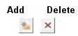

# Variogram Model Set Properties

To access this screen:

  * [**Fit Models**](<Multivariate_Fit_Models.md>) screen **> > Model Parameters tab >> Variogram Model Set Properties**.

  * [**Review Variograms**](<Multivariate_Confirm_Variograms.md>) screen **> > Variogram Model Set Properties**.

Set a custom description for the variogram model set, plus the variable and (if a multivariate scenario) a covariable, picking from one of the variables defined on the [Select Samples](<Multivariate_Select_Samples.md>) panel. Variograms can be added and deleted from the set using the table provided.

#### Validation Feedback

Variogram properties are validated before they are added to the set, and any problems detected appear as a button tooltip.

Error message | Cause  
---|---  
Empty rows found in the models grid.  | One or more rows in the variogram models grid above is empty.   
The variable/covariable pair is defined more than once in the model grid. | If the same variable/covariable pair is defined more than once for a multivariate estimation, processing can't continue as each combination must be unique.  
Failed to save univariate variogram model set as it contains cross variograms. Please check the variogram model grid. | This message is displayed when the variogram model set contains cross variograms but the Multivariate check box has not been enabled.  
Failed to save multivariate variogram model set. Please add variogram models for all the variable pairs.  | This message is displayed when the a multivariate model set has been defined, but not all variable and covariable pairs have been specified.  
  
### Define a Variogram Model Set

The following activity assumes at least one variogram model has been fitted for the active scenario.

To define variogram model sets and each set's respective properties:

  1. Display the **Variogram Model Set Properties** tab.

  2. Review the **Variogram set reference** (this is the VSETNUM value associate with the variogram parameters file for the estimation). You can't edit this value.

  3. Review the Variogram Type, as selected on the **[Fit Models](<Multivariate_Fit_Models.md>)** screen.

  4. If the variogram is with respect to untransformed (or back-transformed) grades, the **Transform** label states "No". If grade values have been transformed, it states "Yes". See [Fit Models](<Multivariate_Fit_Models.md>).

  5. Enter a **Description** for the variogram model set.

  6. If you are controlling your estimation with zonal information, pick a Zone for which the model set relates. All zones (and if they have been defined, custom zones for [soft boundary estimation](<Define_Zones.md>)) can be selected.

  7. Choose if you are setting up variograms for univariate set or cross-variograms for a multivariate case:

     * If Multivariate is **checked** , modify the contents of the variogram model set table below, using the add and delete buttons to insert or remove rows:  
  

You can then pick the Variable and Covariable to which the variogram model relates.

     * If **Multivariate** is **unchecked** , a univariate estimation case is assumed.

  8. Once you've set up the table as you need it, click Validate and Save. 

If any problems occur, they display as button tooltips. See "Validation Feedback", above.

**Note** : Clicking outside of the model set table automatically triggers model set validation.

Related topics and activities

  * [Fit Models](<Multivariate_Fit_Models.md>)
  * [Automatic Model Fitting](<Multivariate_FitModels_AutomaticFitting.md>)
  * [Fit Models Manually](<Multivariate_FitModels_ManualFitting.md>)
  * [Model Parameters](<Multivariate_FitModels_ModelParameters.md>)
  * [Model Parameters](<Multivariate_VariogramParameters.md>)
  * [Save Models](<Multivariate_FitModels_SaveModels.md>)
  * [Format Models](<Multivariate_FitModels_Format.md>)
  * [Advanced Estimation Introduction](<Multivariate_Introduction.md>)