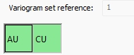

# Model Parameters

To access this screen:

  * [**Fit Models**](<Multivariate_Fit_Models.md>) screen **> > Model Parameters tab >> Parameters**.
  * [**Review Variograms**](<Multivariate_Confirm_Variograms.md>) screen **> > Parameters**.

The Parameters screen displays information about the variogram set for the current estimation scenario. Variables display at the top of the screen in a green, box, for example, in a bivariate case:  
  

The parameters on this screen relate to the selected variable only. Swap between variables in a multivariate case by selecting the relevant green box. A univariate case variable is automatically selected.

### Define Model Parameters

The following activity assumes at least one variogram model has been fitted for the active scenario.

To define variogram model parameters for a target estimation variable:

  1. Display the **Parameters** tab.

  2. For the multivariate case, pick the variable of interest using the green squares displayed at the top of the screen.

**Note** : Where multivariate variograms are selected, if the nugget and/or sill matrices are not positive definite, a warning will be issued indicating the variogram is invalid and that sill and nugget matrices should be reviewed.

  3. Review the **Variogram set reference** (this is the VREFNUM value associate with the variogram parameters file for the estimation). You can't edit this value.

  4. Review (and edit) the **Rotation** table.

This table shows the rotations for the anisotropy axes. 

Choose **Angle** and **Axis** for the **First** , **Second** and **Third** rotation. Angle(s) can be between -360 and +360 degrees.

**Note** : In the multivariate case all rotations and ranges are the same.

  5. Review the **Structure** grid.

This grid displays the nugget and structures for the selected variogram model. All properties other than the fixed **Nugget** or **Structure** index value are editable.

     * **Model** The structure type, which can either be _Spherical_ , _Gaussian_ or _Exponential_.

     * Range X/Y/ZThe ranges for each structure in each axis direction.

     * **Variance** The nugget value for each structure.

  6. Add new structures or delete existing ones using the buttons displayed:

Related topics and activities

  * [Fit Models](<Multivariate_Fit_Models.md>)
  * [Automatic Model Fitting](<Multivariate_FitModels_AutomaticFitting.md>)
  * [Fit Models Manually](<Multivariate_FitModels_ManualFitting.md>)
  * [Model Parameters](<Multivariate_FitModels_ModelParameters.md>)
  * [Variogram Model Set Properties](<Multivariate_VariogramModelSetProperties.md>)
  * [Save Models](<Multivariate_FitModels_SaveModels.md>)
  * [Format Models](<Multivariate_FitModels_Format.md>)
  * [Advanced Estimation Introduction](<Multivariate_Introduction.md>)