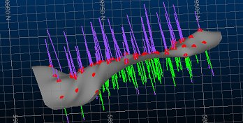
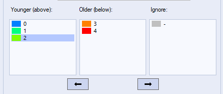
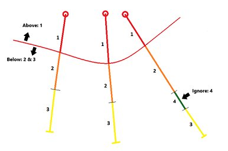
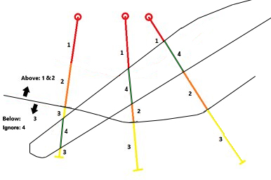
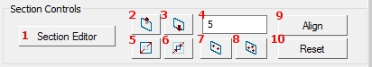
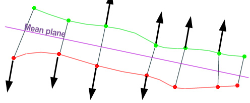
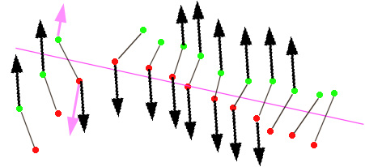
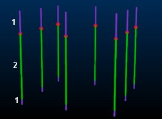
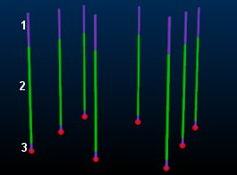
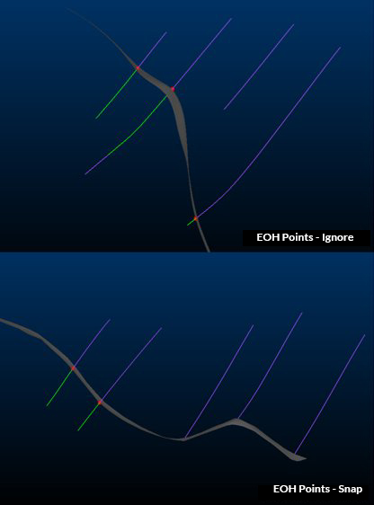

# Create Contact Surface

To access this screen: 

  * **Implicit** ribbon **> > Surface >> Contact Surface**.

  * Display the **[Find Command](<../COMMON/findcommand.md>)** screen, select **surface-from-samples** and click **Run**.
  * Run the command [surface-from-samples](<../command_help/surface-from-samples.md>).

The Create Contact Surface task models the boundary between two groups of contiguous sample attribute values.

Similar to the [[Create Vein Surface](<../COMMON/Create_Vein_Surface.md>)](<../COMMON/Create_Vein_Surfaces_Overview.md>) task, you choose which value(s) represent the upper and lower categorical values between which a surface will be generated. You can optionally specify attributes representing categories to ignore during modelling (for example, a trivial or ignorable intrusion).

This command requires a drillhole data object to exist, containing categorical data that will be grouped within the command and used to calculate a contact wireframe surface.

This command can be used to only work on [preselected sample data](<../COMMON/Create_Vein_Surfaces_1_Data.md>).

You can modify the input contact surface points before generating a new surface, including disabling or reversing points and adding points contained in separately-loaded string objects.

The peripheral shape is determined by your [boundary clipping method](<../COMMON/Vein_Modelling_Boundary_Clipping.md>). 

You can specify one or more [fault wireframes](<../COMMON/Create_Contact_Surfaces_Faults.md>) to generate independent contact surface block data.

A report is generated by this command, with results shown in the Output control bar to indicate the parameters used during processing and whether the command completed successfully (and if not, some suggestions as to what may have gone wrong).

**Tip** : You can also automate this command through a script. See [Create Contact Surface: Automation](<../COMMON/Create_Contact_Surfaces_Automation.md>).

### Implicit Modelling Metadata

Implicit modelling tools store metadata to allow previous settings to be reinstated automatically, and for downstream commands to understand the 'legacy' of input data. See [Implicit Modelling Metadata](<../COMMON/Implicit-Modelling-Metadata.md>).

To model a contact surface:

  1. Load drillhole data containing categorical attribute values to be modelled as a contact surface.

  2. Display the **Create Contact Surface** screen.

  3. Select a loaded static **Drillholes** object containing samples to be used for surface construction.

  4. S elect the data **Column** (attribute) containing the values to be modelled.

All unique **Column** values display in the table below, listed initially in the central column.

  5. All categorical values are initially deemed 'older'. If there are any, move all categorical values representing chronologically more recent domains to the **Younger (above)** list. You can do this either by selecting an **Older** value and pressing the left-facing arrow, or by drag and dropping values from one list into the other.

**Note** : The colour corresponding to the default legend item for each surface value is shown to the left of the attribute value, for example:  
  
;>)

These values are assumed to be contiguous and, by default, a contact point will be positioned at the _first_ point in the downhole direction where all values in this column are above all values in the **Older** column (although you can change this to be the _last_ instance using the **Snapping** controls further below).

  6. Select the key column values that are to be ignored during surface generation, by moving them to the **Ignore** list. For example:  
  
;>)

In this situation (4) represents an intrusion that shouldn't be considered in the surface calculation. Adding (4) to the Below list would achieve the same outcome in this case, however, consider this example:  
  
;>)

In this case, ignoring the intrusion(4) allows a contact surface to be calculated as if the structure wasn't there.

  7. Data can be modelled only if it is **Selected** and/or **Visible** , using a combination of settings. 

     * If **Selected** is **checked** :

       * If no data is selected, everything is modelled.

       * If data is selected, only selected holes are modelled.

If selected is unchecked, all data is modelled regardless of data selection.

     * If Visible is **checked** , only drillhole data that is visible is used for modelling, otherwise data is modelled even if it is filtered from the view.

  8. You can automatically update the current drillholes object legend to highlight either the chronological group to which values now belong or the distinct categorical values of the object. In either case, select **Update drillhole legend** and pick from either:

     * **Group** \- Display the loaded drillholes data in a separate colour for all values in the **Younger** , **Older** and **Ignore** groups.

     * **Lithology** \- Display each drillhole interval with a colour representing the unique values of the selected data **Column**.

  9. If you are defining your own section for surface normal calculation, use the **Section Controls** to configure it.

The Auto Look check box is disabled by default. If enabled, the output surface or volume will automatically be zoomed and centred to the default 3D window. The data will also be rotated to view orthogonally from a trend plane calculated throughout all positive data samples.

String data is digitized onto the current section, which can be modified using the following tools:

;>)

     1. Displays the Section Properties dialog, used to define the current section plane for digitizing new points and/or intervals. 

     2. Moves the current section plane forward by the section width. 

     3. Moves the current section plane backward by the section width. 

     4. The current section width. This determines the clipping 'corridor' and the amount of movement applied by the section movement commands.

     5. Enlarge the current section dimensions. This can be useful if you wish to apply points outside the current data hull. 

     6. Shrink the current section dimensions.

     7. Define a plane by digitizing two points. It could be useful, say, to snap the points to the FROM and TO positions of a drillhole, then select a vertical or horizontal alignment to align the section with a drillhole direction. 

     8. Define a plane by digitizing three points. This could be useful, for example, to create a plane that aligns with a small group of FROM sample positions, in an area you wish to populate with additional HW points. 

     9. Aligns the current 3D view with the active section. 

  10. Specify the plane from which surface normals are calculated. 

     * Select **Auto** to allow Studio to calculate a best fit plane through the contact points between the younger and older rock types. This is often a good choice where the expected structure is of a relatively linear nature, without severe directional changes.  
  
For example, the data below shows drillholes in section with the mean plane shown in purple, and the direction of the corresponding normals for the output surface:

;>)

     * Select **Current section** to define your own section that represents the general linear trend expected in the calculated surface. This may be useful where more complex data implies a structure of multiple directions, you can orient the currently active 3D section to an orientation that best accommodates the changes in direction (e.g. a 45 degree tilt where surface FW points are in a "L" arrangement in profile). Then, choose the **Current section** option to model using the current section as the best fit plane.  
  
In the example below, the active section has been oriented so that it creates a surface that represents the inputs. As the initial samples are not aligned in a single directional plane, a custom orientation is a better option than the Auto plane (shown in pink, with pink mean plane normal indicators):

;>)

     * Select **Custom** to define your own **Azimuth** and Inclination of a 3D plane without affecting the current default 3D window section plane.

**Tip** : Orient your data to a view orthogonal to the mean plane by checking  Auto Look in the **Section Controls** area.

  11. **Edit** specific samples to choose if and how they are considered in surface generation:

     1. Click **Colour** to display the **Set Colour** screen and choose the colour of the resulting surface and the colour of the symbols that represent the drillhole intercept locations for the selected value. You can either set a **Fixed** colour or select a Legend and Column.

     2. Pick one or more contact points in the 3D view. Each selected point is highlighted.

The current status of the contact point displays:

        * If **Use** is checked, the point is used in contact surface generation. If unchecked, it is ignored.

        * If **Reversed** is checked, the contact point is swapped from the uppermost downhole intercept position (FROM) between **Younger** and **Older** values to the lowermost (TO).

     3. Toggle the status of the Use and Reversed options as needed.

The target contact point(s) in the 3D window will either disappear (if toggled to not used) or repositioned (if reversed).

     4. **Apply** the changes you have made, or **Cancel** to reinstate the default status for the selected contact point(s).

     5. Use **Auto reverse all** to automatically position contact point locations based on their relative position to the mean plane of the data.

Also, see [reversing and ignoring contact surface sample positions](<../COMMON/Create_Vein_Surfaces_6_Reversal.md>).

  12. You can encourage surface generation in a particular area by digitizing your own contact points between those derived from the input drillholes.

To use **Additional points** :

     1. Check **Use additional points** if it is not checked. 

     2. To store your additional point data in a different points object to your existing contact points object (created by the **Create Contact Surface** task), select it using the **Object** list.

     3. Click the **Add Point** button and interactively pick one or more locations in the 3D window, defining and string and assigning it as an additional points object at the same time. This can be useful when infilling points to manage contact surface shaping between sample interval intercept positions.

**Note** : Points are digitized and positioned as when digitizing in other commands, that is, onto the currently active section if left-clicking or snapping to the nearest target position if right-clicking.

     4. To convert existing (and selected) string or point data to additional points automatically, pick Add selected strings as additional points. This is only available if string or point data is already selected in the **3D** window, selecting this option will convert the selected string to additional point data.

See [about using additional contact surface points](<../COMMON/Create_Contact_Surfaces_Adding.md>).

  13. Choose how surface data is snapped to contact points using the **Snapping** controls.

     1. Choose which occurrence of a contact position is used when generating a surface. Where multiple instances of a categorical value exist down the hole, there is ambiguity as to which intercept position to use for creating a contact surface. 

        * Selecting First (default) will ensure that the contact surface point will be positioned at the first boundary found between the Younger and Older values. 

        * Selecting Last will move the contact surface point to the final intercept point down the hole. If only one contiguous instance of the Younger and Older value groups exist down the hole, this setting will have no effect on the calculated output.

For example, the following holes contain 2 numerical lithological values, 1 (purple) and 2 (green). In this case, there are two instances of 1 per hole, resulting in an ambiguity as to where the surface contact points lie.

Selecting First, positions the contact points (shown in red) at the first boundary position (from collar to EOH) for each hole:  
  

With the same data, selecting Last will position the contact points lower down:

**Note** : Where multiple values exist forYounger and Older value groups, the same principle applies; the contact point will be positioned at either the first instance of the accumulation of Younger and Older values, or the final instance.

     2. Choose if any data should be ignored when calculating a surface between surface codes. There are four options to specify **Ignored units** :

        * Best Fit\- If this option is **checked** , the surface will be generated to coincide with the best fit plane, anywhere within the ignored samples zone.

        * Midpoint \- Generate a surface within the zone of ignored units at a point that is at the midway point of the hole within the ignored samples zone.

        * Top \- Snap to the top of the below contacts if they've come from an above -> ignore part.

        * **Bottom** \- Snap to the bottom of the above contacts as soon as they run into an ignore -> below part.

     3. Choose how to treat **Collar points** detected within the region to be surfaced. You can choose to Snap to the collar position(s), Ignore the collar positions entirely (surface as if they didn't exist) or force the surface to either be coincident with or Pass above the collar.

     4. Choose how end-of-hole positions are treated using **EOH points** controls. These are similar to the collar points, with the final option to force surface generation to occur either on or below the EOH point(s). For example:

;>)

  14. Determine the boundary behaviour of your surface(s) using **Boundary** settings. 

     * Auto \- Generate an automatic boundary for your surface using one of the following options:

       * Alpha Shape \- Use a specified Segment length to determine the alpha shape of the exterior hull. Depending on the specified Segment length, a more or less generalized outline will be produced. The Extension radius controls how generous or conservative the boundary will be in relation to positive samples.

       * Aligned Square: use a bounding cuboid to restrict the surface hull. The cuboid hull will include all positive samples and will be extended beyond this by the defined Extension radius.  

     * Custom \- Either select a perimeter object in which to create a boundary string (or add an existing string) or creating a new perimeter object if one is not already selected or available. 

     * Proto \- Select a loaded block model or block model prototype object. Your output surface or volume is bounded by the outer cuboid hull of the selected model. By default, an Extension distance of 0 (zero) is applied, but this can be increased to extend the cuboid boundary outwards in all directions.

See [boundary clipping options](<../COMMON/Vein_Modelling_Boundary_Clipping.md>).

  15. If you are modelling faulted data, define your fault wireframe and settings using the Faults options:

Use Faults \- If selected, and a valid fault wireframe and **Fault ID** Column (see below) is selected, output data will generate independent fault blocks for each distinct area created by fault wireframes. If disabled, no faulting will be applied, regardless of other selections.

Fault Surfaces \- Select a loaded wireframe object containing one or more fault wireframes. 

Fault ID Column \- Select an attribute within the selected fault surface (see above) representing unique fault wireframes. If <none> is selected, the full wireframe file is treated as a single faulting structure.

Once a **Fault ID** column has been selected, the loaded fault wireframe will update automatically to highlight the different Fault ID values within the selected attribute.

**Note** : A minimum qualifying number of positive sample points must exist in each output fault area in order to model a fault block. The number required depends on the modelling method in use.

**Automatically extend faults** \- If fault wireframes do not extend beyond the outer edge of modelled volume data, selecting this check box will force all faults within the selected fault wireframe to be extended all the way to the data boundary. 

**Warning** : This option should be used with caution, as if faults intersect within the data, say, they terminate on other faults as result of more complex geological displacement, those faults will continue through the data on both sides of the fault being intersected, out to the boundary. This could, potentially, introduce unexpected/unwanted faulting.

  16. Expand the **Controls** group and set the following general parameters for surface generation:

     * Resolution  Decide how many vertices and edges your output wireframe will have. You can pick from Very low, Low, Medium, High and Very High.

**Note** : Higher resolutions lead to increased processing times.

  17. Define your **Output** data:

     1. Choose an existing wireframe **Surface** or enter the name of a new wireframe surface object to create.

        * Click **Colour** to display the **Set Colour** screen and choose the colour of the resulting surface. You can either set a **Fixed** colour or select a Legend and Column.

     2. If you wish to generate **Contact points** data separately, select a points object using the list provided, or enter the name of a new points object to create.

     3. If you have made formatting changes to a previously-generated object and wish to retain the same appearance when regenerate the same object, check **Retain output formatting**. If unchecked, default formatting will be reapplied when updating a previously-generated structure, potentially losing custom format changes.

  18. Click **New Surface** to create a new wireframe object representing the generated contact surface, or **Update Surface** to overwrite an existing surface (and if selected, contact points) object.

**Note** : If **Update Surface** is chosen and the selected object(s) don't exist in memory, new data is created instead.

  19. Save your project.