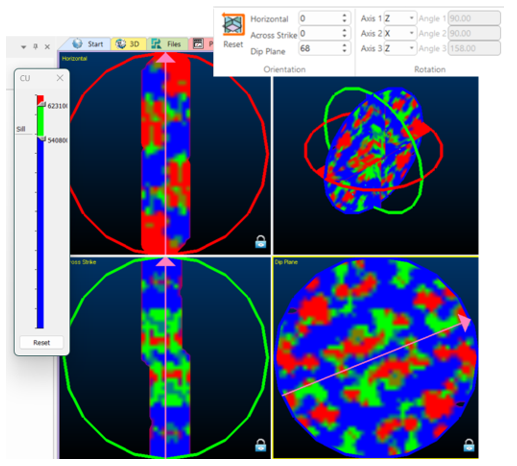

# Unfolded Variograms & Search Parameters

**UNFOLD** is a grade estimation technique where folded orebodies are unfolded to reduce structural complexity. When an orebody is folded in the world coordinate space (WCS), spatial relationships are reduced which means that traditional linear estimation techniques may not do a good job at grade estimation (because mineralization occurred before the rock was folded).

Variograms in the unfolded space removes the dimensionality of a folded structure, resulting in more spatial continuity so variograms might be smoother and have longer ranges. Unfolded distances in the unfolded space represent true distances between samples prior to deformation.

Variogram analysis is performed in the UCS, with the parameters of the variogram model calculated in the UCS. A model with cells and subcells within the folded stratified unit can then be defined using the world coordinate system.

**Note** : An alterantive way to create variogram models is to use **Datamine Supervisor** (making sure to use the unfolded sample file with the coordinate fields **UCSA** as X, **UCSB** as Y and **UCSC** as Z, and import these variogram models into **Advanced Estimation** in the **Supervisor Project Import** on the **[Scenario Setup](<Multivariate_Scenario_Setup.md>)** tab.

## Create Unfolded Data Variograms

To create variograms of unfolded data using the Advanced Estimation console:

  1. Open the **[Advanced Estimation](<Multivariate_Introduction.md>)** console.

  2. Define unfolding parameters for your scenario. See [UNFOLD in Advanced Estimation](<Unfold-advanced-estimation.md>).

  3. Once the parameter file has been defined and unfolded data reviewed, Activate the **Investigate Anisotropy** tab. 

The parameters on this panel create a variance map for identifying anisotropy. 

  4. Use the **Select zone** and **Select variable** lists to define the scope of investigation. 

  5. Choose lag and block settings. See [Investigate Anisotropy](<Multivariate_Investigate_Anisotropy.md>).

  6. Click **Create 3D Map** to generate the variogram map.

**Note** : The variography uses the coordinates set on the **Select Samples** tab. These coordinates need to be set to _UCSA_ as **X** , _UCSB_ as **Y** and _UCSC_ as **Z** to ensure the variogram map and variogram models are from the Unfolded samples.

  7. The 3D window displays the unfolded samples with the variance map. In this window, confirm that the chosen rotation aligns with the unfolded data and the unfolded data lies on one of the planes.

Unfolded data may align with the principal axes, which is the desired outcome as dimensionality is removed through unfolding. In the 3D window panels, the horizontal, across strike and dip plane orientations may be interactively adjusted by dragging the pink arrows to the orientation where the greatest varianges is seen in the middle. The lag legend may be adjusted using the **Show Legend** control. See [Investigate Anisotropy](<Multivariate_Investigate_Anisotropy.md>).

;>)

_Variography shown with respect to the major axes of the unfolded data_

  8. Once the orientation of the horizontal, across strike and dip plane are determined, the rotation around the axes are display in the ribbon. 

Once complete, return to the **Create Variogram** panel in Advanced Estimation.

  9. Switch to the **Create Variograms** tab. In this tab, the grade fields and zones should be checked. 

  10. The **Reference Plane Rotation** is set from the 3D variogram map by clicking **Read from 3D map window**.

If required, variogram parameters may be adjusted for example, increasing the Tolerance of the horizontal or vertical direction, adjusting the maximum distance, minimum / downhole lag or setting a cylinder radius. See [Create Variograms](<Multivariate_Create_Variograms.md>)

  11. Click **Calculate Variograms** to create the variograms for estimation.

  12. Complete the remainder of the **Advanced Estimation** console panels and run your estimation. 

Related topics and activities

  * [Advanced Estimation & Variography](<Multivariate_Introduction.md>)

  * [UNFOLD in Advanced Estimation](<Unfold-advanced-estimation.md>)

  * [Select Samples](<Multivariate_Select_Samples.md>)

  * [Unfolding](<Multivariate_Unfold.md>)

  * [UNFOLD Wizard](<UnfoldWizard.md>)

  * [COKRIG Process](<../Process_Help_XML/cokrig.md>)

  * [UNFOLD Process](<../Process_Help_XML/unfold.md>)