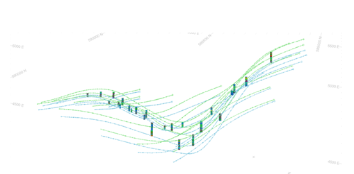
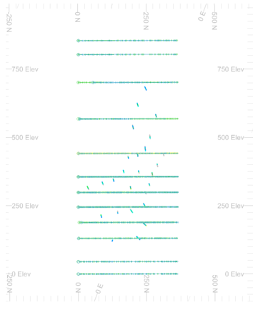
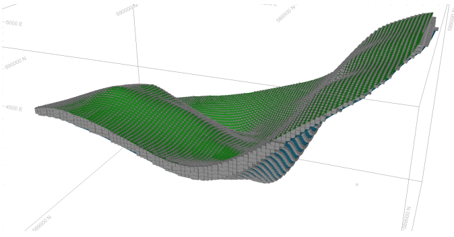

# UNFOLD in Advanced Estimation

**UNFOLD** is a grade estimation technique where folded orebodies are unfolded to reduce structural complexity. When an orebody is folded in the world coordinate space (WCS), spatial relationships are reduced which means that traditional linear estimation techniques may not do a good job at grade estimation (because mineralization occurred before the rock was folded).

The [**UNFOLD Wizard**](<UnfoldWizard.md>) can optionally generate a parameters file that can be used in other processes, such as **[COKRIG](<../Process_Help_XML/cokrig.md>)** (and the [**Advanced Estimation**](<Multivariate_Introduction.md>) console) and **[ESTIMATE](<../Process_Help_XML/estimate.md>)**. This topics covers the unfolding facility available in the **Advanced Estimation** console.

To unfold data in the **Advanced Estimation** console as part of a univariate or multivariate estimation, you will need the following data beforehand:

  * An **Unfolding parameter file** as created by the **UNFOLD Wizard**. This file contains the name of the unfolded samples, unfolded strings and the parameters used for unfolding these. See [UNFOLD Parameters](<Unfold-parameters.md>).

  * **Validated unfolding strings**. These define the hanging wall and footwall of the zone for unfolding (named as str09_hwfw_valid.dm in the **UNFOLD Wizard**). See [Create Unfolding Strings](<Unfold_HWFW.md>).

Here's an example of samples and unfolding strings in World Coordinate Space (WCS):

;>)

The same data displayed in Unfolded Coordinate Space (UCS):

;>)

  * **Unfolded samples with grades coded with zones**. These samples contain coordinates in the world coordinate space WCS and UCS (sample file named as *_u.dm created through the **UNFOLD Wizard**). See [Unfold Wizard: Unfold](<Unfold_UnfoldTab.md>).

  * A **Block model** in WCS, coded with a zone matching the drillholes.

Here's an example of a block model shown with hangingwall and footwall surfaces in WCS:

;>)

  * Optional inputs:

    * Variogram model (in unfolded space)

    * Search parameter (in unfolded space)

See [Unfolded Variograms & Search Parameters](<Unfold-Variograms-Search.md>).

#### Unfold Parameters & the COKRIG Process

The **Advanced Estimation** wizard is powered primarily by the **[COKRIG](<../Process_Help_XML/cokrig.md>)** process. This process facilitates univariate or multivariate estimation, supporting a wide range of estimation methods.

**COKRIG** supports unfolding as part of the estimation run. It does this by using a specific Unfolding Parameters file (UPAR) and a strings file containing the boundary strings that represent stratified units for unfolding. Typically, UPAR is generated by the **Unfold wizard** and string data generated within that workflow also.

As all unfolding parameters are included in UPAR, the **COKRIG** process doesn't provide explicit parameters to manage unfolding. This is similar to the way search volume, fields, zone and estimation parameters are defined for the process.

As such, **COKRIG** has the following optional inputs to support unfolding:

  * &**UNFOLD** Input parameter file containing a single record of parameters for unfolding. It contains compulsory fields:

    * STRING (A24)

    * SECTION (A24)
    * BOUNDARY (A24)
    * WSTAG (A24)
    * BSTAG (A24)
    * LINKMODE(N)
    * UCSAMODE (N)
    * UCSBMODE (N)
    * UCSCMODE (N)
    * PLANE (N)
    * HANGID (A24)
    * FOOTID (A24)
    * TOLRNC (N)
    * UCSALIMT (N)
    * ORGTAG (A24)

If used by COKRIG, values of **IN** and **STRING** within UPAR are ignored and replaced by the specified inputs * **SAMPLES** and * **STRING** (see below).

  * &**STRING** Input string file holding the boundary strings which define the stratified unit[s] for unfolding. 7 fields are compulsory: 

    * SECTION

    * BOUNDARY
    * PVALUE
    * XP
    * YP
    * ZP
    * PTN. 

3 optional fields are **WSTAG** , **BSTAG** and **TAG**. The file must also be sorted on **SECTION** , **BOUNDARY** and **PTN** , with **SECTION** being the primary keyfield. It is assumed that the section numbering system is such that sorting on **SECTION** will ensure that physically adjacent sections are adjacent in the **STRING** file.

Both unfolding inputs can be specified by macro also, for example:
    
    
    !START M1  
  
---  
      
    
    !LOCDBON  
      
    
    !COKRIG   &SAMPLES(holes_eg1),&PROTO(thismod),&FIELDS(ootmod2_fl),  
      
    
    &EPAR(ootmod2_ep),&VMODEL(ootmod2_vp),  
      
    
    &SPAR(ootmod2_sp),&UNFOLD(ootmod2_up),  
      
    
    &STRING(hwfw_ootmod_str),&OUTMODEL(ootmod2),  
      
    
    *XPT(X),*YPT(Y),*ZPT(Z),*KEY(BHID)  
      
    
    !END  
  
## Configure & Run Advanced Estimation

To configure and run advanced estimation with unfolded data:

  1. Launch Advanced Estimation (**Estimate** ribbon **> > Interpolate >> Advanced**).

  2. Activate the **Scenario Setup** tab.

     1. Create a new scenario by pressing **Create New**. 

     2. Type in a scenario name 

     3. Click **Save Changes**.

  3. Activate the **Select Samples** tab.

     1. Browse for an **Unfolding parameter file** and press **Apply**. See [UNFOLD Parameters](<Unfold-parameters.md>).

The samples file referenced in the parameters file appears in **Samples file** below. Also, the **X** , **Y** and **Z** coordinate fields are automatically set to _UCSA_ , _UCSB_ & _UCSC_ respectively.

     2. Select the **Grade/variable field(s)** for estimation. At least one grade field must be selected before you continue.

     3. If required, define **Zone 1** and Zone 2 fields if you intend to apply zonal control to your estimation.

     4. Check **Show Unfolding Parameters**.

The **Unfolding** tab appears in the menu on the left.

     5. Enable the **Unfolding** tab and review the contents.

The Unfolding parameter file input into **Advanced Estimation** must contain the settings used to unfold the samples and strings in the [UNFOLD Wizard](<UnfoldWizard.md>). This is to ensure the same transform applied to the strings and samples is applied to the block model and discretization points to unfold discretization points and blocks during estimation.

**Note** : If an Unfolding parameters file is not available, or you want to edit the stored parameters, edit the fields shown on the **Unfolding** tab. See [Unfolding](<Multivariate_Unfold.md>).

     6. **Run and Display** the results of the **UNFOLD** process and review the data. Adjust settings as required. 

  4. If required for the estimation method, generate your variograms of the unfolded data by visualizing the data's anisotropy and generating variograms accordingly. See [Unfolded Variograms & Search Parameters](<Unfold-Variograms-Search.md>) for information and activities.

  5. Fit your variogram models using the **[Fit Models](<Multivariate_Fit_Models.md>)** panel and commit the estimation parameters for an estimation run.

  6. Optionally define **[Kriging Neighbourhood Analysis](<Multivariate_KNA_Optimize.md>)** (KNA).

  7. Activate the **Select Prototype** panel.

     1. Browse for the **Input model.** This can either be a model prototype or any other block model file.

     2. Type in the name of the **Output model**. 

     3. If zonal control is to be used, confirm that there are samples available in the block model to be estimated. You can see this in the **Summary** table below.

  8. If variograms and search data imported from files are used, activate the **Parameters** panel. Otherwise, skip this step.

[If variograms were previously modelled](<Unfold-Variograms-Search.md>), those variograms and search parameters from those variograms are listed in the **Variogram model** and **Search parameters** fields. If not, browse for and select them.

  9. Activate the **Define Estimations** panel.

All estimations are performed in unfolded space (the UCS), using unfolded data and automatically transformed back into the WCS on completion.

     1. Choose the **Estimaton Type** to be performed. See [Grade Estimation Methods](<Grade%20Estimation%20Methods.md>).

     2. Review and set the **Variables to be estimated**.

     3. Define the base estimation and discretization options. See [Define an Estimation](<Multivariate_Define_Estimations.md>).

     4. Expand the **Field Names** panel and set or unset the field names to be created. See [Field Names](<Multivariate_Define_Estimations.md#Output>).

     5. If using zonal control, optionally, define your [Soft Boundary Setup](<Multivariate_Define_Estimations.md#Soft>).

  10. Activate the **Review Variograms** panel.

Ensure that a variogram has been set for each estimate and zone. See [Review Variograms](<Multivariate_Confirm_Variograms.md>)

The estimates are in the left hand column and the available models are in the centre column. To set an estimate, select both and press the Apply model to estimation button.

Variogram model rotation and structures may be viewed by expanding the **Parameters** panel. 

  11. Activate the **Define Search Vol.** tab.

Ensure that a search has been set for each estimate and zone. See [Define Search Volumes](<Multivariate_Select_Search_Volumes.md>)

Search volumes are automatically created based on the rotation of the variogram and the maximum variogram model range in each direction. These may be created at a percentage of the total variance, in which case the range will be taken at the percentage variance in each direction.

     1. Using the **Shape** panel, the size and rotation of the search volumes may be reviewed and edited. The size and orientation of the search volume may be viewed with the Unfolded samples using the display ellipsoid tool.

     2. In the **Sample Number Limits** panel, set the minimum and maximum number of samples.

  12. Activate the **Run Estimation** panel. 

  13. Ensure the relevant estimation is selected and click **Run estimation**.

  14. Review the estimated model in relation to the original folded inputs. See [Run Estimations](<Multivariate_Run_Estimation.md>)

Related topics and activities

  * [Advanced Estimation & Variography](<Multivariate_Introduction.md>)

  * [Unfolded Variograms & Search Parameters](<Unfold-Variograms-Search.md>)

  * [Select Samples](<Multivariate_Select_Samples.md>)

  * [Unfolding](<Multivariate_Unfold.md>)

  * [Review Variograms](<Multivariate_Confirm_Variograms.md>)

  * [Define Search Volumes](<Multivariate_Select_Search_Volumes.md>)

  * [Run Estimations](<Multivariate_Run_Estimation.md>)

  * [UNFOLD Wizard](<UnfoldWizard.md>)

  * [COKRIG Process](<../Process_Help_XML/cokrig.md>)

  * [UNFOLD Process](<../Process_Help_XML/unfold.md>)