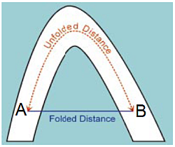
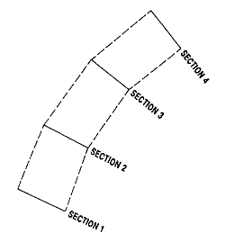
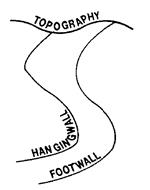
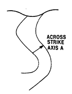
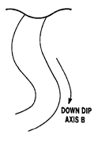
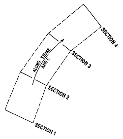

# UNFOLD Wizard

**UNFOLD** is a grade estimation technique where folded orebodies are unfolded to reduce structural complexity. When an orebody is folded in the world coordinate space (WCS), spatial relationships are reduced which means that traditional linear estimation techniques may not do a good job at grade estimation (because mineralization occurred before the rock was folded).

The Unfold Wizard aims to:

  * Model the mineralization in a strata-bound deposit more accurately.
  * Provide better understanding of the mineralization.
  * Calculate true stratigraphic distances between points.
  * Generate experimental variograms that are more accurate and easier to model.
  * Achieve accurate grade estimates and resource & reserve classification.

At the heart of the **Unfold Wizard** lies the **[UNFOLD](<../Process_Help_XML/unfold.md>)** process. Follow this link for useful background information on the mechanisms used to unfold data in Studio products.

## UNFOLD Parameters & Processes

The **Unfold Wizard** can optionally generate a parameters file that can be used in other processes, such as **COKRIG** (and the **Advanced Estimation** console) and **ESTIMATE**.

See [UNFOLD in Advanced Estimation](<Unfold-advanced-estimation.md>).

An unfolding parameter file contains a single line of parameters for unfolding which is used by all estimates, which describe the unfolding transform applied to strings and samples. These parameters are required by other processes in order to unfold the block model and discretization points during a grade estimation.

See [UNFOLD Parameters](<Unfold-parameters.md>) for more information.

## Folded & Unfolded Distances

The main purpose of unfolding strata is to calculate the stratigraphical distances between points. This is demonstrated in the image below, showing two drillhole samples either side of an anticline. Although the standard geometrical distance between them is a straight line, the distance separating them, from a geological point of view, is a line following the anticline structure. It is this distance, called the stratigraphical or unfolded distance, (shown as a dashed line) that is used in variogram calculation and grade estimation. 

  * Folded Distance: standard geometrical distance between points A and B, calculated from standard orthogonal X, Y, Z axes.

  * Unfolded Distance: stratigraphical distance between points A and B, calculated from Unfolded Coordinate System (UCS) axes.

## Unfolded Coordinate System

Unfold attempts to straighten out (or Unfold) complex geological structures into straighter or flatter domains which allows for better spatial correlation of grade. Grade estimation then takes place in the unfolded coordinate space (UCS), using unfolded samples and unfolded estimation parameters. After estimation, these samples are returned to the world coordinate space. This results in a better estimation of grade.

This unfolding technique transforms the standard coordinates (orthogonal X,Y,Z axes) of each sample to the UCS. The UCS axes are not straight lines, and are not orthogonal to each other. This is demonstrated in the following example of a folded orebody.

The image below shows four sections through a stratified deposit, showing the strike of an orebody in plan view.

A section of the same deposit is shown below.

The axes of the UCS are defined using A, B and C coordinates. This is demonstrated with reference to this orebody as follows:

  * Aacross strike (in the hangingwall-footwall direction, perpendicular to the orebody). The **UCSA** coordinate represents a location on the A axis.  
  

  * B down-dip (along the centre line between hangingwall and footwall). The **UCSB** coordinate represents a location on the B axis.  

  * Calong strike. The **UCSC** coordinate represents a location on the C axis.  

## Unfolded Variogram Models & Search Parameters

Variograms in the unfolded space removes the dimensionality of a folded structure, resulting in more spatial continuity so variograms might be smoother and have longer ranges. Unfolded distances in the unfolded space represent true distances between samples prior to deformation.

See [Unfolded Variograms & Search Parameters](<Unfold-Variograms-Search.md>).

## The Unfold Wizard

The wizard presents its parameters via tabs. As each tab is dependent on the proceeding one, they must be completed in order, from left to right. When you click Save in a particular group, the next group is activated and your changes are stored, even if you subsequently click Cancel. This allows you to continue running the wizard at a later time, from a particular point. 

The **Unfold Wizard** comprises the following sections. Click a link for more information and activities:

  * [**Define Sections**](<Unfold_DefSections.md>)select the required files and define the sections of the folded orebody.

  * [**Create Unfolding Strings**](<Unfold_HWFW.md>)view the wireframe sections, section slice, hangingwall and footwall strings, and create additional tag strings. 

  * **[Unfold](<Unfold_UnfoldTab.md>)** specify if quads only, strings or samples are unfolded. Coordinate fields and parameters can also be set before unfolding starts.

  * **[Validate](<Unfold_Validate.md>)** view samples and quads in the World Coordinate System, view samples in the Unfolded Coordinate System, and edit tag strings.

Click [Files and Settings](<Unfold_FilesSettings.md>) to view your progress through the wizard.

Related topics and activities

  * [Unfold Wizard: Define Sections](<Unfold_DefSections.md>)
  * [Create Unfolding Strings](<Unfold_HWFW.md>)
  * [Unfold Wizard: Unfold](<Unfold_UnfoldTab.md>)
  * [Unfold Wizard: Validate](<Unfold_Validate.md>)
  * [UNFOLD Parameters](<Unfold-parameters.md>)

  * [Unfolded Variograms & Search Parameters](<Unfold-Variograms-Search.md>)

  * [Advanced Estimation & Variography](<Multivariate_Introduction.md>)

  * [UNFOLD in Advanced Estimation](<Unfold-advanced-estimation.md>)

  * [UNFOLD Process](<../Process_Help_XML/unfold.md>)