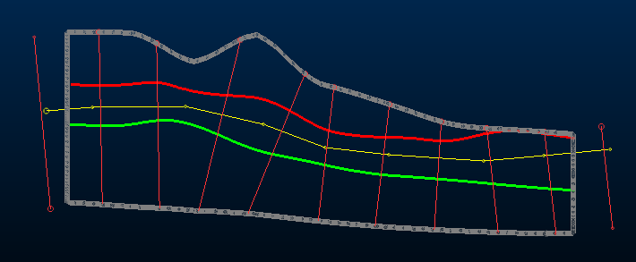
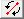
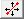
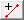

# Unfold Wizard: Define Sections

To access this screen:

  * **Model** ribbon >> **Unfold**.

This is the first stage of the **[Unfold wizard](<UnfoldWizard.md>)** , where you define the wireframe, strike string, sections strings (and definitions) and samples files processed by the unfolding routines. A parameters file is also specified on this screen, which can be used not only to reinstate settings in the Unfold wizard, but also as an input to the **[COKRIG](<../Process_Help_XML/cokrig.md>)** process and the [Advanced Estimation](<Multivariate_Introduction.md>) wizard. Unfolding data can also be passed into **[ESTIMA](<../Process_Help_XML/estima.md>)** and **[ESTIMATE](<../Process_Help_XML/estimate.md>)**.

The process behind all this is [UNFOLD](<../Process_Help_XML/unfold.md>). Follow this link for useful background information about the process and the challenges it aims to resolve.

In the example, below, the HW and FW wireframes are shown as an intersection (green and red) with a vertical (N-S) section. The strike string is highlighted in yellow and the generated unfolding sections are shown in red:

;>)

The aim of these files and settings is to ensure data for unfolding can be sectioned appropriately, and unfolding performed in a practical way for downstream structural modelling and estimation.

See [Unfolding](<Multivariate_Unfold.md>).

Activity steps:

  1. Display the **Unfold wizard**.

The **Define Sections** tab is selected by default.

  2. Select the wireframe data that represents the structure to be unfolded. This can either be:

     * A **Solid Surface** comprising both hanging wall (HW) and foot wall (FW) surfaces, or;

     * Two separate surfaces representing **HW Surface** and **FW Surface** data.

  3. Select the **Samples** to be unfolded. This must be a desurveyed drillholes file.

  4. To store your unfolding parameters in file suitable for downstream estimations, browse for an **Optional Output Parameter File** name location and choose a name.

  5. Choose the plane to be used for structural interpretation. For example, a "strike string" is used to indicate strike direction prior to unfolding. The plane in this context is the plane from which a strike direction is defined.

The following mutually-exclusive options are available:

     * **N-S** The plane of structural interpretation lies in a North-South direction.

     * **S-N** The inverse of the above.

     * W-EUse a West-East plane.

     * E-WUse an East-West plane.

     * PLANUse a horizontal plane.

     * CurrentUse the current 3D section (you can even edit it using the Section Properties screen whilst the Unfold wizard is displayed.

**Note** : If generating an **Optional Output Parameter File** , all options other than PLAN are defined as PLANE=1. If PLAN is chosen, the parameter file contains PLANE=2.

Click **Apply** to 'lock in' the section definition used to ascertain key structural parameters for unfolding, or Reset to remove all User Files & Current Section settings and add different ones.

**Note** : clicking **Apply** at this stage assumes a new unfold operation is being performed and that any previously entered parameters in later stages of the wizard (starting with strike string definition) can be cleared.

  6. Click **Digitize Strike String** and define a continuous string in the 3D window that follows the strike of the orebody. The strike string must extend beyond each end of the wireframe hull(s) to ensure that all samples within the orebody are unfolded.

**Note** : The strike string is commonly digitized in plan, with the sections being vertical. However, hangingwall and footwall interpretations can be in plan, in which case the strike string is digitized on a vertical section.

  7. Click **Save Strike String**.

A check is made to ensure the strike string fully transects the wireframe hull(s) using the structural interpretation plane. If the string is okay, the **Section Strings** section activates below.

  8. Automatically create **Section Strings** to represent the folds in the orebody. 

These are added at regular intervals, defined by Target Interval. A section string is also snapped to the first and last points of the strike string. 

New section strings can also be added in the positions that you specify.

Click **Create Section Strings** to add section strings at the specified intervals. Each section string is created perpendicular to the strike string, and in the same direction, so that the first point on each string is on the same side of the strike string. They are represented by a straight, three-point string; their end points are snapped to the hull, and their centre points are snapped to the strike string.

**Important** : Section strings must not intersect each other. A warning is shown if you attempt to save intersecting section strings later.

Individual section strings can then be deleted, or their position adjusted, using the tools provided.

**Note** : A greater number of sections, recommended for more complex orebody shapes, is created by specifying a smaller **Target interval**. Sections are listed on the [Create Unfolding Strings](<Unfold_HWFW.md>)screen later.

     * **Rotate**()Rotate a specified section string around its centre point. Click a section string to select it and use the cursor to define the new orientation. 

     * **Move** ()Drag a section string to a new location on the strike string. The string snaps to the hull and strike string, and remains perpendicular to the strike string. 

     * **Insert**()Add one or more section strings by clicking in the 3D window to define end points. Each end point is snapped to the hull, and the associated centre point is snapped to the strike string. 

     * **Delete**()Delete section strings by clicking on them in the 3D window. You can also delete strings by highlighting them and pressing DELETE.

In all cases, Click **Done** to complete a command before using another.

  9. Click **Save Section Strings** to validate and save the section strings to the project database. 

**Note** : This also adds the system string file STR03_SECTIONS to the current project.

  10. Define the section planes, based on the generated section strings (see above), including the clipping interval used when viewing them, and the order in which they are displayed.

     1. Define the Clipping interval used when viewing the sections on the **Create Unfolding Strings** screen. By default, half the **Target Interval** (see above) is used.

     2. Optionally, check **Reverse View Along Strike** to display sections in the opposite order on the **Create Unfolding Strings** screen.

     3. Click Save Section Definitions to define the section planes to be used when unfolding data. The orientation of the sections are defined based on the section strings that you specify.

**Note** : This saves a system section definition file (SEC04_DEFN) to the current project.

  11. Proceed to the **[Create Unfolding Strings](<Unfold_HWFW.md>)** screen to continue defining unfolding parameters.

Related topics and activities

  * [Create Unfolding Strings](<Unfold_HWFW.md>)

  * [Unfold Samples](<Unfold_UnfoldTab.md>)

  * [Validate Results](<Unfold_UnfoldTab.md>)

  * [ESTIMATE](<Estimate_Unfolding.md>)

  * [COKRIG](<../Process_Help_XML/cokrig.md>)

  * [UNFOLD in Advanced Estimation](<Unfold-advanced-estimation.md>)

  * [UNFOLD Wizard](<UnfoldWizard.md>)