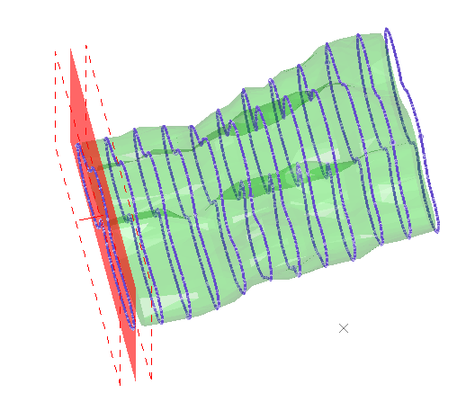
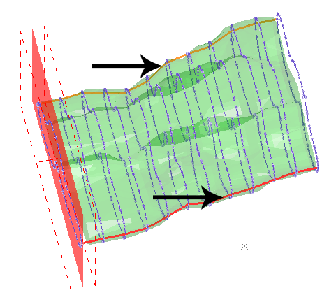
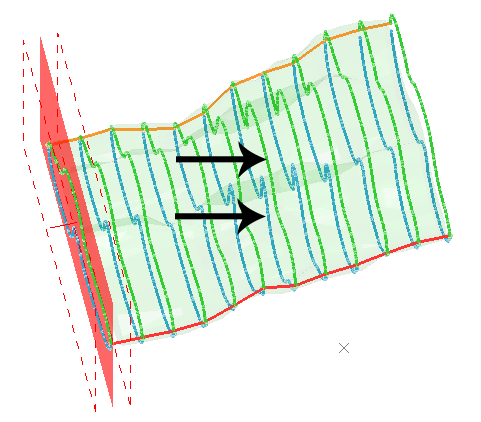
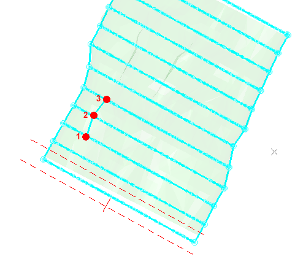
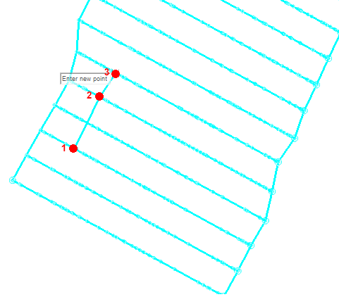
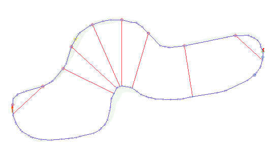

# Create Unfolding Strings

To access this screen:

  * Display the **[Unfold Wizard](<UnfoldWizard.md>)** and select the **Create Unfolding Strings** tab.

View the wireframe sections, section slice, hangingwall and footwall strings, and create additional tag strings in preparation for data unfolding on the next screen of the Unfold Wizard.

Data for unfolding is split using planar sections devised on the [Unfold Wizard: Define Sections](<Unfold_DefSections.md>) screen. Whent he Create Unfolding Strings screen activates, wireframe and section string data is automatically loaded. This screen is used to control how unfolding performs. This is achieved by constraining section string linking using a series of tag strings.

Note: Don't edit the name of data objects generated by the **Unfold Wizard**. The generated object names are used to identify the key components of the unfolding data collection.

For more detailed background on the mechanisms used to unfold data in Studio products, see **[UNFOLD Process](<../Process_Help_XML/unfold.md>)**.

### Unfolding String Types

Tag strings of the following types support the unfolding process. All are created using the **Create Unfolding Strings** screen, and in the order shown below:

  1. **Section Slice Strings** Strings formed from the intersection of the unfolding sections and the input wireframe volume or hanging wall and foot wall surfaces. These strings are automatically saved with the object name "STR05_SEC_SLICES".

;>)

_Section string shown in blue (wireframe in green and section plane in red, with dotted line limits_

  2. **Hanging Wall End Strings** Strings formed by connecting the end points of section strings. These strings are used to denote the boundary between hanging wall and foot wall surfaces, and are saved as "STR06_HW_END".

;>)

_Hanging wall end strings_

  3. **Hanging Wall and Foot Wall Strings** Strings that represent the intersection of each section with the hanging wall and foot wall surface of the loaded surface or volume data to be unfolded. This data is saved as "STR07_HWFW".

;>)

  4. **Additional Tag Strings** These strings are optional and digitized manually between sections. Strings can be one of two types:

     * **Between-Section Tags** Tag strings to control how each of the hanging wall and end wall strings are linked to each other. A single string can link one or more sections but - importantly - concurrent sections must be linked. For example, this is okay (digitized string points are shown larger than normal):

;>)

...but the following example isn't, because the section in the middle has not been used to digitize a tag string point:

;>)

In fact, when you click **Done** to complete a string like the one above, a message tells you the string is malformed, and it is deleted.

**Note** : Between-section tag string do not have to include digitized points on all sections. It is fine to create tags between a subset of sections, providing they are concurrently linked.

     * **Within-Section Tags** Tag strings that define the stratigraphical links between hangingwall and footwall points on strings within the same section. These strings are used to maintain the integrity of the section shape during the unfold operation. They can be inserted manually, or generated automatically, for example, the red strings in the image below were generated automatically and can be thought of as internal structures to preserve particular HW to FW distances:

;>)

**Note** : Tag Strings are only used in unfolding if you choose this option on the following screen: **[Unfold](<Unfold_UnfoldTab.md>)**.

Generated string data can be edited at any stage using any of the available string editing tools of your product.

## Create Unfolding Strings

The following activity represents a typical process flow for this phase of the unfolding process.

To create unfolding section, hanging wall, foot wall and tag strings:

  1. Display the **[Unfold Wizard](<UnfoldWizard.md>)**.

  2. Define unfolding sections using the [**Define Sections**](<Unfold_DefSections.md>) screen. 

  3. Display the **Create Unfolding Strings** screen.

  4. Review the generated sections using the **Sections** controls. Use the left and right arrows to flip between concurrent sections either forwards or backwards.

Note: Data is clipped either side of the active section by default, to a depth dictated by the section width - see [Section Properties](<../VR_Help/Section%20Properties%20Dialog.md>). Show unclipped data by unchecking **Clipping**.

  5. Generate section slice strings by clicking Create Section Slice Strings.

A string trace is created at the intersection of each unfolding section and the loaded surface or volume data. 

  6. If required, click **Delete Section Slices** to remove any automatically generated section strings.

**Note** : Edit the shape of the generated section strings using and string editing tools.

  7. Click **Save Edited Slice Strings** to store the sections strings for unfolding and move to the next stage of string preparation.

  8. Create string data representing the hanging wall end positions (technically, start and end position of each string) by clicking Create Strings Joining End Points. 

Two strings are created, joining each of the start points of the hanging wall string positions, with a separate trace joining each of the end points.

  9. Click **Edit End Points** to reposition any of the "end string" points. String points can only be repositioned at the existing points of a section string (snapping is automatic and applied regardless of other digitizing settings).

  10. Click **Save Edited HW End Strings** to continue to the next stage of string preparation.

  11. Click **Create HW & FW Strings** to generate, for each section string, a separate hanging wall and foot wall string. The boundary between these is determined by the location of the end string points (see above).

  12. Review and edit (using any string digitizing tools) the generated HW and FW strings.

  13. Click Save Edited HW & FW Strings to continue.

  14. Optionally create more tag strings to constrain how unfolding is performed. 

     * **Between-Section Tag** stringsDigitize between points of concurrent HW and FW strings to constrain the string linking process during unfolding. See "Unfolding String Types", above and [Wireframe Tag Strings](<../COMMON/Wireframe_Tag_Strings.md>).

     * Within-Section Tag stringsPreserve key section depths using within-section tag strings. You can generate these automatically for each section by setting a **Within-Section Tag spacing** (the minimum distance between different tag string start and end points of the same section) and then **Create**. See "Unfolding String Types", above.

  15. Click **Save & Validate Tags** to complete this screen and move on to the **[Unfold](<Unfold_UnfoldTab.md>)** screen, where general unfolding parameters are defined.

**Note** : When unfolding strings have been successfully validated, a string object called "STR09_HWFW_VALID" is added to the project. This is used in the next steps of the **Unfold Wizard**.

Related topics and activities

  * [Unfold Wizard: Define Sections](<Unfold_DefSections.md>)

  * [Unfold Samples](<Unfold_UnfoldTab.md>)

  * [Validate Results](<Unfold_UnfoldTab.md>)

  * [ESTIMATE](<Estimate_Unfolding.md>)

  * [COKRIG](<../Process_Help_XML/cokrig.md>)

  * [UNFOLD in Advanced Estimation](<Unfold-advanced-estimation.md>)

  * [UNFOLD Wizard](<UnfoldWizard.md>)