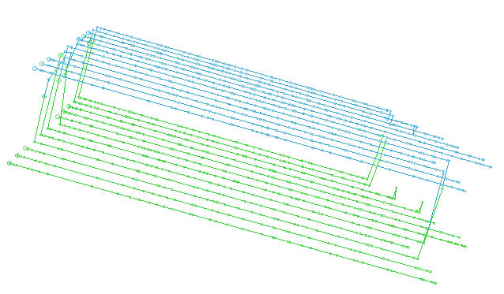
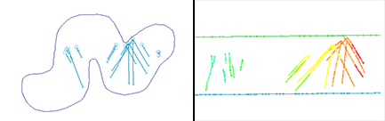

# Unfold Wizard: Unfold

To access this screen:

  * Activate the [**Unfold Wizard**](<UnfoldWizard.md>) and complete all required fields on the **[Define Sections](<Unfold_DefSections.md>)** and **[Create Unfolding Strings](<Unfold_HWFW.md>)** screens. Click the **Unfold** tab.

The **Unfold** screen is the third stage of the **Unfold Wizard**. Up to now, you have defined both the sections used to split up input data and their corresponding sections strings. Hanging wall and foot wall strings are defined as well as any tag strings used to control how data is unfolded.

The **Unfold** screen settings determine the general unfolding parameters used to unfold the data inputs and controlling strings. 

Once all settings are defined on the Unfold screen, click **Run Unfold** to transform the input data (according to the mode selected, see below). Unfolded data can be loaded and reviewed on the **[Validate](<Unfold_Validate.md>)** screen.

## Unfolding Modes

Data unfolding can be performed in one of three ways, although you can perform any or all of them sequentially:

  * Quads OnlyQuadrilateral strings linking hanging wall and foot wall points are created by the unfolding process. Quad strings are generated both between section strings and within them, and their generation is controlled by the tag strings you created on the **Create Unfolding Strings** screen. Viewing them in advance can be useful to see how the unfolding operation will be applied to your data.

This data is used for verifying the unfolding strings and is stored in the string data object "STR10_QUADS".

To display quads, select the **Quads Only** option. No other settings on this screen are then available other than the **Run Unfold** button. After the Unfold operation has completed, the quads can be viewed in the World Coordinate System using the Validate tab.

;>)

An example of between-section quad strings

  * Unfold StringsUnfold only the unfolding strings created on the previous screen for validation purposes. It can be useful to see how your data 'skeleton' unfolds prior to deforming input wireframe and sample data.

After you **Run unfold** with this option, the Validate screen can be used to view the unfolded strings in the Unfolded Coordinate System (UCS). Quad strings are also generated (see above) so can also be viewed, but in the World Coordinate System (WCS, essentially unfolded space).

The following files are created with this option: "STR10_QUADS" (quadrilateral strings) and "STR11_HWFW_VALID" (the unfolding HW and FW strings).

Enabling this option activates the remaining fields on the **Unfold** Screen. These fields are identical to the options used to **Unfold Samples** , and are described further below.

;>)

Unfolded strings shown using the **[Validate](<Unfold_Validate.md>)** screen.

  * Unfold SamplesIf selected, the sample data you picked on the Define Sections screen is unfolded when you click Run Unfold. As with string unfolding, quads are produced ("STR10_QUADS") in addition to three other files that represent the sample data in the UCS:

    * "samps1_u": Unfolded Samples in the World Coordinate System.
    * "samps1_x": Samples in the World Coordinate System which are not unfolded.

    * "samps1_up": Unfolded samples in point format.

;>)

Wireframe and samples in WCS vs. unfolded samples and strings shown using the **Validate** screen.

## String & Sample Unfolding Parameters

**Note** : For more detailed explanations of the fields on this screen, and the unfolding mechanism, see Unfold Process.

Selecting **Unfold Samples** on the **Unfold** screen reveals the following parameters:

Sample Coordinate Fields | The fields used to determine the 3D world coordinate position of the samples specified on the Define Sections screen. Where possible, known coordinate field names are picked automatically (X/Y/Z, XP, YP, ZP and others).  
---|---  
  
Selecting either **Unfold Strings** or **Unfold Samples** on the **Unfold** screen reveals the following parameters:

Link Mode - Use Tag Strings |  Choose if between-section and within-section tags are used during the unfolding process.  **Note** : These tag strings were created using the Create Unfolding Strings screen

  * **Yes** Use tag strings during unfolding.
  * **No** Ignore any tag strings during unfolding. Data is unfolded without tag string constraints.

  
---|---  
Coordinate Type |  The unfolded values produced by unfolding can be scaled in the following ways to define the relative position of the associated unfolded data for each axis where:

  * UCSA is the distance across strike (in the hangingwall-footwall direction, perpendicular to the orebody).
  * UCSB is the distance down-dip (along the centre line between hangingwall and footwall).
  * UCSC is the distance along strike.

The following options are available for each axis:

  * _Normalised (between 0 and 1)_ A normalised coordinate uses a value between '0' and '1' to represent a position on the applicable axis. This is the distance as a proportion of the total distance along the axis, as shown in the example below. 
  * _Adjusted (normalised * av. length)_ The normalised coordinate value multiplied by the average length of the applicable axis, based on data from all sections. For example: 
  * True LengthThe true length coordinate is the distance from the origin of the applicable axis in the Unfolded Coordinate System, measured in standard World Coordinate System units.
    * For UCSA, this provides a measure of width, or true width.
    * For UCSB this is the distance along the dip-direction of the strata.
    * For UCSC, 'adjusted' units are used by default. This is generally satisfactory as the UCSC coordinate should correspond to the direction of the fold axis.

  * _World X/Y/Z Coordinate_ The value on an axis in the Unfolded Coordinate System corresponds to one of the standard (X,Y,Z) axes in the World Coordinate System.

  
Tolerance | By specifying a degree of tolerance in calculating the UCSA coordinate, samples which are just outside the hangingwall or footwall can be unfolded. Defined as a proportion of the UCSA width. The default is (0). 2, for example, would   
UCSA Limit |  If a **Tolerance** value of greater than 0 is set (see above), one of the following conditions is applied to the UCSA value:

  1. No restriction on UCSAValues can be less than zero or greater than 1.
  2. UCSA <=1Values calculated that are greater than 1, are set to 1.
  3. UCSA >=0Values calculated as less than zero are set to zero.
  4. UCSA >=0 and UCSA <=1Values below zero are set to zero. Values above 1 are set to 1.

  
UCSB Original Tag |  Set the origin for the UCSB coordinate by selecting a between-section string, according to its ID. The string with the highest elevation is selected by default.  Alternatively click the pick button and select a string in the 3D view. Its ID appears in this field after selection.  
  
Related topics and activities

  * [Create Unfolding Strings](<Unfold_HWFW.md>)

  * Unfold Wizard: Unfold

  * Validate Results

  * [ESTIMATE](<Estimate_Unfolding.md>)

  * [COKRIG](<../Process_Help_XML/cokrig.md>)

  * [UNFOLD in Advanced Estimation](<Unfold-advanced-estimation.md>)

  * [UNFOLD Wizard](<UnfoldWizard.md>)