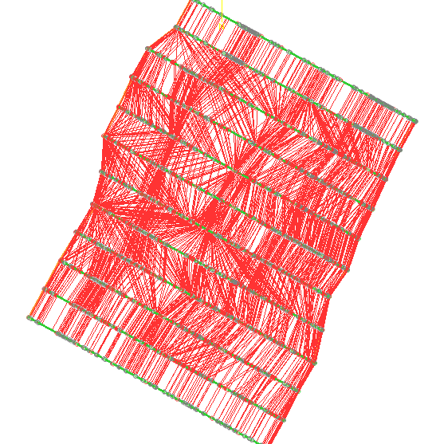
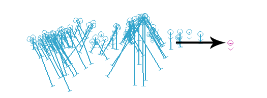

# Unfold Wizard: Validate

To access this screen:

  * Activate the [**Unfold Wizard**](<UnfoldWizard.md>) and complete all required fields on the **[Define Sections](<Unfold_DefSections.md>)** , **[Create Unfolding Strings](<Unfold_HWFW.md>)** screens. Generate unfolded data using the **[Unfold](<Unfold_UnfoldTab.md>)** screen and click the **Validate** tab.

Validate data you have already unfolded using the **Unfold Wizard** 's **[Unfold](<Unfold_UnfoldTab.md>)** screen.

The following data can be viewed if it has been generated:

  * **Quads** Quadrilateral strings formed both between and within unfolding sections. Only visible in the unfolded World Coordinate System (WCS). 

  * **Unfolding Strings** Structural strings formed by unfolding hanging wall and foot wall strings. Only visible in the Unfolded Coordinate System (UCS)

  * **Samples** Can be validated in both the WCS and the UCS. 

You can find out more about these unfolding data types **[here](<Unfold_UnfoldTab.md>)**.

Validation lets you see how unfolding has been performed, allowing you to refine your unfolding parameters and tag strings if required, before reattempting the unfold operation. No data is actually modified using this screen.

## Validate Data

To view and validate quads in the WCS:

  1. Generate quads using the [Unfold](<Unfold_UnfoldTab.md>) screen.

  2. Select World Coordinate System.

  3. **Check** Quads.

  4. Choose the quadrilateral strings you want to view in the WCS:

     * **All** View both within-section and between-section tag strings.

     * **Between Section**.

     * Within Section.

  5. **Uncheck** both **Successfully unfolded samples** and **Samples, not successfully unfolded**.

  6. Click **Display**.

Quadrilaterals display in the 3D view, for example:

;>)

To view and validate samples in the WCS and compare with the UCS, and view sample unfold failures:

  1. Unfold sample data using the [Unfold](<Unfold_UnfoldTab.md>) screen.

  2. Select World Coordinate System.

  3. Uncheck **Quads**.

  4. **Check** both **Successfully unfolded samples** and **Samples, not successfully unfolded**.

  5. Click **Display**.

  6. Review **3D** window content:

     * Successfully unfolded samples are shown in **blue** (in their unfolded state, in WCS coordinates).

     * Samples that could not be unfolded are shown in **purple** (also in the WCS).

For example, in the image below, the sample on the far right could not be unfolded as it contained a single, zero length interval (almost certainly an error in sampling or desurveying):

;>)

  7. Select Unfolded Coordinate System.

  8. **Uncheck** Validated unfolding strings.

  9. **Check** Successfully unfolded samples.

  10. Click **Display**.

The unfolded samples display in the UCS.

To display unfolded unfolding strings in the UCS

  1. Generate unfolding strings using the [Unfold](<Unfold_UnfoldTab.md>) screen.

  2. Select Unfolded Coordinate System.

  3. **Check** Validated unfolding strings.
  4. **Uncheck** Successfully unfolded samples.

  5. Click **Display**.

The unfolded strings display in the UCS.

Related topics and activities

  * [Unfold Wizard: Define Sections](<Unfold_DefSections.md>)
  * [Create Unfolding Strings](<Unfold_HWFW.md>)

  * Unfold Wizard: Validate

  * [ESTIMATE](<Estimate_Unfolding.md>)

  * [COKRIG](<../Process_Help_XML/cokrig.md>)

  * [UNFOLD in Advanced Estimation](<Unfold-advanced-estimation.md>)

  * [UNFOLD Wizard](<UnfoldWizard.md>)