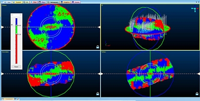
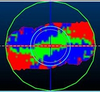
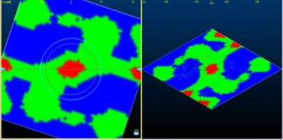
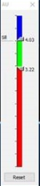
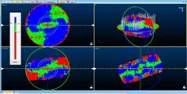
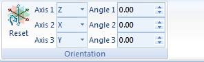
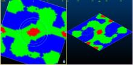

# 3D Variogram Window

To access this window:

  * If you have not yet generated a 3D variogram map, you will need to do so using the [Advanced Estimation Wizard](<Multivariate_Introduction.md>). This window is displayed automatically when the map is created.

  * If a 3D variogram map has already been generated, the 3D Variogram window is available as a tab at the top of the data display area. This will remain in view for the duration of the project session, or unless manually closed.

The 3D Variogram window is displayed as part of the [Multivariate Estimation](<Multivariate_Introduction.md>) workflow. Specifically, it results from clicking Create 3D Map on the [Investigate Anisotropy](<Multivariate_Investigate_Anisotropy.md>) panel, and lets you assess anisotropic trends within your input sample data.

;>)

3D Variogram window showing planar results 

The 3D Variogram window is used to display to provide a visual representation of a 3D variogram map in a 4x4 grid: top left, bottom left and bottom right will show a view orthogonal to each of the X, Y, Z plane - the top right panel is a free-form view that can be rotated independently of the other planar/orthogonal views.

The purpose of these planes is to identify a suitable rotation aligned with maximum visible anisotropy to use as a reference plane rotation for creating and modelling variogram models.

**Note** : when dealing with skewed distributions (e.g. gold grades in most gold deposits), Input sample data containing high grade outliers (e.g. AU deposits) can impact the variogram calculation significantly. This has the potential to distort the resulting continuity. You can mitigate the risk of this impact by transforming the data prior to calculating the variograms, using a command such as [NSCORE](<../Process_Help_XML/nscore.md>), for example.

Multiple planes through the map can be viewed to help understand the structure of the variogram and in particular to identify the directions and strengths of any anisotropy.

One of the views shows the variogram contours for a set of intersecting orthogonal planes. This can help to determine the three perpendicular directions of anisotropy. It is similar to creating and analyzing variogram contours in different planes except that it is done in 3D rather than 2D which makes it significantly more useful and easier to understand.

The currently loaded model is shown as an intersection with 3 orthogonal planes which are always orthogonal to each other. The relationship between the fixed planes is maintained throughout rotation.

How high continuity is defined is up to you; you can adjust the automatically-generated display legend used to define above-sill, sub-sill and high continuity zones (see further below) and immediately update the sectional and 3D views in real-time. This is really useful when trying to create section displays that clearly denote anisotropic trends.

**Note** : Advanced Estimation is part of the Studio RM toolset. Additional licensing modules aren't required.

### Advanced Estimation: 2D vs. 3D Data

Advanced estimation can be performed using 2D or 3D data. Where samples with 2D data have been selected, panel behavior will be adjusted in some cases to ensure inputs the function are valid. 

For example, axes for which it is not possible to rotate around are disabled when computing the variograms and fitting the models, and the Investigate Anisotropy panel will only display a single isocontour plot where 2D data has been specified. Other adjustments are made internally to ensure 2D data is processed correctly, particularly with regards to calculations involving rotation.

3D and 2D data are visualized differently in this window. The example below is displaying a variogram map for 3D input sample data:

The following example shows the visualization of 2D data:

Only 2 panes are displayed for 2D data (Primary and 3D). The 3D pane will only show a single (horizontal) plane. Unlike the 3D data case, this is not displayed as a disk or have any additional indicators on as It's not as useful in 2D. All other functions (auto fitting, dynamic lag adjustment, dynamic legend adjustment) perform an equivalent function in 2D and 3D (see below).

Another difference with 2D is that the generated 2D model is only 1 cell deep, and as such, 2D data is generally processed more quickly than a 3D equivalent.   

#### Adjusting the Variogram Legend

The variogram 'map' that is generated uses 3 colors to indicate:

| Sill with values of 1 or higher  
---|---  
| 2/3 of the sill between 0.7 and 1  
| High continuity area representing values between 0 and 0.7  
  
Change the breakpoints between the legend bins by displayed an interactive legend (3D Variogram ribbon - Show Legend) and adjusting the sliders at the sill position and the sub-sill position, which defaults to 2/3 of the distance from 0 to sill, which represents the limit of the variogram tending to infinity lag distances:

Adjusting the sliders will automatically update the sectional and 3D views of the 3D Variogram window.

#### Adjusting/Fitting Sections to Determine Anisotropy

You can rotate the intersection planes using a version of theView Controllertool (a similar tool is available in the [3D window](<../VR_Help/view_controller.md>)). This will allow rotation about individual axes. Although similar in appearance to the 3D window, the key difference is that as the section planes are rotated three other views are automatically updated and aligned to each section plane.

The variogram fitting functions behave in a different way for 3D data as for 2D data.

  * 3D Data

When investigating the primary axis of the 3D structure, you can perform section rotation using either the interactive View Controller tool (left click and drag inside the overlaid sphere to rotate the view), or using the Orientation functions available on the **3D Variogram** ribbon:

Modify the position of any of the four displayed sections using the following procedure:

     1. Left-click inside the view you wish to rotate

     2. Use either the view control to interactively edit the orientation of the view, or alternatively using the 3D Variogram ribbon, adjust the angle of the view along the X, Y or Z axis. For example, if you have selected the top-right panel, you can change Axis 1, 2 or 3 to be X, Y or Z, prior to editing the values in the Angle 1, 2 or 3 fields. The **Axis** and **Angle** fields will always show the current orientation of the section planes.

Multiple planes through the map can be viewed to help understand the structure of the variogram and in particular to identify the directions and strengths of any anisotropy.

The window is split into four sub-windows with three of them showing orthogonal planes through the 3D map and the fourth showing all three intersecting planes plus (if loaded) drillhole or points sample data:

Sub-window |  View  
---|---  
3D |  3D view of intersecting orthogonal planes - appears in the top right of the Variogram window  
Horizontal |  This represents the XY section of the model and is located in the top left of the window  
Across Strike |  A plane with an azimuth of 90 degrees plus the variogram azimuth. In other words. **Across Strike** continuity is a vertical plane perpendicular to the major axis.   
Dip Plane |  A plane with an azimuth of 90 degrees plus the variogram-azimuth and a dip of 90 degrees plus the variogram azimuth. In other words, a vertical plane in line with the major axis.  
  
Each of the planes can be rotated about the origin point with the plane windows maintaining orthogonal views. Each single plane is outlined in either a red (primary), green (secondary) or blue (tertiary) outline to make it easier to distinguish them in the 3D view.

Changing the direction on the Horizontal view will change the Dip Plane and Across Strike maps, however, changing the direction on either Dip Plane and Across Strike maps will not affect each other, or the Horizontal plane.

  * 2D Data

When investigating the primary axis of the 2D structure, you can also perform section rotation using the interactive View Controller tool (left click and drag inside the overlaid sphere to rotate the view), or using the Orientation functions available on the **3D Variogram** ribbon, although their usage is restricted for 2D data as the concept of axes 2 and 3 does not apply for 2D data.

As such, For 2D data the 3D Variogram ribbon's Axis 1 field is set to [Z] and not editable. Axis 2 and Axis 3 drop downs are disabled in this case as they are not relevant. Angle 1 and Angle 2 fields are disabled for the same reason, but you can adjust Angle 1.

You can modify the position of either of the displayed sections using the following procedure:

    1. Left-click inside the view you wish to rotate.

    2. Use either the view control to interactively edit the orientation of the view, or alternatively using the **3D Variogram** ribbon, adjust the angle of the view along the Z axis.

Two planes through the map can be viewed to help understand the structure of the variogram and in particular to identify the directions and strengths of any anisotropy.

The window is split into two sub-windows with three of them showing orthogonal planes through the 3D map and the fourth showing all three intersecting planes plus (if loaded) drillhole or points sample data:

Sub-window |  View  
---|---  
3D |  3D view of intersecting orthogonal planes - appears in the top right of the Variogram window  
Horizontal |  This represents the XY section of the model and is located in the top left of the window  
  
Each of the planes can be rotated about the origin point with the plane windows maintaining orthogonal views.

You also have the option to Auto Fit your fixed planes (3D Variogram ribbon) so that the area of highest continuity (indicated in red) aligns with the horizontal major axis of the primary view.

You can use the [View Controller](<../VR_Help/view_controller.md>) in each of the plane sub-windows and identify the set of variogram contours that have the longest or shortest axis. Then the coordinate axes should be rotated so that they align with axes of the contours. When this process is complete the coordinate axes should all align with the axes of the contours. This then gives the best estimate of the axes of anisotropy for the variogram mode.

Armed with this information, you can then proceed to the next panel in order to create experimental variograms for the selected grade and zone. 

Related topics and activities

  * [View Controller](<../VR_Help/view_controller.md>)

  * [Advanced Estimation Introduction](<Multivariate_Introduction.md>)

  * [Investigate Anisotropy](<Multivariate_Investigate_Anisotropy.md>)