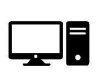

# System Requirements

The type of PC and supporting equipment required to run and use Studio RM is mostly determined by what you intend to do.

It isn't possible to cover every use case here, so what follows is an overview of four basic scenarios that may help you decide on what hardware best suits your needs.

Specific brands or types of equipment aren't always provided. To maintain the longevity of this document, general recommendations are provided instead.

If you're in any doubt, contact your local Datamine office for more information. We aren't affiliated with any particular provider, but can help you with vendor decisions based on our extensive experience of use cases throughout the World.

Important: The advice offered here must be considered general guidelines. If you're unsure about the hardware to buy for Studio usage, contact your local Datamine representative for a chat about your specific needs. We are happy to provide advice on what to buy, but aren't able to support hardware changes or resolve hardware problems later.

1 - Portable |  This mainly applies to Studio Mapper, although any Studio can be run on a portable device.  You need a handheld device, Portable typically for field data capture such as geological mapping in Studio Mapper.  Data doesn't stay on your device for long as it is offloaded to a server or other centralized data storage structure once data has been captured or processed.  | 2-Data Reporting |  You need a laptop or desktop device used for preparing plot or similar reports and don't require complex 3D visualization of 'big data'.  Typically, you rely on file-in, file-out processes but also use more lightweight interactive design commands, such as string digitizing.   
---|---|---|---  
 |    
3 - Typical |  You visualize and perform Typical evaluations of 3D data using a laptop or desktop device, including block models and wireframes of up to 500mb.  You use Studio products to perform on-board calculations such as strategic and operational schedules. Generally,a single 3D view is sufficient.  | 4 - Big Data |  You need a physical laptop or desktop device to perform complex and lengthy calculations using 'big data' inputs, creating sim ilar outputs.  Visualizing large 3D data objects and multiple 3D viens are essential to your workflow.   
 |    
  
## Virtual Devices

Running Studio products on a virtual device, such as an Azure@ hosted platform, should be performed under the guidance of your local Datamine technical support. Virtualization settings aren't described here as requirements vary significantly between usage types, as can the costs. 

## Recommended Specifications

### Processor

Studio products are partly multi-threaded. Some functions utilize multiple processors (or 'cores') if they are available, whilst others execute using a single thread.

That said, even where a single core is targeted by Datamine Studio, multiple available cores may ensure other running multi-threaded applications or services may reduce their impact on your application as a result of OS or application-level load balancing.

Portable | Data Reporting | Typical | Big Data  
---|---|---|---  
A multi-core Intel 64-bit processor offering 8 or more threads, running at 1.0-2.0 GHz.* | A multi-core Intel 64-bit processor offering 8 or more threads, running at 3.0 - 4.0 GHz. | A multi-core Intel 64-bit processor offering 16 or more threads, running at 4.0 to 5.0 GHz. | A multi-core Intel 64-bit processor offering 16 or more threads, running at 5.0 GHz or higher.  
  
* Like any CPU, boost (overclock) speeds are possible, even for short bursts. If you're planning on doing this, your battery life may suffer which could be a problem if working at the face.

Note: 64-bit Intel (not ARM) processor architecture is expected.

### Memory

The amount of memory installed on a particular machine can make a big difference to system performance although. It is assumed that you are using a 64-bit operating system (more on operating systems below).

Portable | Data Reporting | Typical | Big Data  
---|---|---|---  
4GB RAM minimum | 16GB RAM minimum | 32GB RAM minimum | 64GB RAM minimum  
  
### Operating System

The most recently available Microsoft Windows version is recommended for Studio products, with all available security updates. This is to ensure your experience with Studio is as safe as it can be. 

**Note** : 32-bit operating systems are not supported by Studio products, nor are Windows versions emulated on non-Microsoft operating systems. Not all Window variants are supported either - see the list further below.

  * **Minimum supported desktop platform** : Windows 10 Pro edition (with all available security updates)

  * **Minimum supported server platform** : Windows Server 2016 (with all available security updates)

**Note** : Due to potential security concerns, earlier versions of Windows cannot be supported or recommended.

Not supported:

  * Windows 10 S

  * Windows 10 Education

  * Windows 11 Pro Education

  * Windows 11 Education

#### Locale

English operating system versions are recommended. Datamine products will operate under other locales, although additional steps may be required for numeric values to be processed correctly. Contact your Datamine Representative for more information.

### Storage & Backup

It is preferable to have files located on a local disk for rapid access, although network access is only restricted by your current LAN or WAN structure and administration.

Swap space utilizes hard disk space, and as such, it is important to run regular system housekeeping on your disk(s) to ensure as much free space as possible is available.

A Solid State Drive (SSD) is recommended for all scenarios. HDD disks, whilst supported, are not recommended due to lengthier startup times and a more fragile architecture. 

Datamine don't recommend the use of portable, USB-connected storage devices as these can pose a security risk, particularly if used by multiple machines and users.

A minimum of 500MB must be available for Datamine product installations.

Portable | Data Reporting | Typical | Big Data  
---|---|---|---  
248 GB SSD minimum | 512 GB SSD minimum | 1 TB SSD minimum | 4 TB + SSD minimum  
  
Datamine recommend you use an automated data backup facility. In larger organizations, this is commonly the responsibility of a service managed by an IT department. Otherwise, unless you are using Datamine's MineTrust for data management (where cloud backups are formed automatically) you should source your own backup facility to ensure PC component failure doesn't cause irretrievable data loss. 

The figures above relates to local storage. External storage devices (such as NAS) are recommended for storage of particularly large data such as geological or planning block models.

Note: Datamine cannot be held responsible for data loss caused by hardware failure.

### Graphics Card

See [Graphics Capabilities](<Graphics-Cards.md>)

### Monitor

Note: 4K monitors running at resolutions over 1280 width are not currently recommended for Studio products, although this support is coming soon.

Touch screen (+ active stylus) is required for portable device users. Touch screen facilities for other scenarios are down to user preference.

Screen size is determined by space available and personal preference.

Portable | Data Reporting | Typical | Big Data  
---|---|---|---  
A single touch screen.  Resolution (minimum): 1024 x 768  |  Two monitors:  Resolution (minimum): 1920 x 1080 (HD)  |  Three monitors:  Resolution (minimum): 1920 x 1080 (HD)  |  Three monitors:  Resolution (minimum): 1920 x 1080 (HD)   
  
### Pointing Device

Portable | Data Reporting | Typical | Big Data  
---|---|---|---  
An active stylus is required for Studio product portable usage.  This is because access to right-click functionality is necessary and there must be a way to emulate this behaviour on a table. |  2 button wheeled mouse, ideally programmable. |  2+ button wheeled mouse, ideally programmable. |  2+ button wheeled mouse, ideally programmable.  
  
### I/O Ports and Connectivity

How you connect your device to other devices is up to you and your IT policy. The following are general recommendations to consider when purchase a PC device for your working scenario.

Typically, a docking station is recommended for all scenarios as they will offer multiple I/O sockets regardless of native device capabilities.

Portable | Data Reporting | Typical | Big Data  
---|---|---|---  
WIFI capability  1+ USB ports  |  WIFI capability  2 display ports  3+ USB ports (1 x USB 2.0) CAT5 socket |  WIFI capability  3 display ports  3+ USB ports (1 x USB 2.0) CAT5 socket |  WIFI capability  3 display ports  4+ USB ports (2 x USB 2.0) CAT5 socket  
  
### Supporting Software and Services

Where a software component or service is required by Studio products to run (such as Windows Runtime Components), it is installed automatically with your product. There are no mandatory 3rd party softwares required for Studio products post-installation, but there are some that may make your life easier. We can't support these directly, but are happy to recommend them.

The following non-Datamine software applications are recommended to support Studio products:

  * **Microsoft Office Suite** For example, we can read data from Microsoft data sources, and some of our processes (such as TONGRAD and GRIDDC) export directly to Excel for data reporting.

    * **Microsoft Teams** Should you need to contact us for any reason.

  * **Notepad** ++ We just prefer it to Notepad :) We can also provide a formatting template to make macro creation easier (talk to your local office and we'll get a copy to you).

  * **OneDrive** Optional, of course, but it's a good way to back up local data in the absence of another facility.

  * **A screen recorder** This can be helpful if working with us to resolve technical issues. Videos are a great way to demonstrate a software issue or ask for technical help on any area of the system.

### Runtimes

Studio applications will automatically install dependent Windows runtimes as part of a standard installation. 

These runtimes are necessary to support the operation of Studio products, and we update them regularly to support the latest technologies. The latest, most secure version of runtimes are installed.

Related topics and activities

  * [Installation Troubleshooter](<Troubleshooter-Installations.md>)

  * System Requirements

  * [Graphics Capabilities](<Graphics-Cards.md>)