# Example - General Geological Structure Analysis

 |  General Geological Structure Analysis Understanding the fundamental components of a stereonet plot  
---|---  
  
Introduction

Loading Data and Creating a Contoured Pole Plot

Creating a Set

Adding a Fixed Plane

Adding a Friction Cone

Selecting and Viewing Data in Multiple Windows

## Introduction

The identification of the different sets of structural features and their associated average planes and value ranges is done by viewing all the structure point data in a Stereonet Chart, contouring the poles and generating average planes for each set. A pole is the projection of the normal to a plane onto the bounding sphere. For example, the north and south poles of the Earth are projections of the normal to the equator onto the upper and lower hemispheres respectively. A Stereonet Chart can display both the pole data and a projection of the associated plane.

The following data files were used in the examples on this page and can be found in the tutorial data folder (C:\Database\DMTutorials\Data\VBOP\Datamine):

  * _vbgtpts.dm \- structure data points file

  * _vb_itpitstrings.dm \- open pit crest and toe strings

## Loading Data and Creating a Contoured Pole Plot

The procedure for loading data and creating a contoured pole plot is as follows:

  1. In the Project Files control bar, use the Add Existing Files to Project button to add the files to the project.

  2. In the Project Files control bar, locate these two files under the Points and Strings folders, drag-and-drop them into the 3D window (to load the files into memory).

  3. Double-click the Sheets | Points folder entry for the loaded _vbgtpts.dm file. 

  4. In the Points Properties dialog, Symbols tab, adjust the Scale of the symbol to 10 and click OK.

  5. The structure points should now be more visible against the pit crest and toe strings:  
  
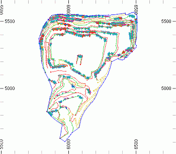

  6. Display the Plots window, then use the Manage ribbon to select Sheets | Charts | Stereonet

  7. In the Stereonet dialog, Data Selection tab, expand the Loaded Data drop-down list, select [_vbgtpts (points)].

  8. In the Dip list select [SDIP], in the Dip Direction list select [DIPDIRN], in the Key Field list check that no column is selected (this will ensure that a single chart is generated).  

 |  If the default dip direction and dip data column names are present in the points file, then these fields DIPDIRN and SDIP are automatically detected.  
---|---  
  9. Click Apply to generate and display a pole projection:  
  
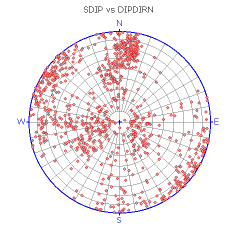

  10. In the Charts tab, Show/Hide group, tick Contours to add contours to the plot (the preview pane is updated automatically):  
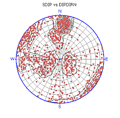  

 |  Right-clicking in the preview pane will display a context menu which can be also be used to control the displayed stereonet.  
---|---  
  11. In the Charts tab, Show/Hide group, clear the Poles checkbox to show only the contours:  
  
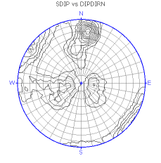

  12. In the Charts tab, Show/Hide group, tick the Color Map check box and use the drop-down list to select the [Hot] option (Ensure that the Poles and Planes check boxes are cleared, and that the Contours check box is ticked). The stereonet plot should now display the following colors:  
  

  13. In the Charts tab, tick the Poles box to re-enable the poles in addition to the contours.

## Creating a Set

In the following example, a set of pole data will be selected. This set will be used in subsequent exercises to determine a plane representing an average indicator for the poles within the set.

  1. On the Charts panel, ensure that only Poles are displayed, and that no Color Map is being used.

  2. Ensure that the Center Cross option is enabled.

  3. Enable the Stereonet toolbar by selecting the Show Toolbar option in the bottom left corner of the dialog.

  4. Select the Add Set icon on the toolbar. At this point, the Stereonet system enters editing mode.

  5. Click once to define the 'corner' of the net segment nearest to the Center Cross.

  6. Move the mouse to define the opposite corner of the segment, furthest from the Center Cross, e.g.:  
  
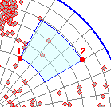

  7. In the New Set dialog, enter the name "JointSet1" into the Set Name field.

  8. For the other parameters, edit the values to match those shown below:  
  
First Point Dip: 50  
First Point Dip Direction: 29  
Second Point Dip: 13  
Second Point Dip Direction: 61  
Display: Average Pole, Average Plane

  9. Click OK to display the set boundaries, average pole (for the set) and average plane (for the poles within the set):  
  
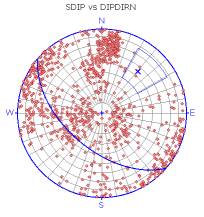

  10. Click the Sets tab to reveal the contents. One entry should be visible in the table at the top of the dialog:  
  
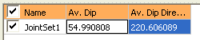

  11. Change the color of the Display so that the Set Color is green, and the line width is "3". As you change the values, the screen will update automatically:  
  
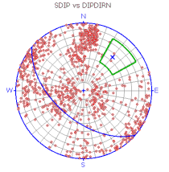

  12. Similarly, change the Average Plane Color to be red, and set the Line Thickness to "3".

  13. Change the Symbol that is shown for the average pole by selecting a triangle from the drop-down list. Set the Symbol Size to "15". Your view should now be similar to the following  
  
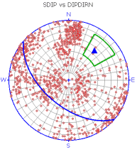

## Adding a Fixed Plane

You can use the Stereonet dialog to insert a new fixed plane by entering a known dip direction and dip.

  1. Select the Planes tab.

  2. Click the Insert Plane button at the top of the dialog.

  3. Enter the Plane Name "NorthWall"

  4. Enter a Dip of "50" and Dip Direction of "40".

  5. You can display the average plane of the specified dip and dip direction and/or the average pole position. It is also possible to display the Daylight Envelope for the fixed plane.

 |  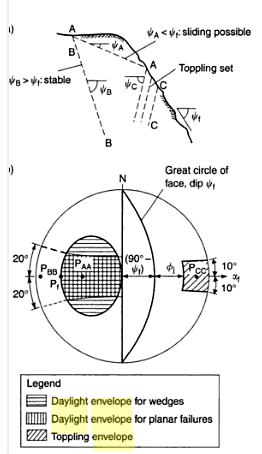 |  What is a "Daylight Envelope"? Where a plane dips at a flatter angle than the face, it is said to "daylight" on the face and has the potentially for sliding. Conversely,where a plane dips more steeply than the face, it does not daylight and sliding is not possible . Similarly, where a discontinuity set dips into the face, it is not possible for sliding to occur, but toppling is possible. The position of these poles in relation to the slope face may show that the poles of all planes that daylight (and are potentially unstable) lie inside the pole of the slope face. This area is known as the Daylight Envelope and can be used to quickly identify unstable blocks. * A daylight envelope is a useful indicator of bench or slope stability, as poles that lie within the daylight envelope could be considered as potentially unstable. This information can be supported with the implementation of a friction cone to further highlight the stability levels of the encapsulated poles. You can add a friction cone using the Cones tab. *Information derived from Rock Slope Engineering: civil and mining; Duncan C. Wyllie, Christopher W. Mah, Evert Hoek.  
---|---|---  
  6. For this example, ensure that Plane, Pole and Daylight Envelope are selected and click OK:  
  
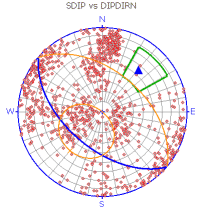

## Adding a Friction Cone

Circular cones are projected on a stereonet as small circles with a radius representing an angle about a vector that passes through the origin. Any point on the small circle is a constant angle from the vector. The potential for a block to slide is a function of the resultant shear force and the limiting frictional shear resistance force along sliding planes. Both forces depend upon the orientations of the resultant force and the normal of the sliding plane.

For a given resultant force, the vector orientation at which these two forces are equal (i.e. limit of equilibrium) is a function of the orientation of the plane's normal and the friction angle of the plane's surface. Considering all possible orientations of the resultant force gives us a set of limit equilibrium vectors defining a cone about the plane's normal. This cone is referred to as the friction cone. This is important for the analysis of data liable to sliding failure, especially where the features are exposed at a slope surface (daylight envelope).

To add a friction cone to the stereonet:

  1. In the Stereonet dialog, select the Cones tab

  2. Click the New Cone button at the top of the dialog.

  3. Enter the Cone Name "SlideBoundary1"

  4. Leave the Axis Dip value at "90", but set the Axis Dip Direction to "25". Set the Angle as "60". Click OK.

  5. Set the Cone Color to purple and the line thickness to "4":  
  
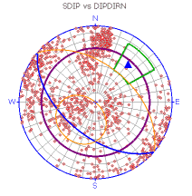

## Selecting and Viewing Data in Multiple Windows

A key feature of Datamine's Stereonet facility is the ability to select poles within your current stereonet plot, and highlight that data in other data windows. The Stereonet dialog is 'modeless', meaning other functions outside of the dialog can still be accessed when it is in view. This makes it easy to visualize data selections in, say, the Design or VR windows, whilst working with the Stereonet.

The following exercise will take you through some of the data selection and viewing options available with Stereonets:

  1. If the Stereonet dialog is not open, open it by double-clicking the existing Stereonet sheet in the Plots window.

  2. For this example, you are going to select all poles within the previously created set ("JointSet1"). Right-click the in preview pane (on the left) to display the context menu.

  3. Choose Selection | Select Set.

  4. Click inside the green boundary of your custom data set. Note that all of the poles within it are highlighted in yellow. Any associated average plane, pole or daylight envelope indicators are also highlighted:  
  
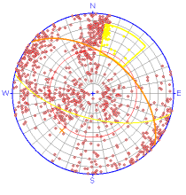

  5. Move the dialog out of view of the Plots window - note that the data within this window is also selected (the hatched effect is intentional - it indicates that the plot is currently 'under construction':  
  
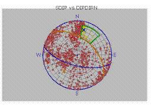  

  6. Data selection is two-way; you can select data in the Design or 3D window, and the representative poles will be highlighted in the Stereonet.

 |  Related Topics  
---|---  
|  [Example \- Slope Failure Mode Analysis](<Example%20-%20Slope%20Failure.md>)