 |  Slope Failure Mode Analysis Identifying the different potential modes of failure within a rock mass  
---|---  
  
# 

# Introduction

# Creating Fixed Planes for Slope Failure Analysis

# 

## Introduction

Slope failure mode analysis in hard rock typically involves the identification of the different potential modes of failure within the rock mass, for each of the major pit slopes. This is done by first viewing all the structure point data in a Stereonet Chart, contouring the poles, creating average planes for each set of poles, creating fixed planes for each pit slope. Secondly, the stereonet plots are inspected for the different potential modes of failure, using the type of information shown in the diagram below:

Failure Mode |  Stereonet Plot Example  
---|---  
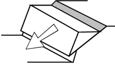 |  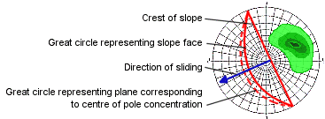  
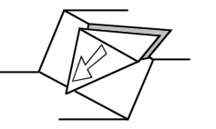 |  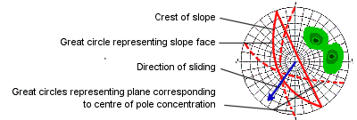  
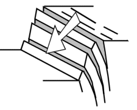 |  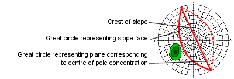  
  
The following data files were used in the examples on this page and can be found in the Studio 3 tutorial data folder (C:\Database\DMTutorials\Data\VBOP\Datamine):

  * _vbgtpts.dm \- structure data points file

  * _vb_itpitstrings.dm \- open pit crest and toe strings

## Creating Fixed Planes for Slope Failure Analysis

The general procedure for performing this type of Stereonet analysis is as follows:

  1. In the Plots window, use the Manage ribbon to select Insert | Sheet | Stereonet.

  2. In the Stereonet dialog, Data Selection tab, expand the Loaded Data drop-down list to select [_vbgtpts (points)].

  3. Ensure [SDIP] is selected in the Dip list, and [DIPDIRN] is set in the Dip Direction list. Ensure that no selection is made in the Key Field column; this column will be used in a later exercise to show how multiple charts can be created by specifying a third data field.

  4. Right-click the (currently empty) projection on the left to show the context menu.

  5. Expand the Show/Hide context menu and ensure that only the Contours option only is selected. This may mean multiple visits to the Show/Hide menu to disable all other options.

  6. ClickApplyto generate a pole projection:  
  
  

  7. Click OK to generate your contour plot sheet and return to the Design window.

  8. Load the _vb_itpitstrings.dm pit crest and toe strings file into memory.

  9. In this example, the following three fixed planes, representing the three major pit slopes shown below, are going to be created:  
  
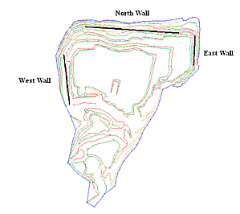  
Pit strings and structure data showing the orientations of the pit slopes

  10. Create fixed planes for each of the following slopes (in the Planes tab, click the New Plane button to display the New Plane dialog). Use the following plane parameters:  
  
North wall \- 184/30  
East wall \- 270/40  
West wall \- 85/35  
  
  
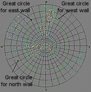  
The pit slopes are represented by the green great circles (fixed planes)

  11. Create a Friction Circle of 20 degrees for checking for potential planar failure of structures along the three pit slopes (the base friction angle i.e. the dip at which a planar structural feature will fail or slide is different for each set of structural features - the value of 20 degrees is just an example), as follows:

     1. In the Cones tab, click the New Cone button.

     2. In the New Cone dialog, define a suitable Cone Name and set the cone Angle to '70' (a 70 degree angle gives a 20 degree friction circle).  
  
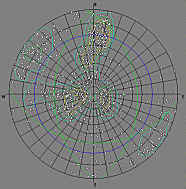  
Stereonet plot showing the location of three fixed planes (pit walls) and a blue Friction Circle of 20 degrees

  12. Using the 2nd type of planar failure shown in the initial table - check the structure set STYPE = 'B ' for potential planar failure on the North Wall using the planes for the poles of this set.

     1. Click All Planes Display to toggle ON the display of planes for selected poles.

     2. Keep the average plane toggled ON.

     3. Select poles in the 'B' set (by selecting a contour) to find any that display great circles

        * lying parallel the North Wall great circle

        * with a dip greater than that of the North Wall

        * with a dip less than the Friction Circle (blue circle).

  13. The results are shown in the diagram below, noting that the great circles of the bedding plane structures (STYPE = 'B ') do not plot in the area defined by the magenta oval and so DO NOT indicate a potential for planar failure on the North wall:  
  
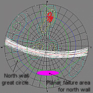  
The poles (red) and planes (white) of bedding plane structures are shown relative to the plot area (magenta) for structures with potential for planar failure on the north wall.

  14. The selected structures (red poles) in the diagram below plot in the area defined by the magenta oval and so indicate a potential for planar failure on the North wall:  
  
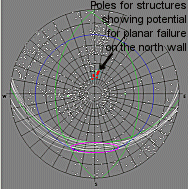  
The selected structures (red poles, white great circles) plot in the area for potential planar failure on the north wall (magenta oval)  

  15. Check if these structures are located (i.e. their X, Y and Z coordinates lie) along the North Wall of the pit. If so, then they have the potential for planar failure:

     * View the positions of these selected poles in the Design window

     * In the 3D window, zoom into the middle third of the East wall and look for highlighted yellow structure points, as shown by the arrows below:  
  
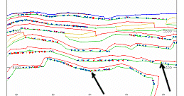

  16. View these structures relative to the pit walls.  
  
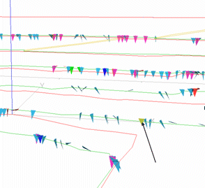

### The above procedure would typically be repeated for:

  1. Each structure set i.e. group of poles
  2. For each wall
  3. For each type of failure mode e.g.:

  1.      * Planar
     * Wedge
     * Toppling

 |  Related Topics  
---|---  
|  [Example \- General Geological Structural Analysis](<Example%20-%20General%20Analysis.md>)