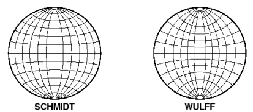

 |  Wulff Projection An overview of the Wulff or Equal Angle projection  
---|---  
  
# Wulff Projection

The basis for all projection techniques is the imaginary reference sphere of radius R, positioned with its center at the center of the area of projection. Consider a line oriented with the trend (a) and plunge (b), and positioned so that it passes through the center of a reference sphere. If this line is extended, it will pierce the perimeter of the reference sphere at two points: P on the lower hemisphere and Q on the upper hemisphere. If you consider one point on the lower hemisphere, P, it can be projected on to the horizontal plane by a number of methods; two of which are available to Stereonet users; equal angle, or equal area projections. The specific types of these projections are Schmidt as the method for equal area projection and Wulff as the equal angle method.

The Wulff projection is a conformal, azimuthal projection that dates back to the Greeks. Its main use is for mapping the polar regions. In the polar aspect all meridians are straight lines and parallels are arcs of circles. While this is the most common use it is possible to select any point as the center of projection.

The polar equal-angle net is used in conjunction with the equal-angle stereonet for the plotting of the normals (poles) to the discontinuities; the polar equal area net, by comparison, is used in conjunction with the equal-area (Schmidt) stereonet for the plotting of poles. Counting nets are used with both types of projection to determine clusters or concentrations of orientations.

For an equal-angle Wulff projection - the given line of trend (a) and downward plunge (b) will intersect the lower reference sphere at point P'. If a straight line is drawn from P' to a zenith point, Z, which is at a distance R vertically above the center point, O, then the line will intersect the plane or projection (horizontal plane) at P. For this projection, the relationship between r, the radial distance of point P from O and b is given by:

r=Rtan(b/2)

The trace of a great circle of dip direction, ac and dip bc on the equal angle projection will have a radius Rc given by:

Rc=R/cosbc

and will have a center point of:

rc=Rtanbc

Where:

  * rc = horizontal length from point O in the opposite direction of ac

  * Rc = radius of the great circle of dip direction ac and dip bc

To compare Wulff (equal angle) and Schmidt (equal area) projections:

(Reference: Rock Slope Stability by Charles A. Kliche published 1999 by SME)

 |  Related Topics  
---|---  
|  [Schmidt Projection](<projection_schmidt%20net.md>)