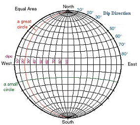
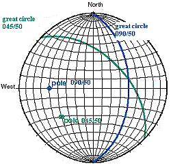

 |  Stereonet Charts Using the Studio 3 Stereonet Charting Facility  
---|---  
  
# 

# Introduction

What is a Stereonet?

A Simple Stereonet Example

Key Stereonet Charting Features

# 

## Introduction

Stereonet Charts are an essential tool for the analysis of geological structure data and its application in mine planning and production. The main function of the stereonet is in the determination of geological structure trends and their relationship to excavation surface orientations. This might be a purely statistical analysis which would identify whether the data is random or has a preferred orientation, or data distributions may indicate some key structural issues.

The main applications for the Steronet Charts are:

  * Structural analysis of joint and fault data.

  * Pit bench and slope stability analysis.

  * Underground excavation stability analysis.

  * Blast pattern optimization.

The Stereonet Charts are unique in that they can deal with spatial (i.e. data with XYZ coordinates) 3D structural data. General structural trends can be determined and individual poles or planes in the Stereonet can be linked to a specific point in three dimensional space in the Design and VR windows.

## What is a Stereonet?

A stereonet (also known as a stereogram or hemispherical projection) is a way of representing the orientation of 3-dimensional structure data (represented by dip direction and dip) on a 2-dimensional surface. In a stereographic projection, planes and lines are drawn as they would appear if they intersected the bottom (or top) of a transparent sphere viewed from above.

The grid lines on a stereonet plot show the projection of a set of great circles and a set of small circles that are perpendicular to one another (just like longitude and latitude lines, respectively, on the globe). These grid lines can be used to locate the orientation of planes (and lines). The image below shows an equal area stereonet with the positions of the Dip Direction and Dip 'grid lines'.

There are two key guide structures on a stereonet diagram; Great Circles and Small Circles:

  * Great circles: (red line in above diagram) a circle on the surface of a sphere made by the intersection with the sphere of a plane that passes through the center of the sphere, through both the north and south poles. The longitude lines on a globe are great circles.

  * Small circles: (green line in above diagram) a circle on the surface of a sphere made by the intersections of a plane that does not pass through the center of the sphere. In the case of the stereonet, this small circles are perpendicular to the orientation of the great circles. The latitude lines on a globe are small circles.

 |  The latitude and longitude lines on a globe are perpendicular to each other. A lower hemisphere stereonet projection should be visualized as the bottom or top half of a sphere. Planes intersect the sphere as great circles and lines intersect the sphere as points.  
---|---  
  
Two broad types of structural features can be plotted a stereonet i.e. a line (Trend/Plunge e.g. stickenside lineation, fold axis, underground drive axis) and a plane (Dip Direction/Dip e.g. fault plane, pit bench or slope, underground excavation surface).

On a stereonet plot:

  * A line plots as a point

  * A plane plots as a great circle and/or a point. This point is referred to as the pole and is perpendicular to its associated plane.

All plotted elements pass through the center of the hemisphere, and their projection reflects where the plane or line intersects the outer hemispheric surface. This means that information about relative position is not represented in the plot, only information about relative orientation.

The stereonet is used to:

  * plot individual or average structural feature orientation, often expressed as a data cloud with dispersion around some average value

  * find the intersection between two planes (e.g. the surfaces of a rock wedge, structure feature vs excavation surface)

  * find the angle between two lines, two planes or a line and a plane.

## A Simple Stereonet Example

The diagram below shows two planes, each represented by both great circles and poles. The green plane has an orientation of 045/50 (dip direction/dip) and the blue plane an orientation of 090/50:

More examples can be found by following the links in the Related Topics, at the bottom of this page.

## Key Stereonet Charting Features

### The following key features are available with Stereonet Charting:

  * Ability to generate single or multiple stereonet plots on key data fields.

  * Generation of stereo plots for both external files and loaded data

  * Stereonet plot data linked dynamically with loaded 3D structure features data in the Design and VR windows

  * Output of the stereonet charts for use in presentations and reports.

  * Lower and upper hemisphere projections

  * Wulff or Schmidt projection methods

  * Addition of Sets, Planes, Cones for use in structure analysis and mine planning

  * Generation of summary statistics for sets of features.

 |  Related Topics  
---|---  
|  [Structural Data Overview](<Structural%20Data%20Overview.md>)