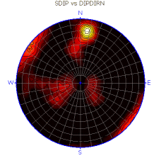
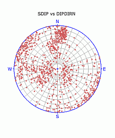
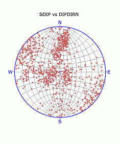
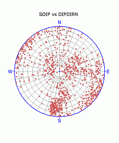

 |  Stereonet - Charts Dialog An overview of the features in this dialog  
---|---  
  
# Stereonet - Charts Dialog

### To access this dialog:

  * In the [Stereonet](<Stereonet_Dialog.md>) dialog, select the Charts tab.

The Stereonet - Charts dialog is used to show/hide poles, planes, contours and a color map; define projection, net type, hemisphere, grid and color settings for the stereonet plot.

Field Details:

Move Record Up, Move Record Down, Select Previous, Select Next, Delete Selected Chart: use these buttons to move, select and delete the listed charts.

Stereonet: this pane displays a list of the stereonet(s) generated in the previous tab.

Display: these controls only act on the item selected in the Stereonet pane.

Show/Hide:

Poles: select this to display the structure points as poles on the stereonet (default).

Contours: select this to display stereonet contours; contours are typically used in conjunction with an Equal Area projection.

Planes: select this option to display the structure points as planes i.e. great circles, on the sterreonet.

Title: select this to display the stereonet title.

Color Map: select this option to display a color map of the pole density; a 'Hot' color map type is shown below:  
  

Color Map Type: select the required color map type from the drop-down..

Projection: projection type.

Equal Area: select this option to display an equal area or Schmidt projection of the data (default); use this when solving angular relationships, statistically evaluating orientation data using contours. [More...](<projection_schmidt%20net.md>)  
  
Equal Angle: select this option to display an equal angle or Wulff projection of the data; use this when solving angular relationships. [More...](<Projection_Wulff%20Net.md>)  

 |  Equal Area and Equal Angle projections:   
---|---  
  
Net: stereonet type.

Polar: select this to display a polar projection (default).

Equitorial: select this to display an equatorial projection.  

| Equal area, Polar (left) and Equatorial (right) projections:    
---|---  
  
Hemisphere: hemisphere type.

Lower: select this to display a lower hemisphere projection (default); the most commonly used projection for structural data.

Upper: select this to display an upper hemisphere projection.  

| Equal area, polar, Lower (left) and Upper (right) hemisphere projections:   
---|---  
  
Grid:

NSEW: select this to label the stereonet with the four cardinal directions (default).

Center Cross: select this to display a blue center cross (default).

Outer Circle: select this to display the blue outer circle (default).

Cross Hairs: select this to display blue NS and EW lines.

Colors:

Background: select a color for the stereonet plot's background.

Net: select a color for the stereonet grid lines (default 'grey').

Grid: select a color for the NSEW, center cross, outer circle and cross hairs (default 'blue').

| The Stereonet dialog is modal. This means that it can be left open while other commands, e.g. in the Design or VR windows, are run. This allows it to be used for the interactive analysis of structural data across various windows and dialogs.   
---|---  
  
|  Related Topics  
---|---  
| [The Stereonet Dialog](<Stereonet_Dialog.md>)  
[Stereonet - Data Selection](<Stereonet_DataSelection_Dialog.md>)[  
Stereonet - Sets](<Stereonet_Sets_Dialog.md>)[  
Stereonet - Planes](<Stereonet_Planes_Dialog.md>)[  
Stereonet - Cones](<Stereonet_Cones_Dialog.md>)[  
Stereonet - Information](<Stereonet_Information_Dialog.md>)[  
Stereonet - Settings](<Stereonet_Settings_Dialog.md>)