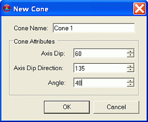
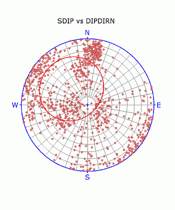

 |  Stereonet - Cones Dialog An overview of features  
---|---  
  
# Stereonet - Cones Dialog

### To access this dialog:

  * In the [Stereonet](<Stereonet_Dialog.md>) dialog, select the Cones tab.

The Stereonet - Cones dialog is used to create and delete cones; define their associated color and line thickness settings.

  
Field Details:

Show All: select this option to display all the listed cones (default).

Create New Cone: click this button to create a new cone.

Delete Cone: click this button to delete the currently selected (highlighted in blue) cone from the list.

Cones: a list of the currently defined cones; only the selected cone parameters are displayed in the Display fields below.

Name: user-defined cone name.

Axis Dip: dip of cone axis.

Axis Dip Direction: dip direction of cone axis.

Opening Angle: the interior angle of the cone.

Display: these controls only act on the item selected in the Cones pane, i.e. the current cone:

Cone:

Color: select the required cone's color from the drop-down (default 'red').

Line Thickness: select the required line thickness from the drop-down (default '2').

 |  The Stereonet dialog is modal. This means that it can be left open while other commands, e.g. in the Design or VR windows, are run. This allows it to be used for the interactive analysis of structural data across various windows and dialogs.   
---|---  
  

## Defining a New Cone

Multiple cones can be defined within a stereonet plot, each with its own set of definition and display parameters, using the procedure outlined below:

  1. Load the required data and define a new stereonet chart using the Stereonet Dialog's [Data Selection](<Stereonet_DataSelection_Dialog.md>) and [Charts](<Stereonet_Charts_Dialog.md>) tabs.

  2. In the Cones tab, click the Create New Cone button.

  3. In the New Cone dialog, define the name and cone attributes, click OK:  
  
  

  4. Check the orientation of the cone in the Preview Pane:  
  
  

  5. Modify any settings in the Cones tab's Display group.

 |  Related Topics  
---|---  
| [The Stereonet Dialog](<Stereonet_Dialog.md>)   
[Stereonet - Data Selection](<Stereonet_DataSelection_Dialog.md>)[  
Stereonet - Charts](<Stereonet_Charts_Dialog.md>)[  
Stereonet - Sets](<Stereonet_Sets_Dialog.md>)[  
Stereonet - Planes](<Stereonet_Planes_Dialog.md>)[  
Stereonet - Information](<Stereonet_Information_Dialog.md>)[  
Stereonet - Settings](<Stereonet_Settings_Dialog.md>)