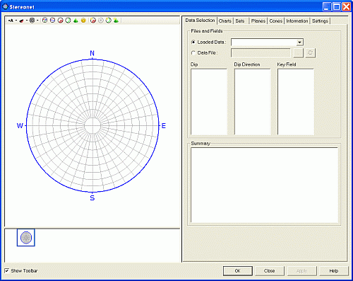
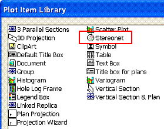

 |  The Stereonet Dialog An overview of the features in the Stereonet dialog  
---|---  
  
# Creating and Editing Stereonet Charts

Stereonet Plots as Sheets or Plot Items

Stereonet plots can be created either as chart Sheets in the Plots window or inserted as Plot Items into existing Plot or Log sheets. A wide variety of chart formatting options are available.

### To access this dialog:

  * Using the  Manage ribbon, select  Insert | Sheet | Stereonet .

The Stereonet dialog is used to create stereonet charts by selecting structural data loaded or stored in a file, setting stereonet chart parameters and settings; creating sets, planes and cones.

Field Details:

Stereonet Toolbar: use the various buttons to change stereonet settings and add features (sets, planes, cones) to the plot (many of these functions are available via the tabs listed below).

Preview Pane: use this pane to preview the new or modified stereonet plot; right-click in this pane to display the context menu.

Chart Thumbnails Pane: select a thumbnail chart to display it in the Preview Pane.

Show Toolbar: tick this box to display the Stereonet Toolbar displayed at the top left of the Stereonet dialog.

Data Selection: select the structure data points from a the loaded data or file; select the dip direction, dip and optional key field. [More...](<Stereonet_DataSelection_Dialog.md>)

Charts: show/hide poles, planes, contours; define projection, net, hemisphere, grid and color settings. [More...](<Stereonet_Charts_Dialog.md>)

Sets: create sets; define associated color and line thickness parameters; define average plane and daylight envelope settings. [More...](<Stereonet_Sets_Dialog.md>)

Planes: create planes; define average plane and daylight envelope settings. [More...](<Stereonet_Planes_Dialog.md>)

Cones: create cones; define associated color and line thickness settings. [More...](<Stereonet_Cones_Dialog.md>)

Information: view a summary of current settings, loaded and selected data statistics. [More...](<Stereonet_Information_Dialog.md>)

Settings: define distribution, counting circle size and default color settings. [More...](<Stereonet_Settings_Dialog.md>)

OK: generate a new stereonet chart or save changes and then close the dialog.

Close: close the dialog without generate a new or modified stereonet chart.

Apply: generate a new stereonet chart or apply changes to the existing chart, without closing the dialog.

 |  The Stereonet dialog is a modal dialog. This means that it can be left open while other commands e.g. in the Design or VR windows are run. This allows it to be used for the interactive analysis of structure data across various windows and dialogs.   
---|---  
  

## Creating a New Stereonet Chart Sheet

Create a new stereonet plot sheet using the following steps:

  1. Open the Plots window.

  2. Using the  Manage ribbon, select  Insert | Sheet | Stereonet .

  3. Define the required parameters in the various tabs of the Stereonet dialog, click OK.

Inserting a Stereonet Chart as a Plot Item

Create a new stereonet plot item within an existing sheet using the following steps:

  1. In the Plots window, select the required plot sheet tab.

  2. Select the top-level Plot Item button on the  Manage ribbon   
  
   

  3. In the Plot Item Library dialog, select [Stereonet], click OK.

  4. In the Stereonet dialog, define the required parameters in the various tabs, click OK.

 |  In order to create a stereonet chart, as a minimum, the Files and Fields parameters on the Data Selection tab have to be defined before OK is clicked.  
---|---  
  
 |  Related Topics  
---|---  
| [Stereonet - Data Selection](<Stereonet_DataSelection_Dialog.md>)[  
[[Stereonet - Charts](<Stereonet_DataSelection_Dialog.md>)](<Stereonet_Charts_Dialog.md>)](<Stereonet_DataSelection_Dialog.md>)   
[Stereonet - Sets](<Stereonet_Sets_Dialog.md>)[  
Stereonet - Planes](<Stereonet_Planes_Dialog.md>)[  
Stereonet - Cones](<Stereonet_Cones_Dialog.md>)[  
Stereonet - Information](<Stereonet_Information_Dialog.md>)[  
Stereonet - Settings](<Stereonet_Settings_Dialog.md>)