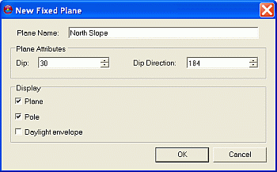
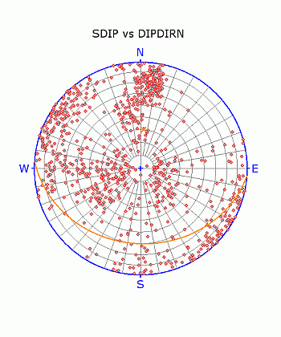

 |  Stereonet - Planes Dialog An overview of features  
---|---  
  
# Stereonet - Planes Dialog

### To access this dialog:

  * In the [Stereonet](<Stereonet_Dialog.md>) dialog, select the Planes tab.

The Stereonet - Planes dialog is used to create and delete fixed planes; define average plane and daylight envelope settings for the stereonet plot.

  
Field Details:

Show All: select this option to display all the listed fixed planes (default).

Create New Plane: click this button to create a new fixed plane.

Delete Set: click this button to delete the currently selected (highlighted in blue) fixed plane from the list.

Planes: a list of currently defined fixed planes; only the selected fixed plane parameters are displayed in the Display fields below.

Name: user-defined fixed plane name.

Dip: dip of fixed plane.

Dip Direction: dip direction of fixed plane.

Display: these controls only act on the item selected in the Sets pane, i.e. the current set:

Fixed Plane and Daylight Envelope:

Plane: select this to display the fixed plane's plane (default).

Pole: select this to display the fixed plane's pole (default).

Daylight Envelope: select this to display the daylight envelope of the fixed plane.

Color: select the required fixed plane's color from the drop-down (default 'orange').

Line Thickness: select the required line thickness from the drop-down (default '2').

Symbol: select the symbol type for the fixed plane's pole (default 'X').

Symbol Size: select the symbol size for the fixed plane's pole (default '10').

 |  The Stereonet dialog is modal. This means that it can be left open while other commands, e.g. in the Design or VR windows, are run. This allows it to be used for the interactive analysis of structural data across various windows and dialogs.   
---|---  
  

## Defining a New Set

Multiple fixed planes can be defined within a stereonet plot, each with its own set of definition and display parameters, using the procedure outlined below:

  1. Load the required data and define a new stereonet chart using the Stereonet Dialog's [Data Selection](<Stereonet_DataSelection_Dialog.md>) and [Charts](<Stereonet_Charts_Dialog.md>) tabs.

  2. In the Planes tab, click the Create New Fixed Plane button.

  3. In the New Fixed Plane dialog, define the name, plane attributes and display settings, click OK:  
  
  

  4. Check the orientation of the fixed plane in the Preview Pane:  
  
  

  5. Modify any settings in the Planes tab's Display group.

 |  Related Topics  
---|---  
| [The Stereonet Dialog](<Stereonet_Dialog.md>)   
[Stereonet - Data Selection](<Stereonet_DataSelection_Dialog.md>)[  
Stereonet - Charts](<Stereonet_Charts_Dialog.md>)[  
Stereonet - Sets](<Stereonet_Sets_Dialog.md>)   
[Stereonet - Cones](<Stereonet_Cones_Dialog.md>)[  
Stereonet - Information](<Stereonet_Information_Dialog.md>)[  
Stereonet - Settings](<Stereonet_Settings_Dialog.md>)