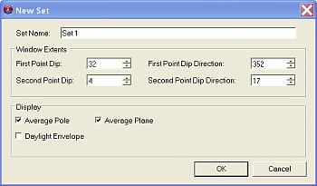
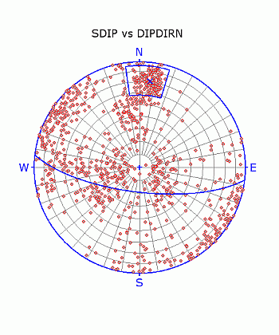

 |  Stereonet - Sets Dialog An overview of features  
---|---  
  
# Stereonet - Sets Dialog

### To access this dialog:

  * In the [Stereonet](<Stereonet_Dialog.md>) dialog, select the Sets tab.

The Stereonet - Sets dialog is used to create and delete sets; define associated color and line thickness parameters; define average plane and daylight envelope settings for the stereonet plot.

  
Field Details:

Show All: select this option to display all the listed sets (default).

Create New Set: click this button to create a new set interactively in the Preview Pane.

Delete Set: click this button to delete the set currently selected (highlighted in blue) in the list.

Sets: a list of currently defined sets; only the select set parameters are displayed in the Display fields below.

Name: user-defined set name.

Av.Dip: automatically calculated average 'dip' of the poles lying with the set limits.

Av.Dip Direction: automatically calculated average 'dip direction' of the poles lying with the set limits.

Display: these controls only act on the item selected in the Sets pane, i.e. the current set:

Set:

Color: select the required set border and great circle color from the drop-down.

Line Thickness: select the required set border and great circle line thickness from the drop-down.

Average Plane and Daylight Envelope:

Plane: select this to display the plane to the average pole (default).

Pole: select this to display the average pole (default).

Daylight Envelope: select this to display the daylight envelope of the average pole.

Color: select the required daylight envelope color from the drop-down (default 'blue').

Line Thickness: select the required daylight envelope line thickness from the drop-down (default '2').

Symbol: select the symbol type for the average pole (default 'X').

Symbol Size: select the symbol size for the average pole (default '10').

 |  The Stereonet dialog is modal. This means that it can be left open while other commands, e.g. in the Design or VR windows, are run. This allows it to be used for the interactive analysis of structural data across various windows and dialogs.   
---|---  
  

## Defining a New Set

Multiple sets can be defined within a stereonet plot, each with its own set of definition and display parameters, using the procedure outlined below:

  1. Load the required data and define a new stereonet chart using the Stereonet Dialog's [Data Selection](<Stereonet_DataSelection_Dialog.md>) and [Charts](<Stereonet_Charts_Dialog.md>) tabs.

  2. In the Sets tab, click the Create New Set button, using the mouse, define two opposite corners for the set window in the Preview Pane.

  3. In the New Set dialog, define the name, extents and display settings, click OK:  
  
  

  4. Check the location and extents of the set window and average plane in the Preview Pane:  
  
  

  5. Modify any settings in the Sets tab's Display group.

 |  Related Topics  
---|---  
| [The Stereonet Dialog](<Stereonet_Dialog.md>)   
[Stereonet - Data Selection](<Stereonet_DataSelection_Dialog.md>)[  
Stereonet - Charts](<Stereonet_Charts_Dialog.md>)   
[Stereonet - Planes](<Stereonet_Planes_Dialog.md>)[  
Stereonet - Cones](<Stereonet_Cones_Dialog.md>)[  
Stereonet - Information](<Stereonet_Information_Dialog.md>)[  
Stereonet - Settings](<Stereonet_Settings_Dialog.md>)