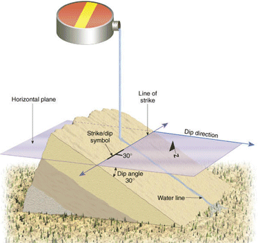

 |  Structural Data Overview Sourcing and formatting structural data for use in Stereonet Charts  
---|---  
  
# 

# Sourcing Geological Structure Data

Representing Structure Data

Formatting Structural Point Data

# 

## Sourcing Geological Structure Data

Geological structure data typically comes from the following activities:

  * Mapping of outcrop, open pit and underground excavation faces, typically using what are known as 'scan lines'.

  * Logging and orientation of drillhole core.

This data can be obtained by manual mapping methods (using tape measure, compass, specialist geotechnical measuring devices and recording into notebook or portable electronic devices i.e. PDAs or tablet PCs) or by means of electronic measuring equipment.

## Representing Structure Data

Structural data encountered in a mining/exploration operation typically includes the following geological features:

  * Rock contact - a contact surface between 2 adjacent, different rock types

  * Joint - a break (crack) in a rock in which there is no relative movement of either side across the break

  * Fault - a break in the rock mass in which the rocks on either side of the break have been displaced (vertically and/or horizontally) relative to each other

The orientation of the surface (hereafter referred to as a plane) is described by the following parameters:

  * Dip direction - the direction of maximum dip on a surface i.e. the direction water would flow if poured on the surface (measured with a compass in a horizontal plane; range of values: 0 - 360 degrees)

  * Dip - the maximum angle that the surface makes with a horizontal plane. A horizontal surface would have zero dip; a vertical surface would have a dip of 90 degrees (measured with a clinometer; range of values: 0-90 degrees, only positive values)

This orientation is typically written in the unambiguous format AAA/BB where AAA = Dip Direction and BB = Dip. For example, a plane with a Dip Direction of 215 degrees and a dip of 26 degrees is described as having an orientation of 215/26.

## Formatting Structural Point Data

A structural points data file requires the following fields (data columns) in order to be recognized by the Stereonet Charts, the Design and VR windows as structural points:

  * XPT \- X coordinate

  * YPT \- Y coordinate

  * ZPT \- Z coordinate

  * DIPDIRN \- Dip direction (units in degrees; values: 0 - 360; clockwise from north)

  * SDIP \- Dip (units in degrees; values: 0 - 90; horizontal=0, vertical down=90 )

  * Other user defined attribute fields

User defined attribute fields are used for:

  * Describing, categorizing and analyzing structural data

  * Filtering data in the Design and 3D windows

  * Generating Steronets by key field values

User defined attribute fields (alphanumeric or numeric) can be used to describe for example:

  * Unique feature ID numbers

  * Feature types (e.g. fault, joint, bedding)

  * Date, Location

  * Surface roughness

  * JCS (joint compressive strength)

  * Rock type

  * Gouge (fill material)

The example structural points file used in the examples, contains the following user defined attribute fields:

  * SCANLNID - the scan line* identifier i.e. scan line number

  * AT - the distance along the mapping line at which the structure is located

* 'scan line' is a term used to describe a particular type of structural mapping method whereby each and every structure (and not an average or representative structural feature) intersected along a mapping line is mapped.

 |  Related Topics  
---|---  
|  [Stereonet Introduction](<Stereonet%20Introduction.md>)   
[Example - General Geological Structural Analysis](<Example%20-%20General%20Analysis.md>)[  
Example - Slope Failure Mode Analysis](<Example%20-%20Slope%20Failure.md>)