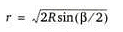

 |  The Schmidt Projection An overview of the Schmidt or Equal Area projection  
---|---  
  
# Schmidt Projection

The basis for all projection techniques is the imaginary reference sphere of radius R, positioned with its center at the center of the area of projection. Consider a line oriented with the trend (a) and plunge (b), and positioned so that it passes through the center of a reference sphere. If this line is extended, it will pierce the perimeter of the reference sphere at two points: P on the lower hemisphere and Q on the upper hemisphere. If you consider one point on the lower hemisphere, P, it can be projected on to the horizontal plane by a number of methods; two of which are available to Stereonet users; equal angle, or equal area projections. The specific types of these projections are Schmidt as the method for equal area projection and Wulff as the equal angle method.

A Schmidt projection is a Lambert azimuthal equal-area projection of the lower hemisphere of a sphere onto the plane of a meridian.

For the equal area projection, the given line of trend a and downward plunge b will again intersect the lower reference sphere at point P'. This point is projected by swinging it in a vertical plane through a circular arc centered at B, located at distance R vertically below O, to point P''. P'' is projected to P, where the arc intersects the lower reference hemisphere, then in a straight line extension of the chord P'' - P' on the plane of projection (horizontal plane). For this projection, the relationship between r, the radial distance of point P from O, and b is given by:

To compare Wulff (equal angle) and Schmidt (equal area) projections:

(Reference: Rock Slope Stability by Charles A. Kliche published 1999 by SME)

 |  Related Topics  
---|---  
|  [Wulff Projection](<Projection_Wulff%20Net.md>)