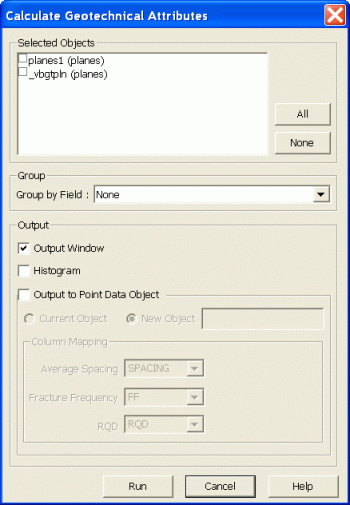
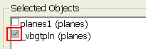

# Calculate Geotechnical Attributes Dialog

 |  Calculate Geotechnical Attributes Dialog Using the Calculate Geotechnical Attributes dialog  
---|---  
  
### To access this dialog use one of the following:

  * Run [calculate-geotechnical-attributes](<../command_help/calculate-geotechnical-attributes.md>) from the Command toolbar.

The Calculate Geotechnical Attributes dialog is used to define Selected Objects, Group and Output parameters and then calculate the average joint spacing, fracture frequency and RQD for the selected Planes.

Field Details:

Selected Objects: this group contains the objects controls:

Selected Objects: lists all currently loaded Planes objects in the Design window.

Clear or check the box to the left of each item in order to deselect or select an object. Objects which were selected in the Design window prior to running this command, are listed with checked boxes. A partially selected object, i.e. an object which has only some of its planes selected in the Design window, has a greyed check box as shown below:

While this dialog is open, planes can also be selected or deselected in the Design window. The status of items in the Selected Objects list is updated as these graphic selections are performed.

All: click this button to select all objects listed under Selected Objects (this overrides any partial selections).

None: click this button to deselect all objects listed under Selected Objects (this overrides any partial selections).

Group: this group contains the group by field controls:

Group by Field: select a field (i.e. data column) in order to calculate geotechnical attributes by key field values; select [None] to calculate geotechnical attributes across all selected planes. Note: this key field must be present in all the selected objects.

Output :this group contains the output controls:

Output window: check this box in order to display the calculated results in the Output control bar.

Histogram: check this box in order to create a histogram chart sheet in the Plots window.

Output to Point Data Object: check this box in order to output a Points object. If this box is checked, the following options are enabled:

Current Object: select this option to save the output to the current Points object.

New Object: select this option to save the output to a new Points object.

Column Mapping: this group contains the data column mapping controls:

Average Spacing: select a field name in which these values will be stored (default [SPACING]).

Fracture Frequency: select a field name in which these values will be stored (default [FF]).

RQD: select a field name in which these values will be stored (default [RQD]).

 |  Related Topics  
---|---  
| [Charting - Chart Parameters Dialog](<../PLOTS_LOGS/Chart_Histogram_ChartProperties.md>)