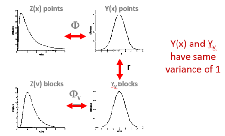

# Change of Support

The core objective of the change of support model is to estimate the histogram of blocks for the entire domain, from the point histogram.

In a discrete gaussian model (DGM), knowing the distribution of sample point values is equivalent to knowing the anamorphosis. The distribution of point data is completely represented by the anamorphosis function.

The distribution of blocks can also be modeled by the block [anamorphosis](<About_Gaussian_Anamorphosis.md>) function. These two anamorphoses are directly related in the framework of DGM as the resulting Gaussian point and block distributions are assumed to be bi-Gaussian and a _coefficient_ can be calculated. This coefficient is directly related to the variance reduction between the raw point distribution and that of a particular support.

;>)

Once a change of support model like DGM is implemented one can apply cutoffs to a block histogram model and then calculate the metal,% of grade above cutoff and mean grade above cutoff for the SMU support. This change of support, when applied to the entire domain, is said to be global. Its application on a local basis is also possible (say, panel by panel) and then yields local recoverable resource estimates, which can be obtained amongst other methods via [Uniform Conditioning](<About_Uniform_Conditioning.md>).

The distribution of raw Z(x) points is transformed into a Normal distribution Y(x) through a process known as [Gaussian Anamorphosis](<About_Gaussian_Anamorphosis.md>).

Related topics and activities

  * [About Uniform Conditioning](<About_Uniform_Conditioning.md>)

  * [About Gaussian Anamorphosis](<About_Gaussian_Anamorphosis.md>)

  * [About the Information Effect](<About_Information_Effect.md>)

  * [About Localized Uniform Conditioning](<About_Localized_Uniform_Conditioning.md>)

  * [About Recoverable Resources](<About_Recoverable_Resources.md>)

  * [UC Wizard - Introduction](<UniformConditioning_Introduction.md>)