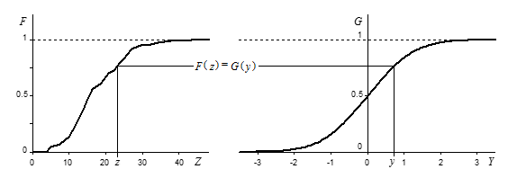
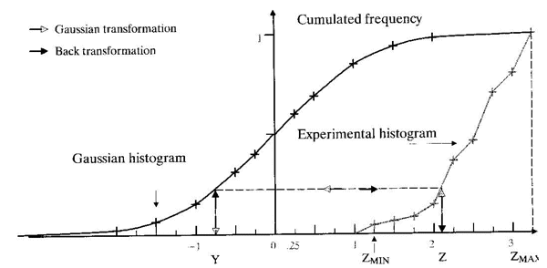

# Gaussian Anamorphosis

For mosaic-style modelling, all variograms are directly proportional, so indicator kriging will provide a correct solution. Diffusion-style models are a bigger challenge in that [co-kriging](<../STUDIO_RM/Grade%20Estimate%20Overview.md#cokriging>) is required as the model is discretely gaussian in nature. The important point is that the gaussian model will retain a gaussian distribution when the [support change](<About_Change_of_Support.md>) occurs (from points to blocks) as a result of Gaussian Anamorphosis.

;>)

The Gaussian Anamorphosis Modelling functionality is designed to:

  * model the histogram of your raw dataset (Anamorphosis function);
  * transform a Raw Variable into a Gaussian Variable (normal score transformation) that will be used in the simulation processes;
  * calculate grade-tonnage curves.

The gaussian anamorphosis is a mathematical function which transforms a variable Y with a gaussian distribution in a new variable Z with any distribution. From a pragmatic viewpoint, this means transforming a non-Gaussian distribution into a Gaussian distribution (anamorphosis means transformation). For example, the image below shows an anamorphosis between an empirical distribution and a normal distribution (cumulated distribution functions)

:;>)

As a more focussed example, the following compound image shows the difference between a Gaussian and Experimental histogram.

;>)

This is used in the global change of support phase, where the histogram of blocks for the entire domain is estimated from the point histogram. In this process, the distribution of raw points is first transformed into a normal distribution using Gaussian Anamorphosis and the block distribution is then derived by implementing a [change of support](<About_Change_of_Support.md>) model.

Related topics and activities

  * [About Uniform Conditioning](<About_Uniform_Conditioning.md>)

  * [About Change of Support](<About_Change_of_Support.md>)

  * [About Localized Uniform Conditioning](<About_Localized_Uniform_Conditioning.md>)

  * [About the Information Effect](<About_Information_Effect.md>)

  * [About Recoverable Resources](<About_Recoverable_Resources.md>)

  * [UC Wizard - Introduction](<UniformConditioning_Introduction.md>)