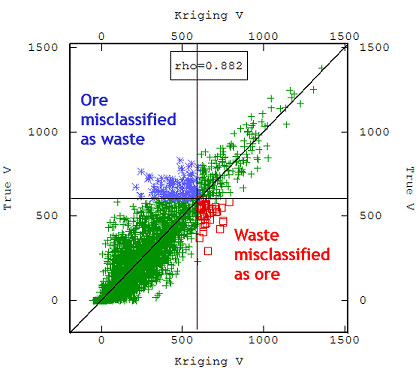

# The Information Effect

The information effect refers to the fact that, even during production, the real mining block grades are not known. Only an estimated value of them, based on production samples, is known and blocks are defined according to whether this value, not the real grade, is above the economic cut-off. So some blocks will be mis-classified as waste and vice versa. This information effect, that quantifies the amount and the effect of the misclassification on the recoverable reserves, can be taken into account to obtain a more realistic [recoverable reserves](<About_Recoverable_Resources.md>) estimate.

During the production stage, the actual grades are sampled on a much denser grid than that available at exploration or feasibility stages and that grid may then be taken into account so the decision between ore and waste is made upon more accurate estimates of the Selective Mining Units (SMUs). It is possible to anticipate future decisions before obtaining the production blast-holes results, because the kriging statistics of these SMU final estimates only depend on the envisaged data configuration, block geometry and variogram model. If the future sampling pattern is known, it is possible to consider the Information effect.

For example, the image below represents the information effect in terms of mis-classification (rich ore sent to waste, in red on the figure, and poor ore added to recovered ore tonnage, in blue):

;>)

If you choose to ignore the Information Effect during grade-tonnage curve calculation, you will effectively generate curves where the mining selection is based on true SMU grade. However - the grades will be estimated using the ultimate information from the blastholes. As such, the g/t curve will be deteriorated (the selectivity obtained by basing our decisions on estimates rather than the true grades is inferior to that of the unattainable ideal selectivity based on the unknown true grades).

It is generally accepted that incorporating the information effect leads to a more realistic recoverable reserves estimate, but this largely depends on the nature of the orebody and operational parameters such as sample spacing/number of samples. This can only be evaluated on a case-by-case basis according to the specific characteristics of the project, so as to provide the most appropriate recoverable reserves estimate on which to base feasibility studies.

In summary then, the information effect relates to the effect of incorrect ore classification that can result from an assumed SMU grade.

Management of Grade-Tonnage curves (as part of Uniform Conditioning) is performed using the [Global G/T Tonnage Curves](<UniformConditioning_GlobalGradeTonnageCurves.md>) screen of Studio's Uniform Conditioning Wizard.

Related topics and activities

  * [About Uniform Conditioning](<About_Uniform_Conditioning.md>)

  * [About Gaussian Anamorphosis](<About_Gaussian_Anamorphosis.md>)

  * [About Change of Support](<About_Change_of_Support.md>)

  * About the Information Effect

  * [About Localized Uniform Conditioning](<About_Localized_Uniform_Conditioning.md>)

  * [About Recoverable Resources](<About_Recoverable_Resources.md>)

  * [Uniform Conditioning - Grade Tonnage Curves](<UniformConditioning_GlobalGradeTonnageCurves.md>)

  * [UC Wizard - Introduction](<UniformConditioning_Introduction.md>)

  * [UC Wizard - Grade Tonnage Curves](<UniformConditioning_GlobalGradeTonnageCurves.md>)