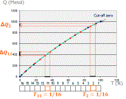
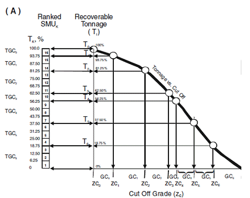
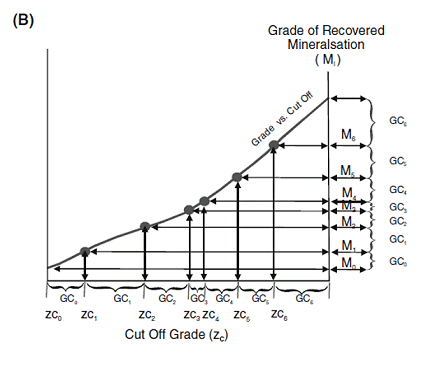
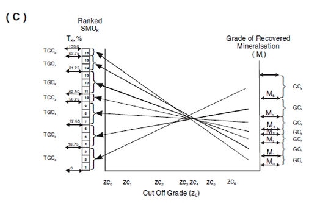
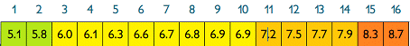
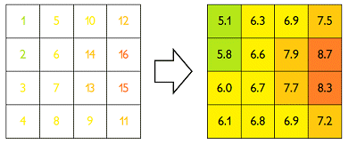

# Localized Uniform Conditioning

Once a panel model has been generated (as part of the [Uniform Conditioning wizard](<UniformConditioning_Introduction.md>)), you can post-process the resulting model to estimate resources at a more granular level - the Selective Mining Unit (SMU) using a process known as Localized Uniform Conditioning, or LUC. 

This process assigns, within each panel, a grade value to each SMU whilst preserving the local grade tonnage curve of SMUs estimated at the panel level by Uniform Conditioning.

This method estimates the localized block grades by using the grade-tonnage curves given by the [Uniform Conditioning](<About_Uniform_Conditioning.md>) process and by utilising a ranking of the SMU grades obtained by Ordinary Kriging.

The goal of Localized Uniform Conditioning is to provide a more 'intuitive' presentation of uniform conditioning result by assigning a unit-level mean average grade based on calculations of the tonnages and grades above each cut-off grade, dispersed within the panel according to their rank

An overview of LUC:

  * Localized Uniform Conditioning = Uniform Conditioning post-processing. Results/data from UC are fed into the LUC process to create the 'SMU Model'
  * The main idea consists in assigning to each block (SMU) a grade such that the distribution of block grades in the panel finds back the local grade tonnage curve estimated by UC.
  * Grade classes are defined according to the output from Uniform Conditioning. The grade class is the portion of the panel whose grade is lying between a given cut-off and the following cut-off. The tonnages above each cut-off are expressed as a proportion of the panel whilst honouring the discretization of the panel into selective mining units. For example, if a panel is divided into 16 units, each grade class will represent as a multiple of 1/16 (6.25%), e.g.:
  * ;>)
  * The mean grades of each grade class can then be calculated, for example;

;>)   

  * Next, each mean grade (for each grade class) is assigned to the mining unit where the tonnage class computed previously matches the class from Uniform Conditioning, for example:

;>)   

  * The metal quantity above cut-off is subsequently calculated from post-processed tonnages class values (where the cut-offs are calculated by linear interpolation between the initial uniform conditioning tonnage values:

In other words, LUC is applied once to assign grades to mining units (possibly belonging to different domains) inside the panels. Mean grades are calculated for every SMU within the panel according to their rank and respective grade-tonnage curves, giving rise to localized, kriged estimates for each mining unit - the "SMU model". The distribution of grades throughout the panel can be described more easily with a visual example; in the following panel, split into 16 selective mining units, localized mean grades have been calculated for each SMU and ranked in increasing order from 1-16

;>)

The locally-conditioned grade is then applied to the SMU that matches the same grade class from Uniform Conditioning, e.g.:  
  
;>)

Related topics and activities

  * [About Uniform Conditioning](<About_Uniform_Conditioning.md>)

  * [About Recoverable Resources](<About_Recoverable_Resources.md>)

  * [About Gaussian Anamorphosis](<About_Gaussian_Anamorphosis.md>)

  * [About the Information Effect](<About_Information_Effect.md>)

  * [UC Wizard - Introduction](<UniformConditioning_Introduction.md>)

Sources: "Localized Multivariate Uniform Conditioning (LMUC) White Paper, Geovariances Publication"

References:

M. OConnor (CSA Global), O. Bertoli (Geovariances) and M. Titley (CSA Global) Estimating Recoverable Uranium Resources using Uniform Conditioning A Case Study on the Mkuju River Uranium Project, Tanzania The AusIMM International Uranium Conference 2012 13-14 June 2012