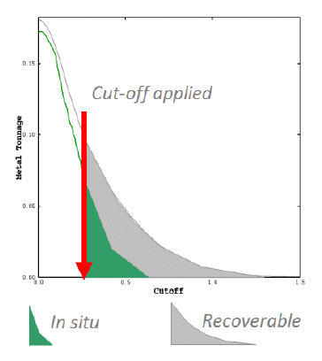
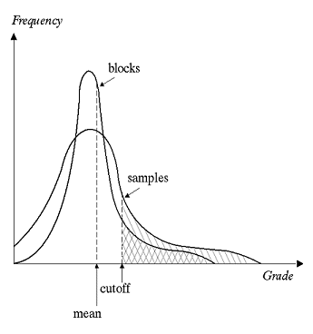
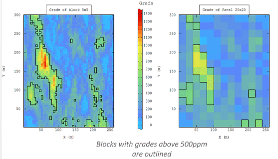

# Recoverable Resources

in situ resource models based on exploration data will usually fail to capture the variability at the scale of selective mining units used for mine planning. Such resource models are traditionally based on panel sizes that are compatible with the exploration drill spacing, and these panels are usually much larger than the size of the actual SMUs.

The prediction of recoverable tonnes and grade based on in situ resources, on the panel-scale, may distort the quantities actually recoverable from the mining process e.g. at the SMU-scale (see figure below).

The tonnage and metal than can be recovered after a nominated cut-off will depend on the ['support'](<About_Change_of_Support.md>) used to define the model (points, blocks, panels). This is because samples that are derived from small volumes (e.g. on the cubic centimeter scale) have a different distribution from the means grades on more general units, such as Selective Mining Units (SMUs - possibly cubic meters). The larger the support size, the lower the spread of values around the mean average:  
  

As such, local estimation of resources largely depends on the support, e.g.:  
  

Where a diffusion-style (gaussian) distribution of grades is expected, one valid method of estimating recoverable resources is [Uniform Conditioning](<About_Uniform_Conditioning.md>).

 |  Related Topics  
---|---  
| [About Uniform Conditioning](<About_Uniform_Conditioning.md>)   
[About Gaussian Anamorphosis](<About_Gaussian_Anamorphosis.md>)   
[About Change of Support](<About_Change_of_Support.md>)   
[About the Information Effect](<About_Information_Effect.md>)   
[About Localized Uniform Conditioning](<About_Localized_Uniform_Conditioning.md>)   
[UC Wizard - Introduction](<UniformConditioning_Introduction.md>)  
  
Copyright Datamine Corporate Limited  
MIN 20044_00_EN

Sources: "Localized Multivariate Uniform Conditioning (LMUC) White Paper, Geovariances Publication"

References:

M. OConnor (CSA Global), O. Bertoli (Geovariances) and M. Titley (CSA Global) Estimating Recoverable Uranium Resources using Uniform Conditioning A Case Study on the Mkuju River Uranium Project, Tanzania The AusIMM International Uranium Conference 2012 13-14 June 2012