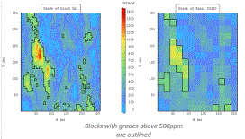
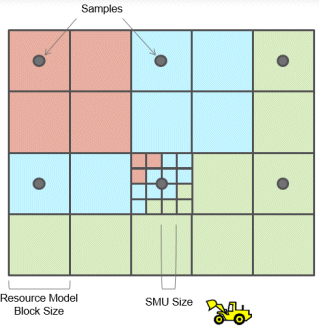
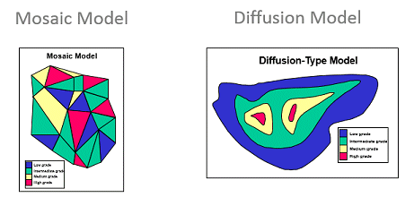
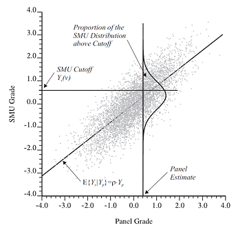
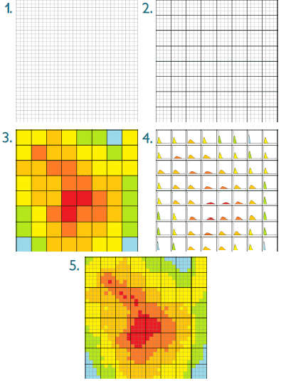

# Uniform Conditioning

The 2012 JORC Code states that when considering Mining Factors:

Assumptions made regarding possible mining methods, minimum mining dimensions and internal mining dilution. It is always necessary as part of the process of determining reasonable prospects for eventual economic extraction to consider potential mining methods

Uniform Conditioning is one tool that can be used to address this requirement by providing a method for creating a model that represents the variability of the deposit for a defined selective mining unit (SMU).

Resource model grades are estimated into blocks whose size is representative of the drillhole/sample spacing. However, recoverable reserves depend in part on the variability of grade at a Selective Mining Unit (SMU) size. 

The SMU size is usually smaller than the panel size so grade tonnage curves and mine plans based on the resource model blocks may not be representative of what can actually be economically recovered.

Uniform Conditioning provides a method for creating a model that is representative of the variability of the deposit for a defined SMU, which if used for mine planning and reserve calculation can increase the confidence in the resulting reports and mine plans. 

The main aim of Localized Uniform Conditioning (LUC) is to assign grades to each SMU within a panel such that the distribution of SMU grades is the same as the distribution of grades for the same panel in the UC model.

The main steps in the LUC process are:

  * Calculate the tonnage of an SMU panel tonnage divided by number of SMUs per panel
  * Calculate the LUC grade of each SMU so that the grade and tonnage curves are consistent with the panel grade and tonnage curves. At this stage the LUC values are not assigned a location within each panel 
  * Create a kriged estimate of the grade of each SMU
  * Sort both the LUC values and the kriged estimates from low grade to high
  * Assign the LUC values to the each SMU block based on its sort order

Uniform Conditioning - How it works

Uniform Conditioning helps you to optimize the accuracy of your predicted [recoverable resource](<About_Recoverable_Resources.md>) estimates and access the information you have available regarding recoveries predicted at the mining (SMU) scale.

UC is a non-linear estimation technique which is used to determine the distribution of SMU grades above specified values (cut-off-grades) inside a _panel_. 

The principle of the tool is that data exists to accurately estimate grade at a larger resource-level panel scale - but - you cannot accurately estimate the selective mining unit (SMU) blocks it contains. This is more likely to be the case where sample data is limited, which is often the case at the start of operations such as during the exploration phase of a project. Linear estimation at this stage can have the effect of smoothing estimates and displaying an apparent loss of ore and metal tonnage at high cut-off grades.

_In situ_ resource models based on exploration data will usually fail to capture the variability at the scale of selective mining units used for mine planning. Such models are traditionally based on panel sizes that are compatible with the exploration drillhole/sample spacing, and these panels are usually much larger than the size of the actual SMUs. 

Because of this difference in scale, grade-tonnage curves and mine plans based on the resource model blocks may not be representative of what can actually be economically [recovered](<About_Recoverable_Resources.md>); the process may distort the quantities actually recoverable from the mining process e.g. at the SMU-scale.

The following image shows an example of a cross-section through a resource model showing sample positions, block cells and SMU dimensions:.  

Uniform Conditioning provides a method for creating a model that represents the variability of the deposit for a defined SMU which, if used for mine planning and reserve calculation, can increase the confidence in the resulting reports and mine plans..

UC estimates the distributions (or histograms) of SMU grades on different scales:

  * at the deposit scale, in global recoverable resource estimates; and
  * at the panel scale, for local recoverable resource estimates.

Estimating tonnage and grade from sparse data at a mining scale resolution is a challenge. Uniform Conditioning provides a powerful approach to estimating recoverable resources at a local scale, i.e. predicting the local distributions of SMUs within larger panels conditional to neighboring information. A set of functions, including [Gaussian Anamorphosis](<About_Gaussian_Anamorphosis.md>), [declustering](<UniformConditioning_Decluster.md>), [grade-tonnage calculations](<UniformConditioning_GlobalGradeTonnageCurves.md>) and optional incorporation of the [information effect](<About_Information_Effect.md>) represent a non-linear process that will, ultimately, estimate more granular information about the model and increased confidence from a higher-resolution grade distribution/calculation

So, how can you infer the grade histogram of mining blocks, and their distribution, from distribution of sample grade points across the entire domain? Use a [Change of Support model](<About_Change_of_Support.md>).

Whilst estimating SMU grades from sparse exploration drilling is not defensible geostatistical practice (one shall not estimate small blocks), the realm of recoverable resource estimation offers a different type of solution: it fulfils the practical objective of evaluating the economic performance of the deposit under fixed selectivity constraints by inferring the distributions (histograms) of SMU values instead.

UC is particularly suited to orebodies that follow a diffusion model of grade architecture, for example, this means UC relies on the underlying assumption that the spatial grade distribution can be best described by a diffusion model, where grade tends to move from lower to higher values in a relatively continuous way: when going from higher to lower grade regions within a domain, we tend to pass through intermediate grades (and vice versa). The validity of this critical assumption can actually be tested on the data.  

;>)

For mosaic-style modelling, all variograms are directly proportional, and indicator kriging will provide a correct solution to the simplification of the full indicator co-kriging system. For diffusion-style models the co-kriging of the distribution indicators can also be simplified as the model is discretely Gaussian in nature. The important point is that the gaussian model will maintain a coherent relationship between gaussian distributions when the occurs (from points to blocks, for example).

In addition, being an extension of ordinary kriging, UC deals well with departures from strict stationarity conditions. Uniform Conditioning estimates the grade-tonnage curves for each panel. The grade tonnage curves correspond to the tonnage and grade of mineralization which can be recovered for a cut-off value

Uniform Conditioning using multiple instances of SMU size and/or cut-off grade allows the differences between recovered tonnes and grade to be displayed, for example as a composite graph:

;>)

A statement of tonnes and grade for a resource may be misleading without analysis of different SMU sizes. Uniform Conditioning provides that analysis.

## Uniform Conditioning Concepts

You can access Uniform Conditioning functionality through a series of steps, formulated into an easy-to-use [Wizard](<UniformConditioning_Introduction.md>) that results in grade/tonnage curves and reports for the different Selective Mining Units.

There are 3 potential outputs from this process:

  * Global G/T curves
  * A Panel Model and reports (optional)
  * An SMU Model and reports (optional)

Model generation involves estimation of the panel/block size grades \- kriging is performed with the block discretization set at the SMU resolution within the panel. This is, in practice, "Uniform" conditioning, resulting in a conditioned panel model. You can then process this model further and apply 'Localized Uniform Conditioning', using the [SMU Model Reports](<UniformConditioning_SmuBlockModelReports.md>) screen.

The output from the UC phase is an updated geological model file containing grade estimates relevant to predefined panel and SMU dimensions. This captures the proportion of the SMU distribution above each cut-off grade.

;>)

The metal quantity is also calculated above the same cutoff grade.

A high-level view of the Uniform Conditioning process:

;>)

  1. The Selective Mining Unit size is defined over the entire deposit
  2. Panels are constructed as multiple of SMus
  3. Panel size is defined to ensure a suitable quality of kriging
  4. Local distributions are estimated panel by panel. The local estimates are conditioned by kriging to accommodate local variations in the mean average.
  5. The grade tonnage curves estimated panel by panel are then localised into SMU sized values during the [Localized Uniform Conditioning](<About_Localized_Uniform_Conditioning.md>) procedure.

Related topics and activities

  * [About Localized Uniform Conditioning](<About_Localized_Uniform_Conditioning.md>)

  * [About Recoverable Resources](<About_Recoverable_Resources.md>)

  * [About the Information Effect](<About_Information_Effect.md>)

  * [About Recoverable Resources](<About_Recoverable_Resources.md>)

  * [UC Wizard - Introduction](<UniformConditioning_Introduction.md>)

Sources: "Localized Multivariate Uniform Conditioning (LMUC) White Paper, Geovariances Publication"

References:

M. OConnor (CSA Global), O. Bertoli (Geovariances) and M. Titley (CSA Global) Estimating Recoverable Uranium Resources using Uniform Conditioning A Case Study on the Mkuju River Uranium Project, Tanzania The AusIMM International Uranium Conference 2012 13-14 June 2012

J. Deraisme (Geovariances), W. Assibey-Bonsu (Gold Fields) - Localized Uniform Conditionning in the Multivariate Case: An Application to a Porphyry Copper Gold Deposit 35th APCOM Symposium 26-30 September 2011

Australasian Code for Reporting Exploration Results, Mineral Resources and Ore Reserves (JORC 2012 Edition)