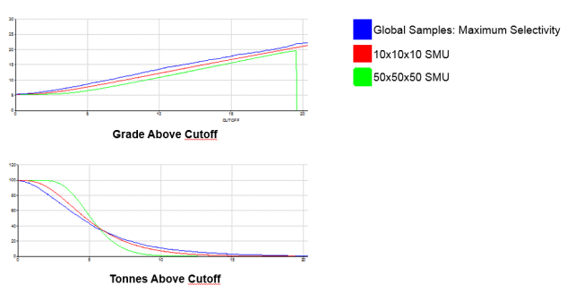

# Uniform Conditioning: Global G/T Curves

To access this screen:

  1. Display the **[Uniform Conditioning](<UniformConditioning_Introduction.md>)** wizard.

  2. Select the **Global G/T Curves** tab.

Generate grade-tonnage curves for each Selective Mining Unit (SMU). You define the dimensions for mining units on this screen, as well as the cut-offs . This process will use the weighted samples file generated during the [Decluster](<UniformConditioning_Decluster.md>) phase to automatically generate a graph (a new, standalone **Plots** window sheet) showing the variance between predicted recovered tonnes and grade at different cutoff grades for different SMU sizes.

Generation of Grade-Tonnage information is completed using two distinct processes: first, values are transformed such that the values are gaussian in terms of distribution (the transformation is inversed to get the values back to the original space) - this process is known as Gaussian Anamorphosis and is run once. 

The second process is run against each SMU and is known as support correction. The algorithmic background of this process is outside the scope of this Help file, but in summary, support correct is where a multivariate _change of support_ (point to SMUs) is performed for the histograms.

Note: You don't need to specify an input block model in order to generate global Grade-tonnage curves. The Uniform Conditioning wizard will allow the [Gaussian Anamorphosis](<About_Gaussian_Anamorphosis.md>) and [Support Correction](<About_Change_of_Support.md>) options to process different sizes of SMU without the need to specify an input model.

In the geostatistical sense, recoverable reserves means the ore tons and metal quantity contained in those tons for a given SMU. The average recoverable grade is calculated as the metal divided by the tonnage.

Instead of dealing in absolute tons, uniform conditioning considers the tonnage as the number of SMU's whose grade is above the cut-off grade . The metal is calculated as this tonnage multiplied by the SMU grade. This type of formalism is used to express the two variables in terms of indicator variables.

To calculate the absolute tonnage and metal, these indicator variables are multiplied by the SMU volume and the density of the ore. However, the potential problem here is that an assumption is made that, at the time of mining, the real SMU grade is known. This is not true as this information is only revealed during production where an estimate of this grade is known and calculated from production samples.

The SMU's sent to the mill as ore are those whose estimated grade, not necessarily real grade, is above the economic cut-off. So some non-waste blocks will be incorrectly classified as waste and some waste misclassified as ore. The amount of misclassification is due to the so-called [information effect](<About_Information_Effect.md>). For a non-conditionally biased estimated the two types of misclassification will at least annihilate each other in terms of tonnage but not in terms of recovered grade.

### The Information Effect

You can (optionally) incorporate the [information effect](<About_Information_Effect.md>) in the estimation of the grade tonnage curves: during the production stage, the actual grades are recovered and may then be taken into account so the decision between ore and waste is made upon more accurate estimates of the SMUs. Therefore you can anticipate future decisions before obtaining the production blast-holes results, because only the kriging variance of these SMUs final estimates is necessary.

See [The Information Effect](<About_Information_Effect.md>).  

Activity steps

  1. Display the **Uniform Conditioning** wizard.

  2. Define input data. See [Uniform Conditioning: Input Data](<UniformConditioning_InputData.md>).

  3. Decluster the input data. See [Uniform Conditioning: Decluster](<UniformConditioning_Decluster.md>)

  4. Specify variograms for conditioning. See [Uniform Conditioning: Variograms](<UniformConditioning_Variograms.md>).

  5. Display the **Global G/T Curves** screen.

  6. Define the No. of discretisation points.

Discretisation allows you to simulate a three dimensional array of points, distributed regularly within the SMU. As Uniform Conditioning adopts a [kriged](<../STUDIO_RM/Grade%20Estimation%20Kriging.md>) approach to estimation, the discretised points are used for calculating the covariance of the cell with each of the surrounding samples. This is then used in calculating the kriging weights. You can use the spin buttons in this area of the screen to set the number of discretisation points in X, Y and/or Z for each SMU.

Note: If an even number of points in a direction are defined, then the points will be spaced around the centre line. If an odd number of points are defined then there will be a point on the centre line and the others will be spaced regularly towards the edges. See [Discretisation](<../STUDIO_RM/Grade%20Estimation%20Cell%20Discretisation.md>).  

  7. Define the Block orientation angle. Where one or more rotations are required to describe block anisotropy, you can enter X, Y and/or Z values here. 

For example: X=20, Y=60, Z=40 means the first rotation is a dip of 40 around the new X-axis, 60 around the new Y-axis and a conventional azimuth rotation of 20 around the Z-axis.

  8. Decide how to treat the variogram sill using Normalise variogram sill (and information effect variance and covariance).

Due to the mathematical complexities of the kriging calculations it can sometimes happen that the kriged variance is slightly greater than the sill of the model variogram. 

**Check** if you intend to use a normalized variogram sill values during grade-tonnage curve generation. As described, this will also normalize the variance and covariance calculations from the [information effect](<About_Information_Effect.md>). The variogram is normalised. If **unchecked** , the input variogram isn't normalised by the Uniform Conditioning process.

  9. Decide how (or if) to incorporate the [Information Effect](<About_Information_Effect.md>):

     * Ignore Ensure the information effect will not influence the g/t information that is generated when curves are created.
     * Manually enter If you are aware of a variance/covariance value you can select this option and enter them here.

     * Calculate Choose this option to ensure the information effect is considered. You will need to enter the planned sample spacing and number of samples in XYZ directions. A variance-covariance will then be calculated automatically. Note that if you are entering these values manually, you must ensure that the sample spacing (which represents the panel dimensions) must be greater than or equal to the largest SMU block size - it is not possible to perform Uniform Conditioning where any SMU dimension exceeds the dimensions of the panel with which it is associated.

  10. Click Create global G/T curves to calculate Grade-Tonnage curves at the specified SMU dimensions and parameters. 

  11. Click View global G/T curves to show the generated G/T curves in the Studio Plots window on an automatically created chart Sheet. Note that you can use all of Studio's charting functionality to further interrogate/format the generated chart. Here's an example (click to expand):

;>)

  12. Continue to the [UC Model Reports](<UniformConditioning_PanelBlockModelReports.md>) screen.

Related topics and activities

  * [Uniform Conditioning - Introduction](<UniformConditioning_Introduction.md>)

  * [Uniform Conditioning \- Input Data](<UniformConditioning_InputData.md>)

  * [Uniform Conditioning \- Decluster](<UniformConditioning_Decluster.md>)

  * [Uniform Conditioning \- Variograms](<UniformConditioning_Variograms.md>)

  * [Uniform Conditioning - Panel Model Reports](<UniformConditioning_PanelBlockModelReports.md>)

  * [Uniform Conditioning - SMU Model Reports](<UniformConditioning_SmuBlockModelReports.md>)

  * [About the Information Effect](<About_Information_Effect.md>)

  * [About Uniform Conditioning](<About_Uniform_Conditioning.md>)

  * [Uniform Conditioning Error Codes](<UC%20Error%20Codes.md>)

References:

Assibey-Bonsu W and Krige DG, Use of Direct and Indirect Distributions of Selective Mining Units for Estimation of Recoverable Resource/Reserves for New Mining Projects, In Proceedings from APCOM'99 Symposium, Colorado School of Mines, Golden, Colorado, pp 239-247, 1999.

Lantujoul C, Cours de slctivit, Course notes C-140, Centre de gostatistique, Ecole des Mines de Paris, Fontainebleau, France, 72 pp, 1990.

Matheron G, Forecasting block grade distributions: the transfer functions, In Advanced Geostatistics in the Mining Industry, M Guarascio, M David & C Huijbregts, eds, Riedel Publishers, Dordrecht, pp 237 - 251, 1976.

Matheron G, The selectivity of the distributions and the "second principle of geostatistics", In Geostatistics for Natural Resource Characterization, G Verly, M David, AG Journel & A Marchal, eds, Riedel Publishers, Dordrecht, pp 421 - 433, 1984.

Remacre AZ, Uniform conditioning versus indicator kriging: a comparative study with the actual data, In Geostatistics: Proceedings from the third international Geostatistics Congress, Sept 5-9, 1988, Avignon (France), M Armstrong, ed., Kluwer Academic Publishers, Dordrecht, pp 947 - 960, 1989