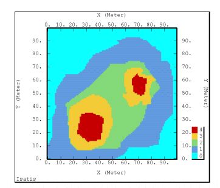

# Uniform Conditioning

Uniform Conditioning (UC) helps you to optimize the accuracy of your predicted [recoverable resource](<About_Recoverable_Resources.md>) estimates and access the information you have available regarding recoveries predicted at the mining (SMU) scale.

UC is a non-linear estimation technique which is used to determine the distribution of SMU grades above specified values (cut-off-grades), inside a panel. 

The principle of the tool is that data exists to accurately estimate grade at a larger resource-level panel scale - but - you cannot accurately estimate the selective mining unit (SMU). This is more likely to be the case where sample data is limited, which is often the case at the start of operations such as during the exploration phase of a project. Linear estimation at this stage will commonly have the effect of smoothing estimates and displaying an apparent loss of ore and metal tonnage at high cut-off grades.

_An example of a plot showing a uniformly conditioned model_

Estimating tonnage and grade, from sparse data, at a mining scale resolution is a challenge. Uniform Conditioning provides a powerful approach to estimating recoverable resources at a local scale, i.e. predicting the local distributions of SMUs (selective mining units) within larger panels conditional to neighboring information. A powerful set of functions, including [Gaussian Anamorphosis](<About_Gaussian_Anamorphosis.md>), [declustering](<UniformConditioning_Decluster.md>), [grade-tonnage calculations](<UniformConditioning_GlobalGradeTonnageCurves.md>) and influence of the [information effect](<About_Information_Effect.md>) are joined into a non-linear process that will, ultimately, provide more granular information about the model and increased confidence from a higher-resolution grade distribution andcalculation.

The resulting model is therefore better aligned with mine planning constraints and offers increased confidence in future scheduling of the mining operation.

Ultimately, at the production stage, SMU grade information will be calculated as a result of blast-hole sampling, for example, as part of a grade control system.

See [Uniform Conditioning](<About_Uniform_Conditioning.md>).

#### Uniform vs. Localized Uniform Conditioning

Another question is; how do you continue this process to calculate a grade histogram and distribution at the local mining unit level?

Localized Uniform Conditioning allows you to assign individual SMU grades.

Uniform conditioning results in a conditioned model in which kriged panel estimates and SMU-sized grade distributions are included. In Studio, this is referred to as the "Panel Model". Localized Uniform Conditioning (LUC) is the process by which SMU grades are assigned, based on the legacy calculations.

The post-processing phase of LUC assigns, within each Panel, a grade value to each SMU whilst preserving the local grade tonnage curve of SMUs estimated by UC. This gives rise to what is known as a 'locally conditioned model'. Both methods are supported in Studio 3, although panel modelling is a precursor to local conditioning and the generation of the 'SMU Model' as part of the final stage of the wizard.  

The Uniform Conditioning wizard comprises the following screens:

  * [Input Data](<UniformConditioning_InputData.md>)Provide the 'ingredients' for the Uniform Conditioning process. This includes the XYZ data fields for the input samples an (optional) model file plus the other parameters required to feed into the process, such as the specified domain field and value. From this information a minimum and maximum grade value, plus details of the number of samples and records held within the domain are displayed. 
  * [Decluster](<UniformConditioning_Decluster.md>)Declustering is the process of adjusting the full data set by removing or weighting data points in densely sampled areas, to give a more representative and evenly spaced set of samples. 
  * [Variograms](<UniformConditioning_Variograms.md>)Use variography tools to create a weighted variogram model file from the declustered samples file. 
  * [Global G/T Curves](<UniformConditioning_GlobalGradeTonnageCurves.md>)Define the SMU dimensions for a global grade/tonnage table and resulting reports. Other parameters such as block orientation angle, number of discretization points and how/if normalization occurs are also available. 
  * [Panel Block Model Reports](<UniformConditioning_PanelBlockModelReports.md>)Generate a uniformly conditioned panel mode. This model contains kriged estimates at the scale of the panel (the sampling distance). Various options are open to you regarding which values are used (e.g. using the input model data, or by selecting a model with kriged values and an optional search volume parameter file). In addition, you can view a summary report showing the total tonnes and grade. 
  * [SMU Block Model Reports](<UniformConditioning_SmuBlockModelReports.md>)Create the SMU block model with a parent cell size corresponding to an SMU and provides a validation table and total tonnes/grade summary reports. This process is referred to as 'Local Uniform Conditioning' and applies kriged estimates to each mining unit whilst honouring grade tonnages. 

Related topics and activities

  * Uniform Conditioning: Introduction

  * [Uniform Conditioning: Input Data](<UniformConditioning_InputData.md>)

  * [Uniform Conditioning: Decluster](<UniformConditioning_Decluster.md>)

  * [Uniform Conditioning: Variograms](<UniformConditioning_Variograms.md>)

  * [Uniform Conditioning: Grade Tonnage Curves](<UniformConditioning_GlobalGradeTonnageCurves.md>)

  * [Uniform Conditioning: Panel Model Reports](<UniformConditioning_PanelBlockModelReports.md>)

  * [Uniform Conditioning: SMU Model Reports](<UniformConditioning_SmuBlockModelReports.md>)

  * [About Uniform Conditioning](<About_Uniform_Conditioning.md>)

  * [About Gaussian Anamorphosis](<About_Gaussian_Anamorphosis.md>)

  * [About Change of Support](<About_Change_of_Support.md>)

  * [About Recoverable Resources](<About_Recoverable_Resources.md>)

  * [About Localized Uniform Conditioning](<About_Localized_Uniform_Conditioning.md>)

  * [About the Information Effect](<About_Information_Effect.md>)

Sources: "Localized Multivariate Uniform Conditioning (LMUC) White Paper, Geovariances Publication"

References: M. OConnor (CSA Global), O. Bertoli (Geovariances) and M. Titley (CSA Global) Estimating Recoverable Uranium Resources using Uniform Conditioning A Case Study on the Mkuju River Uranium Project, Tanzania The AusIMM International Uranium Conference 2012 13-14 June 2012

J. Deraisme (Geovariances), W. Assibey-Bonsu (Gold Fields) - Localized Uniform Conditioning in the Multivariate Case: An Application to a Porphyry Copper Gold Deposit 35th APCOM Symposium 26-30 September 2011

Australasian Code for Reporting Exploration Results, Mineral Resources and Ore Reserves (JORC 2012 Edition)