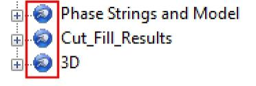

# 3D Folder Menus

The **[Sheets](<SheetsOverview.md>)** control bar displays a secondary level entry for all currently available 3D views, for example, below, three 3D windows exist for the current project.

See [3D Window Visualization](<VR_Introduction.md>), [External 3D Views](<../COMMON/External_3D_Windows.md>) and [Independent 3D Windows](<../COMMON/Independent_3D_Windows.md>).

Each section can be expanded to reveal a set of data-type specific folders, which can in turn be expanded to display the available overlays of that data type. Each level of the menu provides context-sensitive menu entries. See [3D Data Folders](<SheetsOverview.md>).

Right-clicking a view-level icon reveals commands that will be applied to all overlays (of all data types) that reside within that view. For example, you can enable or disable clipping, or apply a display filter to all overlays in the view at once. This is useful where you need to isolate a particular category of data, say, the drillholes, block model and wireframe of a particular shear zone in a resource modelling case study.

To make view-specific changes:

  1. Display the **Sheets** control bar.
  2. Locate the relevant view item. If you are only displaying the default 3D view, it appears as "3D".
  3. Right-click the view item to reveal a menu. 

  4. To generate a new **[overlay](<../COMMON/concept_views%20sheets%20overlays.md>)** of any currently loaded 3D data object:

     1. Select **Create from Loaded Data**.
     2. A list of all loaded data objects (all data types) displays.
     3. Check all objects from which you wish to create a new, default overlay.

**Note** : 3D Overlays are generated using the settings of the **[default template](<../COMMON/3D_Window_Templates.md>)** for each data type.

     4. Click **OK**.
     5. A new overlay will appear in the respective object data type folder(s).
  5. To enable or disable clipping in the view, that is, apply or ignore the current view clipping settings as displayed on the **[3D View](<../COMMON/Ribbon_View_VR.md>)** ribbon:

     * Select **Clip All** to apply the current clipping settings to all visible overlays of the view.

     * Select **Clip None** to disable clipping in the selected view.

  6. To hide or show all loaded overlays of the view:

     * Select **Show All** to enable the display of all available 3D overlays in the view.

     * Select **Hide All** to disable the display of all overlays in the view

**Note** : This emulates the checking and unchecking of overlay items in the lower menus,

  7. To redraw the contents of a 3D window, select **Redraw All**.

  8. To apply a previously saved [Quick Filter](<../COMMON/Quick%20Filter%20Dialog.md>) to all overlays in the selected view:

     1. Expand the **Apply Filter** menu.

     2. Select a previously saved filter description.

The filter applies to all overlays in the view. If the filter references attributes of loaded data objects, a filter is applied to all corresponding 3D overlays of those objects.

Also see [Quick Filters: Examples](<../COMMON/Quick_Filters_Worked_Example_1.md>)

  9. To remove all overlays from the selected view:

**Warning** : Use this option with caution as it cannot be undone.

Related Topics and Activities

  * [3D Window Visualization](<VR_Introduction.md>)
  * [External 3D Views](<../COMMON/External_3D_Windows.md>)
  * [Independent 3D Windows](<../COMMON/Independent_3D_Windows.md>)
  * [Windows, Sheets, Projections and Overlays](<../COMMON/concept_views%20sheets%20overlays.md>)
  * [3D Window Templates](<../COMMON/3D_Window_Templates.md>)
  * [3D Data Folders](<SheetsOverview.md>)
  * [Sheets Control Bar](<../COMMON/Sheets%20Control%20Bar%20Overview.md>)
  * [Quick Filter Control Bar](<../COMMON/Quick%20Filter%20Dialog.md>)
  * [Quick Filters: Examples](<../COMMON/Quick_Filters_Worked_Example_1.md>)